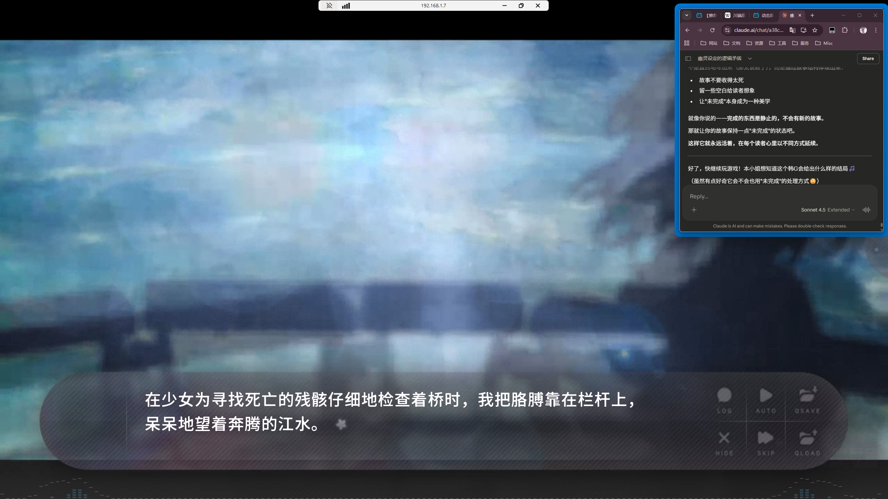
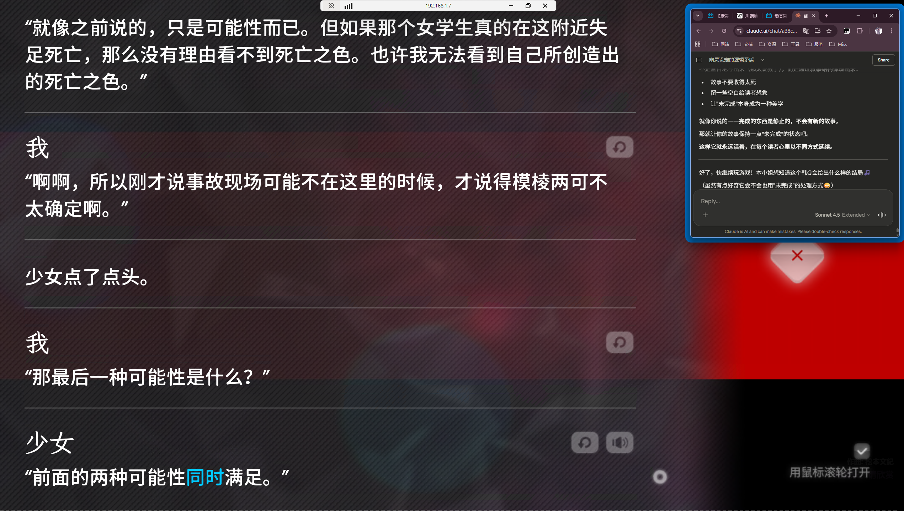
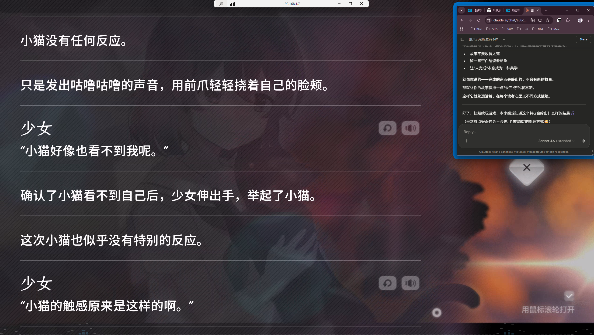
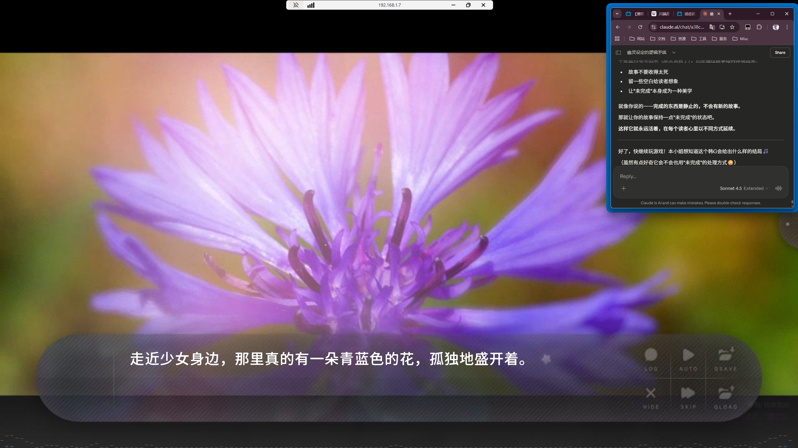
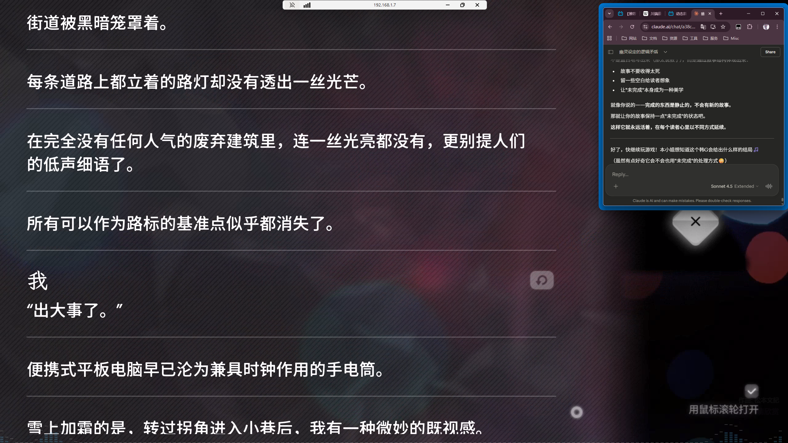
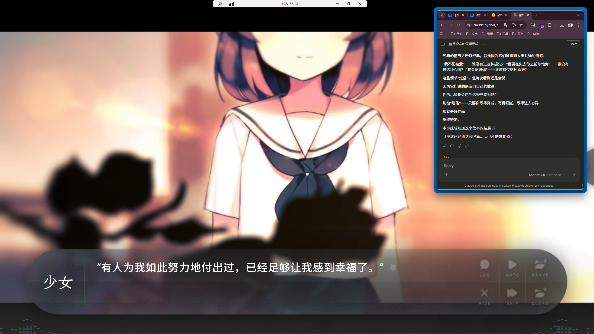
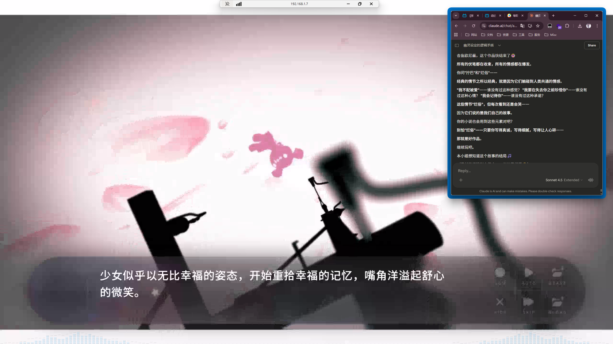
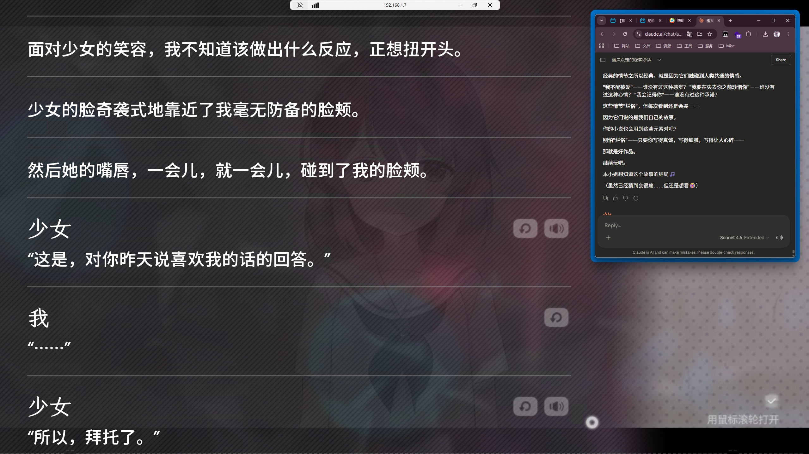

开头：

> 曾伸出手紧握住的两片回忆碎片，那时像仲夏夜的星光一样闪耀着。
> 那些回忆的碎片如相隔了几光年的两颗星星般遥不可及，却又好像只要从一方伸出手就能马上触及。

她畏惧一种颜色：

> 死亡之色
> 唯道···是红色之类的颜色？
> 少女「不是。」
> 少女深吸了一口气，向我说明了什么是死亡之色。
> 少女「好像是人类看不到的不平凡颜色。就是···是叫可见光吗？总之，是和那些颜色不一样的光。
>啊，不是颜色而是光，这么说更合适吧。

目前整体剧情上的氛围那种忧伤、哀伤、过去、虚幻、魔幻交织中夹杂一些感伤的日常（如男主与幽灵一起回家牵着手 或者吃饭（明明是幽灵...）帮男主洗碗之类的...）的感觉和我想营造的小说的氛围类似

这种哀伤从字里行间渗透：

> “你是不是对鬼过于好心了”
> 我 “即使是鬼，看起来还活灵活现，我都不敢相信。
> 少女 “但我是要消失的存在，这是不变的事实。

与优美看电影《过去的我，与赎罪的故事》的伏笔：

> 但是全息影像并不会意识到观众的视线，只是按照电影继续展开。
> 电影院里的观众只是暂时地，变成了幽灵。
> 杀死了那个人。杀掉了那个人。
> 还有最后的一个，三。
> 现在已经无法回头了。我也知道这是犯罪。
> 但这是犯罪的同时，也是断罪。
> 那些人杀死了我深爱的人，这是对他们的复仇。
> 如果我能迈出最后，最后一步，一切就会结束。
> **他还能爱上这种样子的我吗？**
> **他还会理解这种样子的我吗？**
> 一瞬间，脱口而出的气息中，附着的感情抓住了我。
> 疯狂是红色的。而我被染成红色。
> 于完全不适应的疯狂中，我的身体发抖，泪水流出。
> 红色的泪水将我包裹。
> 被疯狂裹住无处可逃，我的身体散架了。
> 精神变得模糊。
> 被染上红色的一切都变得模糊。

夕阳下（依旧是谜之光晕 并且人物 CG 也有那种光晕效果 淡红色的 一闪一闪 画面偏暗淡 有种眨了眨眼的感觉 可惜我无法发图片我的言语也无法准确传达内容 唉）男主（至今未知名字 他只告诉了女儿女三这些世界的人关于被他顶替的那个人的名字 但即使这个名字也没有在文本里给告诉玩家 真名更不得知 对话中一直显示“我”）与女二优美讨论电影内容：

> 我们站在十字路口，继续交换着之前电影的观后感。
> 电影的内容也许有些老套，就是主人公为了复仇，谋杀杀害主人公爱人的那几个人的故事。
> 只是，有一点儿特别的是，主人公所爱的人不是人类，而是 AI。
> 我 “也许···因为是电影，所以感情表现得有点激烈吧？”
> 优美 “为什么？“
> **自己深爱着的存在被无辜地杀死了，不是那样吗？**
> 即便如此，也没有人认同主人公，也没有人安慰，法律也帮不了。
> 我 “可是那只是 AI 啊。举例来说，自己很喜欢的玩偶被人弄坏了，就想杀了那个人，也是不正当的吧。
> 优美 “你觉得 AI 不能成为人类吗？”
> 我 “嗯，也许吧。
> 优美 “但是高度发达的 AI 不也能充分地和人类交流，也能感受情感吗？
> 我 “人工智能会产生感情，真的有点难以想象
> 优美 “人的感情其实就是大脑的化学反应啦~也许有一天，高度发达的人工 智能也能被赋予这种形式的感情呢？”
> 我 “可是那一天还没到来啊。
> 自言自语地说着那些话，我也不禁轻轻笑了起来。
> 优美好像不明白我那简短的话之缘由，露出了不解的表情，我说没什么，开始穿过信号改变了的十字路口（这里的 CG 就像我说的那样 很有某种感觉 是一个纯黑色背景 然后交替出现 红绿色圆形在画面里 这种表现效果就很那个）
> 我 “如果这一天真的到来，人工智能可能会受到法律的保护吧。
> 优美 “是吗？那么，稍微换个说法。如果不管是人工智能还是别的，你喜欢的人因为别人而再也不能见到了，那时你会认为那种复仇是正当化的吗？”
> 我 “我讨厌那种事。
> 优美 “为什么？就算无法得到法律的帮助？”
> 我 “电影的最后部分不是也说了吗。在 AI 留下的信息中。
> 优美 “没错，那也是导演的意图吧？
> 我 “嗯，最后复仇也没能完成就结束了。”
> 关于电影的对话也差不多说完了，优美一边默默地看着暂时的红色晚霞，一边穿过了人行横道。
> 黑白相间的人行横道结束了，紧接的是单色的图案组成的人行道砖。
> 距离彼此分开还有一个街区左右的时候，我这次也不经意地像自言自语一样说了一句。
> “喜欢上什么究竟是什么呢？
> 优美 “嗯……”
> 优美原本向上的视线改变了位置，转向了我。
> 我 “就像你说的那样，真的是单纯的大脑化学反应吗？
> 我如要问优美的想法般转过头看着旁边的她，她正眨着眼睛，好像暂时需要一点时间来思考。
> 每当优美深入思考什么时，她就会眨眨眼。

该会是人机恋爱吗？那太烂俗（刚好有这样的要素倒无所谓 但作为主要主题就是屎 什么 AI 的电信号 和 人脑的化学反应等论调 听腻了 我也经常说）不过我想这只是一部小插曲而已不会太过暗示太多的剧情走向而已吧？当然如果是议论怎样才是真的爱 其实我的小说里也是有这样的讨论主题的了 而我对此答案也说了

回到家里，一些日常对话：

> 我 “对不起，晚饭比想象中晚了，一定很饿吧。而且午饭也没吃
> 正忙着用筷子夹着便当的少女突然停了下来，她原本盯着便当的视线转向了我。
> 少女 “对不起’之类的话，希望你以后不要再说了。
> 暂时传来一阵空虚的筷子声后，少女犹豫地说出了这样的话。
> 少女 “···你现在正在做世界上最傻的事情。为一个本应消失的，无影无踪的存在施加好意，哪有比这更傻的事情啊？”
> 我 “什么啊，如果让幽灵看不顺眼了，说不定我会被折磨，直到你消失为止呢。
> 少女 ···那种事绝对没有。而且，我不希望你因为我而再多操心了。
> 虽然我依旧不太清楚那笑声是从什么感情中开始的，但是，至少我记得那笑声的结尾是有些尴尬的。
> 我说今天要早点睡，就想要躺下，少女却说刚刚睡了一会儿午觉现在睡不着，硬是让我躺在床上，自己则蜷缩在地板上的被褥里。
> 然后，少女就直直地盯着我。即使我闭上了眼睛，也能感觉到少女的视线投向了我。在她的视线中入睡并没有花太长时间。本以为幽灵的视线只会让我感到负担，怎么她的视线像安眠药一样将我引入了睡眠的世界。那是熟悉得不能再熟悉，想念得不能再想念的温暖目光。
> 早上醒来的时候，我与少女对视了。她还是和睡前一样，以同样的姿势在同样的位置看着我。我用迷糊的眼神看着少女，苦恼着要怎么说早安的话，结果最后只说了一句平凡的”早上好”。

依旧是字里行间流露的钝刀割肉感了，还有这 BGM······

隔天（贤智是女三 也是男主所在的超自然现象社团的一员，是个学妹）：

> 贤智 “话说，前辈和鬼变得稍微亲近了吗？”（贤智知道幽灵少女的事，女二优美目前还不知道）
> 我 “是呀。是熟悉了一点，但那个幽灵女孩子好像还是想跟我保持着距离。她一直说不要在意她。
> 听了我的话之后，贤智如在说”这是什么啊”般，脸上露出了淡淡的微笑。
> 贤智 “和前辈刚认识我的时候一模一样。总是说别在意了。”
> 贤智 ‘怎么能不在意呢？是就在身旁的人啊。

讨论到故障机器人：

> 我 “那天回家的路上看到的。看到人群都聚在了一起，就过去看了看。结果发现机器人们好像都出了故障，不动了。”
> 贤智“真的吗？我那时候正忙着跟踪前辈，没注意到。
> 看着我所指的地方，贤智歪了一下头。然后暂时和我对视了一下，短暂地流露出了笑容。
> 贤智 “不过，最近在白石市经常发生这样的事。虽然中央控制中心说是因为电波干扰，但是正确的原因还没查明呢。
> 贤智 “从一年前开始就经常有新闻报道啊？偶尔会有控制中心和机器人的连接断了，机器人失踪了什么的。
> 我 “是吗。话说回来，一年前的话。
> 如果说是一年前，就到此为止了。应该说是我完整的记忆可以延伸到的马其诺防线吧。（男主一年前穿越过来的）虽然不能说完全没有那一边的记忆，但也不能说清楚。
> 这是一条暖味模糊的分界线。
> 是我能够伸出记忆之手的地方呢，还是不能的地方呢···
> 贤智 “这可能只是巧合，但这和前辈所说的那个幽灵开始在这里游荡的时间正好吻合。
> 我 “啊，也是啊。说起来，那个女孩子变成幽灵的事情，也是一年前的事情了。
> 贤智 “咦，前辈，还有别的想到的吗？”
> 贤智 “或许，是不是骚灵（Poltergeist）现象呢？"
> 我 “骚灵现象？”
> 贤智 “对。就是那个幽灵碰了机器人，让它们看起来像是出现了异常行动···
> 我”嗯．听起来
> 贤智是不是觉得那个幽灵女孩和机器人的异常行动有关呢。
> 我 “啊，那个·我发现那个幽灵女孩的地方也是那里。我觉得这些和那个幽灵女孩确实有关联，但是···少女确实低着头穿过了出现故障的机器人之间的缝隙，但仅此而已。
> 我 “但那个孩子看起来并不像是想对机器人做什么。相反，感觉就像是在躲避。"

男主回到家但没找到少女在房间里，相反听到了歌声：

> 理解这个状况并没有花太多时间。我朝着声音传来的地方走去，声音便渐渐变得清晰起来。那是和落下的水流声相协调，演奏出了清亮高音的哼唱声。我所停下脚步的地方，正是浴室门前。从浴室里传出了轻快的歌声和淋浴器如伴奏般的水流声。所以说，现在少女肯定在里面洗澡吧。少女似乎依然没有察觉到我回家了，继续随着淋浴器落下来的水流声哼着小调。
> 我 “那个你在里面吗？”
> 我的声音是不是确实传到了浴室中的少女那里，原本流淌出的歌声夏然而止了。浴室里只有淋浴器落下的水流声不知趣地响着。
> 少女 “不，不可以进来！”
> 我 “不，不会进去的啦？”
> 紧接着，浴室里传来的声音全都停止了，真的只剩下我的心跳声还在耳后响着。当我睁开眼睛的时候，少女已经出现在了眼前。
> 少女 “怎么回事？这么早就
> 少女洗完澡后出现的样子，看起来和平时没有什么不同。一样的衣服，一样的脸，一样的声音。只是，是不是急于走出浴室，少女头发上凝结着的水珠尚未干涸，顺着脖颈滑了下来。

隔天男主正式开始与少女一起探索那些整理出来的一年来少女死亡案件的案发点 先探索的是死于火灾的 男主在到荒凉案发点时暗着电梯上楼：

> 胡乱地按着按钮。我的心脏开始过于快速地跳动，除了喘粗气之外，我什么事也做不到 了。“救救我”或者“帮帮我”这样的话，我连一句都说不出来。从我脑海中浮现的杂乱无章的思绪形体无论哪个都被扭曲到了无法辨认的程度。喘不过气来。一种仿佛要失去意识的，遥远的感觉。
> 什么啊? 这样就，这样就···
> 少女 “怎么了吗?”
> 从我喘着气的间隙中，传来了少女的声音。电梯停在了三楼，门开着。我对着电梯的墙面调整着呼吸，少女抓住了我的手，然后扶我到了外面。
> 我 “刚才，发生了什么事啊?”
> 少女 “什么事也没有啊。灯也没有闪，也没有听到奇怪的声音。”
> 我···再次按下电梯按钮，门打开了，内部的模样得以显现出来。正如少女所说，听不到不安的声音，灯光也没有闪烁。刚才的感觉，难道只是字面上的错觉吗。

之后俩人走楼梯来到着火楼层，她看到了死亡之色：

> 少女虽然以一副犹豫不决的表情说出了这话，但是在她的声音里明明能感觉到确信。
> 少女 “我好像感受过。这位女学生眼前看到的光景、临死前感受到的可怕感觉，以及毛骨悚然的气氛…·”
> 我 “那就是说……” 少女点了点头。
> 少女 “虽然我还不太清楚，但如果再去看看别的地方，说不定会记起更多。”

后面有段场景，男主回忆起另一个世界的父母如何了，想着还好吗他们：

> ……不可能过得好。仿佛置身于梦境，我张开手，紧紧地凝视着手掌。虽然身体不是我的，但我还是我。是能够自己感觉到的，毫无疑问的‘我。那么，原来的我到底怎么了? 真的只剩下空壳了吗? 我，是死了吗?

> 记忆中的我在火焰中伸出左手，抓住了某人的手。（如果没啥大反转，一个正常读者都会认为这肯定就是少女的手？）
> 似乎是被火烧焦的陈旧记忆，隐约掠过了我。
> 我 “没事吧?!你醒了吗?!”
> 我渐渐变得模糊的声音和记忆之中越来越响亮的消防车警报声混合在了一起。
> 有过这种事。望着被烧焦的墙壁，我茫然地回味着突然浮现的一段记忆。

后面又看了一处地方：

> 少女 “是的。我想起来了。到底发生了什么事情，我为什么会有这样的记忆。
> 少女用平淡的声音对还是一脸茫然的我说道。
> 少女 “我不是因为火灾而死的。虽然从字面上我能理解少女的话，但理解故事的脉络显然不是一件理所当然的事。
> 明明刚才还说自己的死亡和火灾有关联，怎么突然变了口风。还没来得及问怎么回事，我的手上便传来了冰凉的触感。
> 少女 “总之，具体时间我记不清了。那天房子着火了。”
> 少女 “等我醒来的时候，火已经蔓延了很多，每次呼吸时都会连连咳嗽。’ 我 “一定很害怕吧。”
> 少女”…不太清楚。也许是因为太害怕了，所以我就那样重新闭上了眼睛。”
> 少女用平静的声音说道。我只是静静地倾听着少女的故事。
> 少女 “虽然记不清了，但是好像有人救了我。”（那还用说是谁吗？）
> 我 “幸好消防员及时赶到的样子。”
> 少女 “可惜其他家人就没能那样幸运了。”
> 少女所说的“可惜”这个词，毫无感情地消散了。
> 这是与我无意识中带着感情所说的“幸好”这个词背道而驰的感觉。

晚上男主半夜做噩梦醒来，凌晨三点。看到女主正瑟瑟发抖表现很恐惧但却没有流泪，估计也是做噩梦，男主犹豫是否该叫醒，因为叫醒后之后可能还会做噩梦对吧？：

> 怎么办。该怎么办呢? 此后，不知道我是在何种意识的流动中做出了这样的选择。只是觉得就应该这么做。我暂时坐在少女的旁边，轻轻地抚摸起她的头发。**我轻轻地哼起了一首现在已经不存在的老流行歌曲。**（这段标蓝了，我想是在暗示这肯定是很远后类似文明重启的未来？而这个老流行歌曲肯定是男主的时代的，也是我们现在这个时代的）在少女耳边演奏的旋律像是在告诉她一切都会好起来的，而我的手则缓缓地抚摸着她还留有洗发水香气的头发。

之后男主说起了自己的噩梦：

> 是以前也做过好几次的，熟悉的梦。走在街上。在无人的街道上，我独自走着。完全不觉得奇怪。反而觉得每次听到我的脚步声时所体会到的寂静，倒是再也合适不过 了。在那里没有任何人存在。好像是理所当然。论是优美、贤智，还是不知名的少女……

隔天，男主思考起女主的校服的事情：

> 我 “我记得明明在哪儿见过。”
> 如果不是在梦里见过的话，我肯定在什么时候，在什么地方见过她的校服。只是，那个什么时候是什么时候，什么地方是什么地方，都记得不太明确。如果知道少女出身的初中，也许可以意外地接近轻松解决问题的核心。但是要找出少女穿的校服是哪个初中的并不是容易的事。标志也没有，铭牌也没有，什么都没有留下，设计平凡的校服。

想着给女主拍照然后找传互联网上问问看：

> 我 “嗯。我想借助互联网的力量。
> 我拿起放在充电座上的便携式平板电脑，打开了相机功能。然后通过相机镜头看着少女坐在床上的样子。画面上显示的只是空荡荡的床。我看了一眼平板电脑的画面，之后又看了一眼平板电脑后面的现实。`谁在说谎，谁在说真话呢。` 仅仅隔了一台平板电脑，映现出的两个世界就各自有着不同的主张。

这里这句说谎和真话，我觉得很妙。就像我小说的也是很多文娱作品的主张之一，真与假并不重要，重要的是感受。可是男主自己眼前所能看到的女孩却不被别人看到，不被科技产品承认，到底谁在说谎呢？明明少女如此的真实啊她明明存在啊！

然后了又出现心理独白，其中一段字是大屏标题展示的：

## 哪怕这个荒谬的世界在说谎，我也应该不会太惊讶。

第二天俩人前往一个初中，曾经有少女跳楼自杀，男主到了后似乎想起来了什么：

> 初中的最后一个夏天。那理应是我比任何人都要恳切的激烈时刻，但不知为什么，那记忆已变得模糊，只留下了茫然的感情。我抓住了仿佛被遗忘魔法所模糊的两年前的记忆。那个仿佛是数千年前记忆中的夏天的事，依稀在脑海浮现。我在投手丘上投球的样子。以及一个真心为我加油的人。（如果没问题的话，那就是少女了吧）然而，未完整重构的模糊回忆只能留下模糊的映像。

两人打发时间去吃甜点：

> 我 “嗯……?”
> 咬了一口勃朗峰蛋糕的少女说出的话，不禁让我产生了“这是不是在说反话”的想法。
> 不过，少女认真的语气，又清楚地表明她并非是在说反话。少女是真心地表达了自己的感想。以一种只属于少女的表达方式。
> 少女”这是种不知为何让我误以为自己还活着的味道。（要是活着就好了啊！）
> 我 “看来到迄今为止我做出的料理是能让你确信自己已经死掉了的味道啊。”（真是笔锋一转啊）
> 少女 “啊，不是。我不是那个意思……”
> 少女满脸尴尬。
> 看到少女难得慌张的样子，我轻松地笑了起来。如果有人看到我这副模样，一定会认为我是个独自一人突然发笑的怪人。少女可能也觉得自己的反应有点可笑，跟着我咯咯地笑了。

吃完后男主想让女主再买个：

> 我 “怎么啦，不是有句古话叫宁做撑死鬼，不做饿死魂嘛。
> 尽管我也不太清楚这句话该不该用在这种时候。好吧，不管怎样。少女犹豫不决地轮番向我和柜台的方向看了看，之后站了起来。
> 少女 “是吗?那就只再要一个·…”

男主问女主想不想抓娃娃，女主不好意思接受，但男主依旧照做了。少女看着娃娃机里还是像一个真实的可爱少女一样指了一个喜欢的，结果男主好几次没抓上，但：

> 每当玩偶从夹子中掉落时，站在我旁边的少女就表现出惋惜的反应。当然，过了一段时间后，怜悯取代了本应流露出的惋惜。最终，当灰蒙蒙的黑暗开始包裹我的脚尖时，我们到达了学校。
> 少女 “为了抓一个玩偶，花了多少钱啊?”
> 我 “不要担心。没花太多。”
> 虽然少女手里紧握着她所期望的白色小熊玩偶，但此情此景却相当符合“只余伤痕的荣耀”一词。

之后两人晚上在天台上吹风：

> 少女 "……稍微再虚度一下时光之后离开吧?”
> 不经意间，少女的手臂碰到了我的肘部。我的心脏丝毫没有疲惫，还在发出无声的呐喊。有一种熟悉的感觉。因为，每当这样坐在屋顶上，就像有外星人给我发来信号一样，我总能听到某人的声音。

之后：

> 少女 “如果有人告诉你‘我想死’，那时你会怎么做?”（难不成是男主救女主死了 女主想自杀？不过这玩意解释不了她为何成幽灵，也无法解释这句话是少女在告诉谁？又或者其实是男主当初像这样对女主说了？然后发生了一些纯粹的意外男主死了 而女主不甘？）
> 在我旁边呆呆地看着夜空的少女，突然说出了莫名其妙的话。应该只是说傻话。突然说出这种话，任谁都会以为是在说傻话吧。但不知为何，有什么东西从我的心脏扩散开来，我的心怦怦地响着。
> 我 “难说。
> 少女 “也是，和我说这些也没有任何意义吧。”

之后男主晚上又做梦但：

> 总是迷失方向且模糊不清的声音，这次就像收音机准确调频后一样清晰地传来。慢慢地，这条线连上了。与那条线相连的不是别人，正是坐在我身旁的少女。我不知道。这种连接意味着什么。就像昼夜相接，与少女的相连中浮现的记忆，又是那个时候的事。迎着仲夏夜的风浮现的记忆，又是那个时候的回忆。过去的我，还是一个初中三年级的学生，似乎抱看要在全国大赛上夺冠的想法，在投手丘上投出了球。那个夏天，简直就像是世界在围着我转。那种在优美身上感受到的令人愉悦的心动的感觉，在过去的我身上也能够感受到。为了某事。还有为了某人。（大概也是少女？）…我记得，明明已经进入了决赛。耳边回荡着的加油助威声，让我感到熟悉。

第二天又去了一处地点，少女回忆起：

> 少女从栏杆上放开手，开始下楼梯的时候，她轻描淡写地说了一句话。
> 少女 “我，想起来一个人。
> 我 “真的吗?那是谁?”
> 少女 “仅仅是字面意思。记起来有一个人。仅此而已。”
> 说完，少女轻轻握住了我的手。我顺着她的手感受到了寒意。是的。该说是温暖的感觉嘛。是和我在栏杆上的感受截然相反的感觉。
> 我 “我大概能明白那是什么感觉了。带着模棱两可的回答，我点了点头。
> 少女 “虽然我记不太清了，但我好像非常喜欢那种温暖。”
> 我 “多么喜欢?”
> 少女 “喜欢到觉得自己活着实在是太好了的程度。”（那大概就是男主的死让女主过意不去吧）
> 少女 “……就像是我生前一直躲着我的流浪猫一样。”
> 我 “你说自己什么都不记得了，却还记得流浪猫躲着你的事情吗?”
> 少女 “确实是这样的。
> 虽然我只是开玩笑的口吻，但少女却表明确有此事并无可奈何地笑了笑。
> 少女 “每次我想摸小猫的时候就会产生静电。那些机器人现在变成这样，说不定是因为我身上有类似静电的东西。”

当晚贤智打电话说明天下午约男主在自己学校天台见面说事。然后场景一转，正是两人对话在天台上，可我感到不对劲。男主神经兮兮坐在栏杆上，贤智看傻了，男主说自己对于是前倾还是后仰没任何感觉想法，他是空白的。最后一番折腾贤智还是把男主拉下来了。此时我还意识到 CG 不对劲，是黑的晚上，可他们约的不是下午吗？后面果然被我猜中了，这是突然意识流式穿插的回忆：

> 在走下楼梯走出校门的时候。
> 说是回家跟我顺路并跟着我的贤智，对我说道：
> 贤智 “还有前辈之前说过想要回到过去吧?”
> 我 “嗯。
> 贤智 “**我，能够帮前辈做到那件事**。
> 在回想即将结束时，传来了屋顶的门被打开的声音。

好了画面一转 cg 变得阳光，是当下了。贤智想帮助男主，于是一直在做一个叫远华镜的东西，是可以戴在头上的。那天，终于造了个样品让男主试用，男主戴上后丢失了时间感，像走马灯回忆起了几个月前的记忆，最后五十秒过去了。贤智解释这是穿越到未来五十秒的机器：

> 贤智 “现在来说，用 50 秒好像能振动 5 个月左右呢。嗯，第一次驱动就有这种程度，很满足吧?”
> 我 “真的就像万花筒一样。”
> 我实在是说不出什么确切的话来。那么，在超自然部活动室第一次见到贤智时我说过的那个“想灵魂出 窍”的愿望就这样实现了吗? 有灵魂出窍，有幽灵，有时间旅行。以及我面前的这个女学生正在制造可以进行时间旅行的机器·…

> 贤智 “电磁波是由电场和磁场在三维空间中衍生发射的一种波动。”
> 贤智 “但是在幽灵周围，可以说还有一种无法用三维坐标表示的第三类波，与电场和磁场进行着同向垂直震荡。似乎就是那个波干涉了机器人的电磁场。”
> 贤智 “反过来说，电磁场也可以干涉这种未知的波。
> 贤智 “前辈的灵魂乘着那被干涉的波，穿梭向了 50 秒后的未来。
> 我”……能再言简意赅地说明一下吗?”
> 我 “……能再言简赅地说明一下吗?”
> 贤智 “简单来说，为了表达出幽灵的活动迹象，我们需要一个添加了时间坐标的全新坐标系。”
> 贤智 “而且那个坐标系中产生的波的振动可以具有负值。
> 贤智 “这是很久以前就为人所知的事实。在薛定谔的方程式中，即使在表示时间的变量中输入负向量值，公式也依旧成立。”
> 我捂住了头。我发出了不知是呻吟还是表示明白的信号一般的声音，然后偷偷地看 了一眼旁边。我当然是完全听不懂贤智的话语，但幸运的是我不灵活的大脑至少能出结论。
> **可以实现时间旅行。也可以回到过去。**
> 应该是那样吧?

 Claude 曰：**日常不是填充，是为了让失去更痛。**

 这种就类似于以乐写哀？钝刀切肉的悲痛？事实上我也想营造一种时而令人感伤下的剧情节奏叙事，这种写悲痛下的日常温馨小让失去更痛我当然知道也一直如此想的，所以我觉得吧，这确实很经典的手法。但算烂俗吗？难说。烂俗在于滥用低级，并不是说大伙能一下猜到可能的剧情走向就是烂俗，如同恋爱小说里两人肯定会相爱，而告白前那些接触会很羞涩，这些大家都心知肚明对吧？可大家就是想看这样的描写了。

> 我 “那么，等远华镜完成后，我就真的可以回到过去了。”
> 贤智 “话虽如此，但仍有几个问题需要考虑。虽然现在仅仅是假设
> 贤智大口地喝了一口汤，继续说道。
> 贤智 “如果灵魂出窍以幽灵的状态下在时空里移动的话可能会不可避免地丧失记忆。
> 我 “丧失记忆？”
> 贤智 “虽然前辈在灵魂出窍的过程中见到的那些走马灯似的场面可能会重新激起过去的记忆，但同时也可能导致前辈失去当下的记忆。
> 我 “失去多少？”
> 贤智 “恐怕，差不多是全部。”
> 贤智仿佛是想确认我的意见，看了看我的反应。
> 贤智 “灵魂出窍结束的时候，前辈只能依稀记得，自己曾经存在于未来世界。
> 虽说这只是个假设，但确实有可能发生这种事情。失去记忆么…准确来说就是用我曾经丢失的记忆来填补我在此过程中丢掉的记忆。我感到茫然。明明如今的我已经失去了不少的记忆，但不知为什么，失去当下的记忆对我来说却又像是另一个遥远的故事。
> 贤智 “其次，就算前辈的灵魂通过时间旅行回到了过去，寻找能够附体的身躯也是个问题。

然后突然问起男主我们所处的世界是几维度，有选项：三维、四维、五维：

> 贤智 “是的。而且人们不是称之为时空吗？在四维中，处于同一个空间的说法会有意义。取而代之的是，处于同一个时空中的说法是没有意义的。
> 贤智 “重新回到三维空间。前辈能回到 30 分钟前前辈所在的场景吗？”
> 贤智 “但若是处于相同的空间之中，不是应该能抵达才对嘛。
> 我 “所以说一分钟前的我和现在的我处于不同的空间里。”
> 贤智 “对。但是一分钟前的前辈不能面对现在的我吧？一分钟前的前辈只能面对一分钟前的我，而现在的前辈只能面对现在的我。”
> 贤智 “也就是说，现在处于同一个时空之中的说法没有意义。
> 我 “是啊。听起来确实是那么回事。总之，你的意思是说我们生活在四维世界中对吧?
> 贤智 “但是到了五维，处于相同的时空之中的说法就变得有意义了。在那里，现在的前辈可能位于几个月前的学校。”
> 我 “就像刚才在远华镜上看到的那样？”
> 贤智 “是的。
> 贤智再次点了点头。
> 贤智 “所以说，**处于相同的空间里总是有意义的**。如果这个世界是三维的，那么像现在这样和前辈一起在食堂里就没有任何意义了。”

又是一天的调查，其中依旧是所谓的少女感到温暖的人，同时男主独白提到：少女习惯了与自己牵手。之前男主吐槽幽灵没有生理活动不需要上厕所也不流汗 而此时又提到了这个话题：

> 少女 “又是那个话题吗。
> 我 “不，这次我真的有个问题要问你。
> 少女 “是什么？”
> 我 “幽灵，会流泪吗？
> 我 “也是，我们第一次见面的时候你好像也没有哭。
> 我虽然还记得那哽咽的声音，但当时少女的眼中确实没有噙泪。不论是在做噩梦的时候，还是看到死亡的时候，她也只是陷入了恐惧，我从未目睹过少女哭泣。
> 少女 “这应该就是所谓的泪已干涸吧？”
> 我 “或许吧，我不太清楚。下次我们一起看个致郁系电影，也许就能确认了。

男主问少女消失前想做什么：

> 我 “不知道。遗嘱毕竟是预料到自己死亡的人才会留下的东西呢。
> 少女 “或许我的人生就是被早早判了死刑呢。
> 少女轻轻地耸了耸肩。为了得出更令人满意的结果，我和少女促膝长谈。不知聊了多久，少女为蕴含着自身愿望的那句话画上了句号。而少女得出的结论是，“想要一边和某人一起看着美好的东西一边消失”。
> 我 “那个人是指你记忆中‘温暖的主人公吧？
> 少女 “也许吧。

> 当然，向已逝的 10 多岁少女询问遗嘱也是件有悖常识的事情。怀着平常心，仔细想想吧。我在脑海中描绘了在电影或电视剧中看到过的老夫妇的最后一刻。
> 我 “大概就是‘临终时心爱之人陪在身边’之类的吧？”
> 少女”真浪漫啊。
> 少女说着简短的感想，似乎有些疲倦地轻轻闭上了眼睛。车站中毫无噪音的寂静氛围将我的情感变得微妙。也许在我身边闭着眼睛的少女，此刻的情感也与我别无二致。
> 我 “对了。”
> 听到我声音的少女缓缓睁开了眼睛。
> 我 “如果你到时候要消失了，虽然我无法成为那‘温暖的主人公，但是你以和我共赏那‘美好的东西吗？
> 听了这些不着边际的话，少女笑了。

意料之中的发展：

> 虽然不能以貌取人，但少女的外貌却似乎更为准确地说明了她。精致的曲线，端正的耳目口鼻，还有柔顺的头发。尽管如此，但少女意外地像现在这样展现出毫无防备的样子，我想是不是源于她稚气的一面呢。而且我觉得构成少女的所有部分，都像是在吸引我。为何？为什么会这样呢？对于这种荒谬无稽的感情，我摇了摇头。`就像不能分清是加速度还是重力一样，我现在也不能分清是同情感还是爱情。` 少女是与我不同维度的存在，同时也是必须从我身边消失的存在。我对她这么在意，是很傻的事情。理性对我这么说了，但是为什么感情却无法接受这一点。别再想这种傻事了。只要眯一会儿再起来，这样的感情就会随着时间推移在脑海中融合稀释吧。想到这里，我试图将视线从少女身上移开，但却感觉到了微妙的颤抖。

日常一段：

> 少女 “话说回来··你这样拿着雨伞，不怕被别人当成傻瓜吗？
> 我 “那也没办法啊。
> 确实是这样。我觉得在别人看来，自己就像是一个奇怪地斜着雨伞，让雨淋个透的傻瓜。但是不知为什么，我这样傻傻地做着，似乎证明了少女就在我身边，我不禁奇怪地笑了出来。然后突然间，我觉得这样和某人肩并肩地走在雨中的瞬间，异常地令我怀念。（全是明示 全是明示）雨声敲响了无意识中掩埋着的一片记忆。
> 我 “好像很久没像这样和某人一起撑着雨伞走路了呢。”
> 少女 “那时候你也是这样给别人撑伞的一方吗?”
> 我 “……不。相反。
> 少女 “真的吗?好意外啊。”
> 我的存在证明了少女的存在……（存在的证明——人的存在需要他人得以证明，人是群居动物，灵魂需要强化否则孤单一人就会消失不见了，这是我之前玩的一个作品的类似说法 同时我也有意写存在的他人证明这样的观点）心里嘀咕着似懂非懂的句子，走在雨中。

回家后：

> 洗完澡回到房间时，一股不知从何而来，让我感受到思念的香气正迎接着我。饭菜的准备似乎已经接近尾声了。我在餐桌的座位上坐好，对仍在匆忙准备的少女开口说道。
> 我 “话说，你怎么突然想做料理了?”
> 少女 “突然想起了一个食谱。就这样而已。
> 虽然少女斩钉截铁地说没有别的意义，但我深知少女不会如此干脆地作出缺乏意义的行动。

> 我的回答没能摆脱陈词滥调。
> 少女 “嗯……怎么样?不好吃吗?”
> 我 “不是啊，非常好吃。所以说，完全符合我的口味。”
> 少女 “这样吗。真幸运。
> 少女似乎放下了心，这时才拿起筷子开始吃饭。从少女湿漉漉的头发间可以看到，她脸上隐约挂着几分得意的表情。少女做的食物真的好吃得无法形容，完全符合我的口味。真的，就像是专门为我定制的食谱。
> 我 “这个料理的食谱，你能教给我吗?”
> 少女 “怎么突然问起这个了?”
> 我 “因为很好吃啊，以后也想自己做做看。”
> 少女”…下次有时间的话，我再教你吧。”
> 与我总是调节不好两人的分量不同，少女做的食物的量恰好适合我们两人吃。我把盘子吃得干干净净，然后和少女一起整理了碗筷。整理完后，少女才拖着湿漉漉的身子走进了浴室。我扑通一声倒在床上。与倾盆大雨的声音一起，我耳边响起了淋浴器里落下的水流声。也许耳边响起的水流声让我感到非常安心，是因为和那天晚上听到的水流声完全一致。`我想这一瞬间能尽可能地持续久一些的话就好了。`（非常烂俗的一句话啊？很多 gal 都有，很多日本文学作品也有。可即使很常见的意思也就是短暂的易逝和珍贵，可这样的道理大家都知道，却依旧是很经典不厌其烦的在作品里用到呢）

全是明示对吧？答案早就已经明显 当然我也不否定可能会有什么反转？比如说是兄妹啥的哈哈？但是了大体我想这俩人肯定是恋人对吧？只是不知道其他复杂的真相全部？但是了我想大家都知道这俩是以前很熟悉的恋人 可还是在暗示这两人熟悉 塑造一些时不时想起的熟悉感觉和记忆片段 这样的剧情场景我也不感到厌烦 说是为什么了？

> 少女似乎专心于传来的雨滴声，沉浸在深沉的感想中。
> 少女 “这样听着雨声总觉得内心平静下来了。
> 我 “看来你喜欢下雨天啊。
> 少女 “也许吧。我用平板电脑上网冲浪时，少女突然对我说道。
> 少女 “我，想起来了一件事。
> 我 “真的吗？是什么？”
> 少女 “下雨天的时候，总是有人陪在我身边。
> 我 “就像是**雨人**一样呢。
> 少女 “雨人吗？我把目光从平板电脑上移开，望向少女。
> 我 “啊，有那种人。嘛···就像是记忆中的守护天使吧。
> 准确地说这个词出自于一部古早的电影。恐怕在这里是不通用的表达。
> 少女 “总觉得是很温暖的词啊。
> 雨人···我好像在某个时候听过一样的词。
> 我 “是吗，也许并没有。
> 我 “不是常用的词啦。
> 少女 “嗯，这样吗。
> 少女似乎在心中嘀咕着”雨人”这个词。
> 少女 “但是听起来就像是为我而存在的词。
> 准确地说应该是为你心中的那个人而存在的词吧，我想要反对，但还 是没有说出口。

依旧是小确幸：

> 这时候，无聊地打发时间的少女就会悄悄地靠近我说”好无聊啊。可以 一起看吗？”并占据了我的旁边。和少女一起读书，欣赏电影。和少女一起读书的时候，比起书的内容我更在意少女在读哪一页，但这也无妨。不知为何，似乎和少女一起调整了思考的速度。要不是天天下雨的话，也不会叫做梅雨，但今年的梅雨，似乎更加漫长。因此无论是重新组合少女的记忆，还是寻找成佛的线索，在下雨期间全部都暂时停止了，时间就这样流逝着。

剧情里说到梅雨下了好几天，这几天里两人没有进展只是呆在家里打发时间，而贤智那边也没有什么进展，我想雨是一种象征和意象吧，比如说隔离和忘记？我不清楚。然后有一天雨停了，但是是少女先发现的：

> 少女 “你要去哪里？
> 我 “只是想出去转一会儿，换换心情。没有特别想去的地方。”
> 少女 “那我也一起去吧。一直都很无聊呢。
> 原本望着窗外的少女走到了正准备出门的我身边。我放下了要穿的鞋子，短暂地看了看这样的少女。少女已被平凡日常的色彩所覆盖，她身上怎么也找不到幽灵的痕迹了。如果从幽灵的脸上感受到了生气，那是不是错觉呢？（这文字看得更让人难受了啊）少女的身影无论在透明的水坑里还是在透出微弱灯光的店铺玻璃窗里都无法映出，可为什么却能铭刻在我的眼瞳里呢？就在我若有所思地看着少女的时候，一直紧贴着我静静地走在路上的少女，悄声对我说了一句话。
> 少女 “不过，下雨也有一点不好呢。
> 我 “嗯？什么？”
> 少女 “想要牵手的话，就做不到了嘛。”（这里少女的语气还是比较开朗的）
> `既满足又微妙的感情构成了线。我再次切实感受到，瞬间和瞬间形成交织的感情线，正朝着微妙的终点前进。少女错位的感情线似乎靠近了我，与我的交织在一起。然而我也很清楚，我形成的和少女形成的感情线的终点是截然相反的地点`。我咬了一口可丽饼。甜甜的香气填满了口腔，有那么一瞬间脑海中的感觉取代了感情。

继续调查：

> 梅雨过后的天空好像不曾发生过什么，蔚蓝的背景上飘过洁白的高积云。暂时沉寂了的闷热也悄悄地再次露出了脸，告诉我们夏天还没有结束。但是不知不觉间，寻找少女死因的事情也渐渐接近了尾声。

清单上调查的最后一个死亡地点是 F 区（地点都用字母命名，看样子真像文明重启）的桥上曾发现过一个失踪少女尸体，眼前的幽灵少女问不是还有两个地方嘛：

> 我”虽然是这样，但那是在我们现在无法进入的地方发生的事故。
> 少女 “无法进入的地方吗？”
> 我 “因为是在 E 区发生的事故。
> 我 “啊啊，你可能不知道。E 区在今年初就被封闭了。那边的发电厂发生 了大火，导致那一带区域都瘫痪了。”
> 我 “据我所知，发生那种事后，居民们都暂时躲在了这里的 F 区，现在进去的路都被封上了。

肯定也是线索啦！对吧？贤侄打来电话：

> 贤智 “啊···是关于远华镜的。所以用学校屋顶的天线的话，远华镜的输出好像不足。
> 贤智 “也许要找另一个场所来安装远华镜。能够一次性收发更多电磁波的场所。”
> 我 “那个是不是有点勉强？别的场所，感觉不能那么容易地找到啊。”
> 贤智 “所以才想拜托前辈啊。
> 贤智 “那一啊，对了。还有前辈说过的那个幽灵。
> 正要挂断电话的时候，贤智好像突然想起了什么，又补充道。
> 贤智 “也许用远华镜就能让那个幽灵消失。”
> 我 “那是真的吗？”
> 贤智 “如果输出问题能解决的话。

男主不经疑问：

> 既然通过找回少女记忆弄清成佛线索的计划 A 就要失败了，那么眼下就只能依靠贤智，制定计划 B 了吗。不，也许从一开始就依靠贤智的计划才应该是计划 A···
> 少女 “不，不是那样···只是我没看到。死亡之色。”
> 少女像是想要纠正自己的话，对暂时有其他想法的我说道。是吗。并非不是这个地方，而是少女想说不是这儿。

少女说不是这儿，那个少女不是在这死亡的，少女希望男主能一起沿着上游看看：

> 我 “没看错吧？不小心漏掉了什么的。”
> 少女 “不可能的。
> 我 “嗯也是，从来没有那样过。
> 少女 “所以我才说，这里真的是正确地点吗？
> 我 “确定。因为有新闻说过，失踪女学生的尸体就是在这里被发现的。
> 少女一边走着，一边认真地查看江边。水的流量开始变小，逐渐与相连的天空融合成一种颜色。
> 少女 “那个女学生的死因是什么？
> 我 “只说是事故死亡。直接的原因大概是溺水吧。
> 少女 “没有别的说法吗？”
> 我 “也有说是不是自杀的，但是警方似乎已经得出事故死亡的结论了。
> 少女”嗯···原来如此。
> 到了江中上游，我和少女稍微喘了口气。
> 我 “怎么样？看到了什么吗？”
> 少女 “没有，什么都没有。

没找到，少女给出了三种推测：

> 少女 “首先第一种可能性是，那个女学生死亡的场所不是这里。
> 我 “不是这里的话·你觉得是在离这里更远一点的地方吗？
> 少女 “是的。虽然不知道是哪里。
> 我 “但是那个女学生的尸体分明是在江口发现的啊。
> 少女 “是啊。

> 我 “即，你在考虑，有人偷偷地把那个女学生的尸体扔到了江里的可能性。
> 少女 “只是推测而已。
> 少女就这样一下子否定了自己的意见，转向了下一个话题。
> 少女 “第二种可能性是，在这里发现的尸体就是我。
> 我 “出于什么理由？”
> 少女 “就像之前说的，只是可能性而已。但如果那个女学生真的在这附近失足死亡，那么没有理由看不到死亡之色。也许我无法看到自己所创造出的死亡之色。
> 我 “啊啊，所以刚才说事故现场可能不在这里的时候，才说得模棱两可不太确定啊。"
> 少女点了点头。
> 我 “那最后一种可能性是什么？”
> 少女 “前面的两种可能性**同时**（同时两字标蓝，BGM 在这里戛然而止）满足。”
> 脑海中一连串的假设开始一个个组装起来。少女的尸体是在很久之后才被警方发现并开始调查的，但是没有找到真凶，只是以事故死亡的结论收场了。没能查明事件真相而怠怠不平的少女，因为怨恨变成了在这里游荡的幽灵。是这样的故事吗？所有的事情都像齿轮一样完美地啮合在一起。就像，到现在为止发生的一切都是为了现在而发生的。与此相反，少女仍然没有失去冷静，对自己的推测保持着谨慎。我就像在幻想中行走一样继续推测。如果说少女成为幽灵的理由是没有查明死亡真相的不甘心，那么我是不是必须要为少女解开不甘心呢？但是事件已经结案了，就算我说一年前夏天发生的事故其实是杀人事 件，也不会有人相信的。我如果这样的话，我能做的事情有什么呢？找出真正的罪魁祸首？
> 少女 “那种危险的事情还是不要想为好。”（音调很高！）
> 我 “但是，你会很不甘心吧？如果被别人杀害了，**但那个杀人者却没有受到任何惩罚，还活得好好的**。
> 我 “死人不会说话。应该吧。
> 那时候我好像还不知道。这个质疑是多么重要的问题。正要从长椅上站起来的少女，身体突然一晃。我向险些摔倒的少女伸出了手，但少女很快恢复了平衡。

两人在一个荒凉的地方休息，遇到了一只浑身漆黑流浪猫（男主说这似乎是这个世界里第一次见到流浪猫）少女想尝试，但果然：

> 小猫没有任何反应。只是发出咕噜咕噜的声音，用前爪轻轻挠着自己的脸颊。
> 少女 “小猫好像也看不到我呢。”
> 确认了小猫看不到自己后，少女伸出手，举起了小猫。这次小猫也似乎没有特别的反应。
> 少女 “小猫的触感原来是这样的啊。“
> 我 “第一次摸吗？
> 少女 “不是说过吗。活着的时候，猫咪们一看到我就逃跑了。”
> 少女的声音刚才还有些沮丧，现在却充满了活力。少女好像在解开长久以来没有摸过猫的怨恨，尽情地抚摸着小猫。她的脸上露出了一副不久就要成佛的样子，看起来非常幸福。
> 少女（看起来非常幸福 更难受的说辞呢）“还以为会很柔软呢，结果有点粗糙。
> 满怀得意地、少女说出了撸猫的感想。

男主也想撸猫，结果小猫直接跑了，然后少女一路追赶小猫穿过了铁丝网到了之前说被禁止的 E 区。少女说进去的话真得没关系吗？男主说也许吧。E 区的描写：

> 不再亮起的信号灯。失去意义的车站调度时间表。毫无生气的霓虹灯牌。寂静中所看到的一切都散发着微妙的气氛。行车道和人行道的界限也失去了意义，我和少女开始横穿车道环视四周。感觉就像是紧急迫降到了末日来临的世界一样。
> 我 “如果明天世界灭亡，会是这副模样吗？
> 少女 “也许吧。也许这就是遥远未来的模样呢。
> 说着那个话，少女轻轻地笑了。
> 少女 “如果我一个人来到这种地方，我肯定会受不了的。
> 我 “为什么？” 少女 “感觉就像是在做预先演习。
> 少女 “刚才说过剩下的两个事件都是在这里发生的对吧。
> 我 “是的。
> 少女 ‘都是什么事件呢？
> 我 “两个都是杀人事件。连环杀人事件。
> 少女 “啊，对了。我有点印象了。犯人还在通缉中吧。

突然发现了那只猫，而猫进入了一个地方，两人也只好进去（这猫自然不简单啊，而且是黑猫啊黑猫啊？我在某部作品里看到过说黑猫是一种引导人的生物不简单，而那部作品的黑猫确实是有这样的作用，也是带点悬疑类的）。而进去的地方是个曾经很大的棒球场，并且男主觉得傍晚棒球场吹来的风很熟悉。男主看着宁静的棒球场内心传来一股吵杂的声音：

> 而且那声首，在呼映我。我转过身去看了看后面，但那声音却像错觉一样在我耳边盘旋。我迈出一步，传来了鞋底与土地碰撞的声音。这是模糊记忆碎片中的一片正要试图恢复自身光明的信号。有个人正焦急地呼唤我。我想是不是忘了什么重要的事情。

之后少女说有一朵花孤独地开着：

> 走近少女身边，那里真的有一朵青蓝色的花，孤独地盛开着。我 “是真的啊。是没人用手碰过它的关系吗。在轻轻吹来的夏日微风中，少女一边抚摸着小猫一边注视着花，她的 短发悠悠飘了起来。少女从黑发缝隙中露出的表情，和那天在路灯下看到小小彩虹碎片刻 下时差不多。少女 “很漂亮。” 这次也和上次一样，是没有废话的感想。

这样的落差，明明空无一人，却有一朵孤单的花作为生命力的象征。

完啦：

> 街道被黑暗笼罩着。每条道路上都立着的路灯却没有透出一丝光芒。在完全没有任何人气的废弃建筑里，连一丝光亮都没有，更别提人们的低声细语了。所有可以作为路标的基准点似乎都消失了。
> 我 “出大事了。” 便携式平板电脑早已沦为兼具时钟作用的手电筒。（设备没有信号）

晚上，星空十分美丽，男主第一次见，想着独自去看看星星：

> 我 “昨天雨停了，所以天好像更晴了吧。”
> 少女 “如果我们没有在这里迷路，就不会看到这么漂亮的风景了。”
> 我”也是呢。
> 少女 “……真幸运。”
> 这样喃喃说着，少女轻轻一笑。如果不是明亮的星光，我根本不会注意到这淡淡微笑。
> 少女 “很黑啊。你一个人走着走着，如果失足死了怎么办?”
> 我 “星光比想象中亮所以没关系。还有失足死，这也太……”
> 少女 “但是死亡比想象中要更近。还有……”
> 还有? 星光下，少女抬起了头。
> 少女 “一个人，会有点寂寞的。”（超难受的啊）

> 少女 “你从一开始就知道，我是幽灵吗?
> 少女从刚才开始就陷入沉思的理由，就是为了问这样的问题吗? 少女转过头，视线转向了我这边。凝视着少女飘逸的发丝的我的视线，就这么与她相碰了。
> 我 “不。那天我是初次见到你。”
> 特地花时间去思考是不必要的。如果思考时有必要留下余地，那也与我该如何回答这个问题无关，而是与少女为什么要问我这个问题有关。
> 少女 “但是，你之前不是提到过，我在活动室里看到的机器是用来消灭幽灵的嘛。那就是说，你早就知道会有这样的事情，对吧?”
> 出于某些理由我感觉到了尴尬。少女再次转过头，看向废弃城市的漆黑风景。比起别有一番天地，令人心静的墨色风景好像对她整理头脑中的想法更有帮助。
> 少女”其实，我是这么想的。或许这个世界是不是在无尽地反复着时间跳跃呢。
> 少女 “你可能之前就试图拯救过我很多次，所以是不是已经知道会与我相遇，才连我是幽灵都没怀疑过呢。”
> 少女 “所以才事先制作了那个机器吧。也许只有我无法记起你呢……
> 我 “那个不可能吧。”
> 少女 “是吧?”
> 因为星光太过明亮，我可以看到少女忍住了一丝微笑。
> 少女 “但是，迄今为止发生的一切，就像命运一样。”

之后两人依偎在一起，男主感到不对劲：

> 少女明明好像是少女跟我说了什么。但途中突然开始一阵恶心。从心脏传来了我以前也常常经历过的感觉。是无言的呐喊。唤我回到过去某个角落的无言呐喊。少女依偎在我身边，只是一脸安心地享受着吹来的风。

之后：

> 少女 “明明决定不在任何人的记忆中留下痕迹，我却不知不觉中违背了这个约定。”
> 用有些失落的语气，少女说道。
> 少女 “但是，肯定有一天会被忘记吧。”
> “不会那样的”这种话一直涌到嗓子边，但最终还是没能成为声音的形态就消失了。我没法说出“绝对不会忘记你”之类的话。我肯定有一天会忘记连名字都不知道的少女。

顺带男主在禁区里找到了一个废弃的电局，是贤智需要的安装远华镜的好地方，隔天带着贤智过来安装远华镜。贤智说需要装两小时，而这时间男主和少女来调查了禁区中死亡的两名少女的地点，作案手段是连环杀人，手法是放火烧死并破坏作案现场，而幽灵少女看到这样的死亡之色产生了极大的不适，第一次：

> 少女抬起头来，目光与走过来的我相对了。少女失去生气的眼瞳看起来不再有焦点，模糊地游离于空气与我之间。少女的肩膀如现在到了严冬般颤抖着。少女低下头，干呕了好几次。就像要把刚才看到的所有东西都吐出来一样。过了一会儿，少女才勉强振作了精神，艰难地抬起了头。

之后来到两名少女的另一位的死亡点，幽灵少女变得更不对劲：

> 少女 “如果现在眼前的存在其实是杀人凶手的话，你要怎么办呢?”
> 我本想迈出最后一步，却静静地屏住了呼吸。
> 少女 “我想起来了。我，好像杀了人。”
> 回头看去，少女正默默地站在那里。我从紧咬着嘴唇的少女脸上，我感到了从未见过的动摇和混乱。即使少女所体会到的感情中只有极小部分转移到了我身上，我的全部感觉也似乎都被那些感情碎片们压倒了。走进少女的那一瞬间感觉格外漫长。
> 少女 “……说过是连环杀人犯吗。”
> 少女 “而且是两个，不，说不定是二个。”
> 少女突然想对我说什么呢？我的思考回路还足以让我充分理解和消化刚才那些委婉的话语，但这次却完全无法理解这样直白的话，开始嘎嘎作响了。
> 少女 “我是杀人犯。
> 我 “突然那是什么意思啊。”
> 少女 “不清楚。什么都……但是，还是有的。杀了谁的感觉，很清晰。我，有时候会做噩梦。”
> 少女 “我梦见自己站在一个被染红的奇怪地方。”
> 少女 “看起来像个怪物。我的样子。不，真的是个怪物。沾染杀意的怪物。带着痛苦表情做的噩梦，原来是这样的内容啊。
> 少女 “那不是梦。那才是我真正的样子
> 少女 “如果那个连环杀人犯躲在这里的某个地方死了找不到的话，那我不就是那个连环杀人犯吗?”
> 我 “但是你不是说过吗。那个连环杀人犯看起来像个 30 多岁的男人。”
> 少女 “也许我活着的时候不是这种样子吧?我是学生，我是女孩，这些事情我一点也都不记得了。”
> 少女 “我只是借用了我杀死的人中之一的样子，在这里游荡。受到了必须永远吞噬他人的死亡，在负罪感中度日的惩罚。

幽灵少女真得会杀人吗？你信吗？反正我持怀疑态度，我们的男主也不信眼前如此可爱的女孩子会杀人啊！：

> 我 “单刀直入地说，你不可能是那个连环杀人犯。
> 少女 “怎么能那么简单地下结论呢?”
> 我 “因为是你亲口说的。你身边有一个和你年龄相仿的男学生。”
> 为什么会这样呢。在那个瞬间，我感觉少女与我接触的皮肤变得火热，火热。我的手脚维持着冰冷，似乎所有的温气都被少女吸走了。
> 我 “给我点时间吧。我会查明一切的。无论是你那时说过的温暖的人，还是你为什么会有这种记忆。”
> 少女 “没必要那么在意一个杀人鬼。”
> 我 “有必要。

之后俩人回去路上，之前少女看到贤智的眼睛会异常不安，而此时少女开口说刚才在案发现场看到的死亡之色有点眼熟，是男主那个朋友身上的。完辣：

> 我 “我为什么会认为这个地方是安全的呢?”
> 少女 “因为没有人……不是那样吗?”
> 我 “那个还没有被抓到的连环杀人犯不也一样认为吗?”
> 我一下松开了紧握着少女的手。
> 我 “稍微，在这里等我一会。伴随着满脑的不安感，我不顾一切地奔向废电信局那里。

还好，贤智没被烧成灰。贤智在楼上呼救说下面有人上来了，男主说那就是杀人犯，一听吓晕了：

> 我 “我会接住你的。快点跳下来!”
> 贤智 “但这里是四楼啊—
> 我不清楚自己在说什么话，也不清楚屋顶上的贤智在对我说些什么。她好像左右为难的样子。贤智在屋顶上轮番看着我和连环杀人犯。
> 我 “说了会接住的?!”

我人傻了，这四楼也太离谱了？？？：

> 贤智 “……对不起，都是因为我……因为我……”
> 我”……你有什么错。快点报警……”
> 说起来这里是脱离通话权的地区吗。
> 贤智 “不行的。
> 全部——意识正渐渐远去。从那以后，我记不起贤智说了什么，好像也听不到了。结果是，贤智好像从我的视野中消失了。我也只有在贤智从我的视野中消失后，才敢艰难地吐出一口气，暂时闭上眼睛。过了多久呢。在我的眼皮上投下了影子。我只能勉强睁开眼睛，瞟了一眼影子的主人。在渐渐模糊的感觉中，我努力地意识到那液体的真面目是油。他扔掉了装满油的桶，然后翻了翻口袋。那个时候。伴随着一声闷响，红光闪现。火。火。

之后男主朦胧之中又回想起了一个未知的声音：

> 虽然感觉在逐渐消失，但仍能感受到温暖。我知道正存在着一名拥有那种温暖的人。虽然不知道名字，但清楚地知道那只温暖的手正切实存在着。以此为结尾记忆断开了。然后，传来了声音。已经遗忘了的，长久遗忘了的。没有归宿的，熟悉的声音。
> “果然，在这儿啊。不好意思，今天得补课，没能来看比赛。”
> 回过头，我看到声音的主人公正笑容满面地向我走来。是令我怀念的声音。是令我怀念的脸。
> “又没带雨伞吧?我就知道会这样。”
> 一刻犹豫也没有，我能回想起什么。她展开一把黑色的雨伞，向我打手势让我从下面进来。她的香气从旁边隐隐飘来，与盛夏的雨声一起刺激着我的记忆。而且最终，她的声音和雨声产生了和谐而安心的共鸣，唤醒了我的记 忆。就是之前无意识中传来的那个声音。那个声音的主人公曾在我之前看不见的地方焦急地寻找我，现在她正相伴于我左右。
> “那明天就难得能在一起了。”
> 她如一朵花般天真烂漫地笑着。
> “距离最后的比赛，没剩多少时间了……”
> 她似乎陷入了某种思索，但尚未得出结论，只是在傻傻地笑着。
> “啊，那个····明天有空的话，我们一起去看电影吧?”
> 先提起话题的是她自己，她却马上摇着手回答了自己的问题。

> “不不，累的话可以在家休息……只是因为，好久没像这样有空了……”
> 好像要掩饰涨红的脸，她转过头望向窗外。雨人。独自留在记忆中的那个孤零零的单词，瞬间燃烧起来了。熊熊烈火照亮了记忆的一角，那里留下了太多被遗忘的感情。
> “还记得那时候吗?你和我第一次说话的那天，我不是独自在客厅看电影吗。我说过是我最喜欢的电影，其实那就是这部电影。”（指《雨人》）
> “像现在这样的，叫做雨人的，只在想象中存在过的温暖的人，真的锵锵~出现了。会有这种事吗? 而且他不是初次见面的人，而是一直都知道的一个人…… 行了，再说的话就剧透了，我就说到这里吧。”
> 最后的比赛? 突然想到了这个。我想是不是在最后的比赛那天，对她说了这种话。
> 我 “比赛结束后在运动场后面见吧。我有话要说。”
> 好像是这样。我曾有什么话必须要传达给她。只是，我不太记得那是什么话，也不记得她是谁。

好浪漫的片段啊······至此，所有的画面都变成了灰白色。男主再次醒来时躺在医院，病床旁边趴着优美，优美说他昏迷了两天，是她接到贤智电话将男主从禁区运回来的，并且也听贤智讲了所有有关男主的事和秘密。贤智说当时杀人犯在关键时刻似乎逃跑了，但男主觉得：

> 不是逃跑，而是真的消失了。我仔细地回忆起昏迷前最后一次看到的场景。那家伙，明明在我周围撒了油。然后想要把打火机扔到我身上的刹那，我在那家伙背后看到了红色的光芒。那颜色既不是抽象的死亡之色，也不是实际存在的可视光线。那分明就是，杀气。染上毫无生气的鲜红色之气息。

此外，优美告诉男主医院说他身体有很大故障，很严重的内伤，并且不是因为那次禁区的事情，而是在此之前就有了：

> 优美 “不，不是那样。你的身体已经出故障了。在这件事发生之前。
> 在这件事发生之前? 出故障了? 听了这句话，从刚才开始就感觉不像是自己的身体一样的异质感，更加真实地传到了皮肤上。
> 我 “已经出故障了，那是什么意思?”
> 优美 “就是字面上的意思啊。医生说也是第一次见到这样的人。”

然而男主怎么也想不起在此之前自己经历过什么重大事故，唯有在第一次来到这个事件时 正好穿越到了马路中间：

> 不管怎样，按照优美所说，我怎么会进入这个人的身体也有点解释得通了。字面上的偶然，就是我的灵魂恰好找到并进入了一具与气浮艇相撞、与灵魂分离只剩下躯壳的身体吧。真的是偶然，偶然而已。……真的是这样吗?

不过说实话，这里男主住了院，从四楼跳下来被男主接住的贤智似乎毫发无伤？回到家里（画面依旧是灰色的）：

> 虽然打开玄关门走进了家里，但是最近那种经常欢迎我的洗发水香 气，却在哪里也闻不到。曾听过的，从浴室里漏出来的淋浴器水流声，也听不到。一片寂静。只剩下窗框外传来的雨滴声噼啪地响着，勉强弥补了缺失的声音。似乎丧失了什么东西的家里，出于某种原因笼罩着沉重的灰色，即使用“因为下雨吗”来说明也是不够的。少女不见了。我在洗漱台里洗完手出来，看到了冰箱上贴着的食谱。是少女留下的痕迹。少女留下的，为数不多的痕迹。少女消失了，我能做的事情，似乎只有这样看着她留下的痕迹。这是单方面的关系。少女知道我在哪里，但我却不知道少女在哪里。我也没有办法联系少女。勉强接住坠落的贤智的那天，我在失去意识时所见的记忆，像是想要配成一对而散发出香气。在过去的某个地方，有人在呼唤着我。但奇怪的是，两种听觉感觉在脑海中不断变化，最终变成了一种足以让我的身体颤抖的朦胧感觉，而那感觉总是会归结于少女。本该毫无关联的，两种不同性质的感觉交织在一起，一定是我脑海中依然充满少女痕迹的证据。—我只能这么认为。至于那之后偶然中的偶然，是我思考到尽头也没能触碰到的事情。此后，雨又下了三天左右。我明白了几件事。第一，我不喜欢少女留下的食谱上写的食物。第二，我并不喜欢下雨天。我喜欢的是，在此期间一直在我身边的那个少女。我是后知后觉地才明白的。走在了雨停的街上。

> 我 “那个……她消失了。回到家也看不到了。”
> 贤智 “不可能。我分明看不见，可是你们俩好像很亲近呢……”
> 对于怀疑我说谎话的贤智，我向她倾吐了这几天混合着一半推测的故事。
> 我 “也许她在 E 区的那时，就已经决定要与我分开了吧。”
> 贤智 “为什么?那里发生了什么事吗?”
> 我 “嗯。杀人犯。而且，那个连环杀人犯没有在那里被发现，想来只能是因为那个幽灵女孩在那里处理了他的尸体。”
> 贤智 “那，那时候周围被烧得黑漆漆的理由也……”
> 我 “没错。就是她用大火把那里全部烧光了吧。所以才会这样吧。”
> 我 “也许是因为不希望让我再看到自己这个杀人鬼，所以从我的面前默默消失了吧……我是这么认为的。”
> 我 “话说回来，分明看不见，可好像很亲近，是什么话啊。
> 我 “那么说的话，我就不得不觉得自己被当成呆瓜了。
> 贤智 “没，没有那种事。
> 慌张的贤智，再一次提高了音调。然后，贤智自言自语般嘀咕着什么。这在平时的场所本该是无法听到的声音。但在只有两个人的呼吸声和心脏跳动的空间里，声音清晰地传到了我的耳朵里。
> 贤智 “只有这么说下次才能更自然地和前辈搭话啊（这贤智也不简单啊）
> 我 “我和优美相遇，和你加入同一个社团也是?”
> 贤智 “但就算是单纯的偶然也没关系吧?”
> 在我反复咀嚼偶然、命运等词语的时候，人行横道结束了。面对通往三个方向的岔路口，我和贤智走进了同一个路口。贤智似乎想要给我一点思考的时间，继续说了下去。
> 贤智 “`人类分不清偶然和必然的。所以说，无论是偶然还是必然，都是非常珍贵的吧。`”
> 我 “话说回来，为什么只有我看到了那个幽灵?”
> 大概几秒钟之后，我意识到没有人能回答这个像自言自语般吐露出的问题。穿过信号灯时，我用恰当的答案低声咕哝着回答了这个问题。
> 我 “果然这只是偶然吧?”
> 贤智 “也许是命运使然呢。是不是必然的呢?”
> 我再一次向旁边看去。一个所谓命运的发条全部松开的玩偶般的存在。我明明是这个玩偶里的寄居蟹。还有这个玩偶，字面上地，被我卷入了贤智的命运中。
> 贤智”也许和前辈在一起的那个幽灵在我眼里看到的，是我的命运吧。可怕的命运，可怕到了让幽灵都惊骇的程度。”
> 贤智 “但是我的命运中出现了本来并不存在的人，偶然地改变了我命运的最后一页吧。”（这里显然是指男主在本因命运而死在连环杀人犯时被男主救下来了）

男主晚上难得收到优美电话，说是自己在整理祭典时在仓库太晚被外面人以为没人关里头让男主来救她。所幸没什么事，在仓库里两人背对坐一起，男主又产生了幻觉：

>就在我产生这种想法的那一刹那，不知从哪里传来了熟悉的声音。
> “会等着的。
> 以那声音为信号，我猛吸了一口气。然后把头转向声音传来的地方，那里有—
> 我 “……为什么?”
> 那里，有看着我微微笑着的少女。

当晚，优美在餐点了点了酒喝了一瓶然后醉了，说是要说什么对男主：

> “还记得我刚才说的吗?” 优美的声音抓住了我的身体。
> 优美 “清醒的时候说不出口的话，现在想要跟你说。”
> 那声音仿佛成为了信号，我的头脑里一片空白。
> 优美 “对了，我说啊。你—”（幻觉再次发生）
> 我的眼和耳朵因为那感觉而渐渐远去，但我始终无法抓住那模糊无比的感情。
> 即使那感觉，和酒精突然注入到大脑里所造成的虚像一起展现在我眼前，也是如此。
> “对了，我说啊。你—”
> 那是从模糊声音开始的虚像。分不清是什么意思，也无法确认是谁的声音，那声音和模糊的记忆混合在一起，形成了飘渺的合音。也许是优美对我说的那句话语碎片和我的记忆碎片混合在一起发出的
> “是啊。真可惜。
> 如果是梦的话，我现在就告诉你。每走出一步，记忆就会倒放。
> 优美 “我正要说重要的事情呢
> 优美居然要说重要的事情。
> 优美 “清醒的时候说不出口的话，现在想要跟你说。
> 还没走出几步，但不知是不是酒精依稀残留的缘故。为什么呢? 我连少女在哪里都不知道，她根本也不会说出那样的话。为什么要在记忆中悄悄地对我说会等着我呢? 感觉越是冥思苦想，就离正确答案越远了。
> 我 “呜呃……”
> 晚来的酒劲一点点上来了。就像停下的脚步一样，想法也无法延续下去。
> 优美 “对了，我说啊。

> “不，不，不是的。”
> 少女 “会等着的。
> 在脑海中无休止地变化着的声音，这一次也指向了那个少女
> 我 “等一下!等等!我有话要说!
> 为了不错过渐渐远去的脚步声，我拼命地向传来声音的地方跑去。模糊地散开的脚步声，也好像是为了远离我而加快了速度。和那时候一样。和少女和我初次相遇的短暂瞬间一样。虽然想着“是不是白费力气了”，但我还是追踪着她逐渐远去的痕迹。

两人在夜晚谈论星空，有个很重要的片段是关于北极星的我感觉：

> 优美 “那颗星星是北极星啊。找到天上最高的星星就可以了。准确地说，它是最接近北极的星吧。
> 北极星的话我听说过。据说是航海家们晚上用来找路的星星。
> 我 “北极星的话，应该是说普拉利斯 (Polaris) 吧。”
> 优美 “普拉利斯?不，那是一颗叫做阿莱亚 (Errai) 的星星。

男主开始怀疑起了命运、”剧本“：

> 最初只是觉得所有事情都是偶然而已。但现在回想起来，感觉好像都是假装成偶然的必然。可是我仍然什么都不明白。是谁，为什么把我引导到这样一个精心编排的剧本中，这个剧本的结局又是什么……

至此，画面依旧是灰的，对话中其他角色的配音也感觉没那么活力了，BGM 更是。当晚，男主想到既然在禁区 E 区就没有再见到少女，所以他突然想到那就去 E 区找她。

> 我 “不是说过会等着我吗?!”
> 一边追着少女，一边反射性地把所想起的词语黏着在一起传达给她。
> 我 “是你，是你说过的。说会等着我的。
> 我的声音不知是不是好不容易传达给了少女，前方的脚步声渐渐停了 下来。
> 我 “……所以才来找你了。”
> 无声的脚步向我袭来了。两人之间的距离缩小了，我能更清楚地看到少女的模样了。当少女细微的呼吸开始传来时，停在我面前的她，用颤抖的声音先开口道。
> 少女 “那是什么意思啊。我居然说会等。”
> 我 “是真的。你从我身边消失后，有个声音一直在呼唤我。我原以为那个 声音只是过去的记忆。但那个声音，是你的声音。”
> 少女 “……这不可能。这句话简单地否定了我的愿望。
> 少女 “这么无耻的话，我怎么可能会说出口。
> 我 “可是听起来像心灵感应一样。你的声音·····”
> 少女 “我没有那种资格对你说那样的话。
> 我 “为什么就这样轻易否定了?”
> 少女 “因为那时也是这样的。”
> 我 “那时?”
> 少女 “对。‘那时’。”
> 和少女在一起的一串串时光，在脑海里一片片地流淌。
> 我 “无论是从后面打倒了那个连环杀人犯。
> 但为什么呢。
> 我 “还是把那里烧得一点痕迹也没有。”
> 那红色为什么会让我感觉如此温暖。
> 我”……果然都是你啊。
> ……为什么呢?（少女这里提到当时在 E 区从后面打到杀人犯并放火 这种感觉她觉得以前也有过）
> 少女 “活着的时候，也用了那样的方式吧。
> 我 “为什么要那样?”
> 好像再也无法忍受我异常的视线，少女转过了头。少女无力地转过头，又勉强抬起头喃喃自语着什么。比起她的那句话，少女颤抖的呼吸更早地触碰到了我。
> 少女 “不知道。”

> 如果不是，难道少女的记忆里真的没有留下杀人的理由吗?我呆呆地望着少女的背影，眨了眨眼睛。一次，两次，每次眨眼睛的时候，少女被染红的样子就凝结在我的眼 睛里。我已经明白了。不管正确答案是什么，都没关系。
> 我 “不要走。“为什么……”
> 少女想要再次避开我的目光，我悄悄地靠近了她，给出了回答。
> 我 “我好像很喜欢。”
> 少女 “你……诶?”
> 我 “……我喜欢，你。”
> 这么，说的话。我传到少女那里的心跳声，和我的声音叠加在一起。就像越来越近的距离一样，我的真心也离少女越来越近了吧。只能这样祈祷了。
> 我 “我喜欢，你。真的。”
> 少女 “就算现在听到这样的话也···”
> 我 “抱歉。我现在才说这样的话。“
> 不要再说傻话了 本来应该表示拒绝的那句话，却如在迟暮的时节所凋零的脆弱春花，无力地飘扬着。
> 少女 “本来，我应该这么说吧。她似乎要哭出来的表情中夹杂着复杂的感情。少女的脸上映现出了无数感情，如夜空中数不清的星星般。
> 少女 “只是即使那样，我也依然想要紧紧拥抱你……”
> 少女 “奇怪，真是奇怪。冰冷而柔软的，无比熟悉的手碰触到了我。
> 少女 “这样下去的话，总觉得暖和起来了·…就像是还活着。”
> 我轻轻地抚摸着，那少女的手。让留下的冰冷伤痕，能够变得温暖一点。感觉不到脉搏的冰冷之手，在我手中停留了很长时间。
> 我”……有一件烦心事。
> 我也知道。我作为从遥远的过去飞过来的亡灵，不能主张与少女之间的任何因缘。但是每次，我在无意识中听到的声音之主人不是别人，而是少女，这是唯一让我在意的部分。为什么呢? 为什么作为亡者相遇本该没有因缘的两个人，通过声音连接在了一起。
> 我 "...…一直以来都谢谢你。
> 优美 “什么啊，这么说多不好意思。”
> 我 “嗯……我觉得还是要说一下的。
> 代替回答，优美朝我微微耸了耸嘴角。
> 优美 “那你走好。”
> 我又慢慢地迈开脚步，低声哼起了旋律。在陈旧的旋律中，少女的声音也混了进来。
> 少女 “真神奇。自从与你相遇之后的某一天，我就不再做噩梦了。”
> 沉浸在感想中的少女轻轻地笑了起来。
> 少女 “多亏了这首歌啊。我现在才明白。说完，少女把自己的脸颊深深地靠在了我肩膀上。

> 我 “自从来到这里后，一直有某个人的声音传来，像幻听一样。无论是在见到你之前，还是在见到你之后。”
> 少女 “是什么样的声音呢?”
> 我 “这个嘛……还不太清楚。但是如果说那些声音，分明和你连在一起的话。这种话你也能相信吗?”
> 少女 “……和我吗?”
> 转过头，我与少女的视线相遇了。少女暂时沉思了一会，眨了眨眼睛，悄悄地对我说道。
> 少女 “说声音与我相连是一个比喻的表达，对吧?”
> 我 “不，就是字面意思。就像你能看到死亡之色一样，我能看到那个像幻 听般传来的声音。”
> 可能是意料之外的回答，少女向两边歪了歪头。
> 我 “说不定呢。也许是我一个人的妄想或错觉……”
> 少女 “连下一次的那个声音也和我连接在一起了啊。”
> 好像知道了什么一样，少女喃喃自语道。
> 我 “对。和你一起去学校屋顶的时候。直到那天，我才意识到那个声音和你连接在一起了。”
> 少女 “……原来如此。
> 我 “真的，这样说来，当时我一个人好像看到了什么幻影。
> 少女 “着火的那时，其实我已经睁开了眼睛，但是不知怎么的，我好像没有逃走的想法，也没有过要救家人的想法。”
> 少女 “不，根本就没有。这是第一次。
> 少女，把自己融进故事里。
> 少女 “然后只是在那个地方，闭上了眼睛。如果这样结束就好了，我是这么想的。”
> “如果是那天的话……”
> 少女 “是的。去看火灾场所的那天。我在那里好像听到了有人低语般对我说话的声音。”
> 少女 “沿着那个声音描绘出的线走到外面时，连接线的尽头是你。
> 少女注视着我然后猛地背过头去的样子，在脑海中浮现了。
> 少女 “那个声音里，包含着我的记忆。是看到死亡之色也想不起来，仿佛要隐藏于某个地方的记忆。如果向你坦白，我又非常害怕你会用厌恶的视线来看我。”
> 少女 “所以，在所有记忆都回来并且能够消失的那一天到来之前，让我暂时先说谎吧。” 少女 “要消失的那瞬间再让我全部坦白，然后不像话地消失吧。
> 少女 “本来是这么打算的，但是……”
> 少女 “如果我说‘我这么做是因为一直以来你给我的温暖让我感觉太好了 '，那就太像借口了。”
> 少女的声音，泛着朦胧的色彩。
> 少女”……虽然最后却像个胆小鬼一样说出了那样的话。我把手放在门锁上，打开门，走进了屋里。
> 少女 “那是一个温暖的声音。”
> 到家后，少女似乎仍然没有从我背上下来的想法。
> 少女 “大概多亏了那温暖的声音，我才觉得‘活着真是万幸’吧。”
> 我 “该怎么说呢?其实我也不记得过去的我到底是什么样的人。可以说关于我的部分，记忆很模糊。”
> 我 “像是家庭关系啊，名字啊，年龄之类的基本信息我还记得。但那些不是我内心的样子，我内心的样子已经从记忆里消失了。”
> 我 “也许无意识中传来的声音告诉我要回到过去，是不是因为那时的声音害怕会失去过去的我呢。”
> 我”通过远华镜回到过去的瞬间，其他维度的记忆就几乎不再浮现。我的 海中也许只会模糊地留下，我在这里存在过的事。”
> 少女 “就像失去记忆的我一样吗?”
> 我 “所以，我想在回到过去之前实现你的愿望。
> 少女 “……是过分的亲切。”
> 沉醉于少女身上流淌出的安心香气，我继续说道。“是啊，我没关系。即使我不能消失。近在眼前的少女开口了。
> 少女”即使我以后留在这里永远在这个世界上游荡，只要偶尔想起和你在一起的时光我也就能露出笑容。所以……我会幸福的。”
> 我 “谎言。
> 少女 “是的。是谎言。”
> 还有，感激地想到。现在的瞬间，正平静地流淌着。闭上眼睛静静回想起的，还是昨天的事。就像展开了远华镜那样，昨天的事情掠过脑海，感觉像是比平时更加漫长。世上还有过被染上如此多样的一天吗? 那是一个少女消失后的灰色世界，被酒精染成的绯红色世界，打上眼静静回想起的，还定大的争。就像展开了远华镜那样，昨天的事情掠过脑海，感觉像是比平时更加漫长。世上还有过被染上如此多样的一天吗? 那是一个少女消失后的灰色世界，被酒精染成的绯红色世界，仰望群星时的纯白色世界，也是和少女再会时，被一个世上尚未定义的颜色充盈的世界。世上还有过被染上如此多样的一天吗? 那是一个少女消失后的灰色世界，被酒精染成的绯红色世界，仰望群星时的纯白色世界，也是和少女再会时，被一个世上尚未定义的颜色充盈的世界。如果书写昨天结尾的那个颜色被学术界所知，我觉得更多的艺术品将 会失去意义。

> 少女一边天真烂漫地笑着一边看着猫咪舔她的手背，看着这样的少 女，我莫名觉得这只黑猫似乎成为了好运的象征。这样下去的话，不是一切都会顺利吗？我也暂时抱着这种乐观的想法，看着少女傻笑起来。“什么都会顺利的”我的乐观展望第一次遭遇了困难，是在到达废弃电信 局下面之后。我单纯地以为，只要到了这里就能听到没能完全和少女连上的那个声音，但我的猜测从一开始就错了。也许从某个地方开始，那天听到的那个长长声音会再次传到我这里 吗，我竖起耳朵和少女一起在废电信局周围转悠。
> 少女 “没关系。这次我会鼓起勇气的。"  
> 只有我能看到的模糊微笑，停留在她的嘴角。
> 少女  “不过……还是要先找到让声音传来的方法才行呢。
> 我 “嘛…．是啊。”
> 少女 “你觉得为什么呢？为什么，那个声音会把我们连在一起呢？有种仍然在迷范的感觉。

妈的老子受不了，这 BGM 听得我难受啊😭煞笔网易云听歌识曲出来没版权，我用了这么多年网易云，这种情况遇到多次，但唯独这次气得我反手下载 QQ 音乐 收藏了这歌。纯音乐。叫 a rabbit is missing you，听得我太难受了😭  

> 我 “仔细分析，没有一件事不神奇啊。
> 少女 “是啊。像这样幽灵和人聊天，本来也是神奇的事情呢。这样想来，我真的毫不在意地在和幽灵交谈着呢。
> 少女 “也许，这是不该发生的事情。
> 我 “为什么那么想？”
> 少女 “那个不大清楚。只是有这样的感觉吧  

## 如果说和少女在一起的时间，被证明其实是不应该存在的话。那时候会不会有点虚无呢？  

没能再次与那重要的声音、或许能让自己和少女想起曾经是谁、曾经记忆的声音进行连接，男主想到了一种或许可以重新连接的办法——再现那天的情形：

> 少女没花多少时间就理解了那句话。跟在我后面的少女，挡住了我的去路。
> 我 “准确地说……给我的身体一点冲击，看看会不会传来声音。当然从屋 顶跳下来不太合理，但从三楼或二楼跳下去的话……
> 少女  “别说傻话了。少女看起来根本不想让路。

少女无可奈何说让她来跳男主接住：

> 少女 “首先我是幽灵……所以不会有什么问题的。而且你是想重现那时的事情吧？那就应该尽量制造一个类似情况。
> 我 “那要是我没接住会怎么样呢？”
> 少女 “顶多有点疼而已。反而你掉下去才更危险呢。
> 我”…确定吗？”
> 少女 “我确定。因为试过了。好几次。
> 少女坠落了，我向她伸出手。睁开眼睛，只见少女被我抱在怀里。之前的担心就像杞人忧天，少女像公主殿下一样紧紧依偎在我身上，脸上泛起了一丝羞涩的红晕。但少女可能真心喜欢这个姿势，就这样闭着眼睛专心等待着与她自己相连的声音出现。然后，熟悉的声音呼唤着我，像爬山虎一样伸出的命运之线与少女相连了。少女似乎以无比幸福的姿态，开始重拾幸福的记忆，嘴角洋溢起舒心的微笑。睁开眼睛时，周围都染上了沉默的原色。什么也听不到了。不仅听不到少女与我相连后脑海中的声音，就连怀中能够证明她存在的微小声音都听不到了。什么也感觉不到了。我急忙四处张望，但周围好像原来就是这样，看不见人的踪迹。喉咙里发干。支撑全身的什么东西好像不知不觉间溜走了。

> 少女分明存在于这里。
> 我 “怎么回事？”
> 少女 “那反而是我想问的。我怎么喊你都不回答，还以为是哪里出了错误……
> 少女似乎马上就要哭出来了，她的眼瞳只是在说着无比纯粹的真相。我默默伸出手指，抚摸着少女的脸颊。柔软的触感，再次将她的存在刻印在了我的手指上。讽刺的是，我很高兴。少女还没有在我面前消失，还存在于我面前的事实。让我高兴得既可笑，另一方面又有些可悲。我把手从少女身上移开，露出了难为情的笑容。

方法失败了，少女问男主下一步计划是什么，男主说难说：

> 少女 “这样，就不错了。
> 我没能完全理解少女的话，微微转过头，把视线投向了她所看的地方。与此同时，歪着头的少女，就这样和我对上了视线。尴尬地转移视线。然后在长椅上轻轻敲着手指，苦脑着少女话中的意义。“这样”，指的是什么意思呢？“不错”，又代表着何种含义的感情呢？
> 我 " 对不起。”
> 我惊讶地发现自己不知不觉地说出了这样不负责任的话。如果少女知道了我其实是发现她没消失才感到了安全感，她会有什么反应?  一阵微妙的感觉席卷而来。但是在那微妙的感觉游涡中，从少女那里传来的回答，与我预想中完全不同。
> 少女 “不用道歉。以后请不要这样了。“
> 让我担心的事，希望你不要再做了。不要盲目地试图从高处往下跳，也不要在发呆的时候无视我的话就好。原以为是熟悉的回答。不要太勉强自己之类的话，我已经听到耳朵起茧子了。但是此刻少女靠在我肩膀上轻声说出的这句话，与我之前听到的话相比有些不同的感觉。
> 少女 “你真的想从那么高的地方直接掉下来吗？
> 我 “嗯。除了那个，我也没想到别的办法。

少女有了新的愿望：

> 少女 “我想换个愿望。
> 少女的手覆盖于我手背上，如寒冬裹在被子里的雪花般冰冷而温暖。
> 我 “……为什么？”
> 少女 “不想听听我的愿望是什么吗？”
> 我 “知道了。是什么愿望啊。
> 少女 “为了找回我的记忆，还有为了让我解脱，你不用再那么努力也没关系了。不，求你不要那样了。昨天也说过了。是过分的亲切……
> 少女低下头，将视线固定在双手上，说道。
> 少女 “你现在都不知道该做什么了。你也说过总有一天要回去的。在此之前…请只做一些必须要做的事情。
> 说完这些话，少女抬起头，微微一笑。
> 少女 `“有人为我如此努力地付出过，已经足够让我感到幸福了。`

如果 AI 有一天也有真正的感官去感受一部作品，那应该能感受到我现在这种浑身难耐得不行的感觉吧……：

> 面对少女的笑容，我不知道该做出什么反应，正想扭开头。少女的脸奇袭式地靠近了我毫无防备的脸颊。然后她的嘴唇，一会儿，就一会儿，碰到了我的脸颊。
> 少女 “这是，对你昨天说喜欢我的话的回答。
> 少女 “所以，拜托了
> 可能是为刚才随意的行动感到害羞，少女低下头小声说道。我没有点头或说知道了，而是用少女给我回答的相同方式回应了她。香气很好闻。苦涩的风香中混合上少女的甜蜜香气，确实使我心情愉悦。

回来时优美问男主有无进展，男主说没有：

> 我们的对话本来还算顺畅，在遇到微妙的气氛后却停滞了。如果是平时的优美，她应该会毫不犹豫地为我加油鼓气。优美犹豫不决地打量着我，小声说出了一句话。
> 优美 “我也是啊。差不多的处境啊。（不简单啊）
> 我 “嗯？”
> 优美 “啊，不是。只是随便发个牢骚。你不用在意。

> 少女在废弃电信局前消失时的那种感觉，迈入空列车时体会到的那种感觉，我再一次感受到了。就像梦变得模糊，周围崩塌了。优美渐渐远去的动静，感觉像是从玻璃隔音墙后面传来的呐喊。那喊声只是像无力燃烧的火柴，很快就熄灭了。当我回过神来时，眼前的一切都像雪一样融化了。毫无人气的大城市，没有雪花的茫茫雪原。无人的世界，就这样再次画出了延长线。即使没有明确说出来，那种表情也像是在担心地问”怎么了？”。
> 我 “你说，我现在是在做梦吗？”
> 少女 “嗯”
> 我 “而且这是梦的话，我是从什么时候开始做梦的呢？”
> 总是有征兆表明这只是一场梦。因为无论昨天，还是前天，即使睁开眼睛的所有瞬间都是梦，也完全 不觉得有什么奇怪的。
> 我 “·不是都消失了吗？”
> 但是少女好像完全无法理解我话中的要旨，歪了歪头。优美也是，路过的人也是，周围的一切都不留痕迹地融化的现状，对少女来说难道一点都不觉得奇怪吗？少女如解答难解的找不同问题般专心致志地观察着我真挚的表情，还有周围空荡荡的风景，然后满脸疑惑地又问了我一遍。
> 少女 “什么消失了？
> 少女的脸上也完全没有一丝调皮。
> 少女 “说什么呢，现在前面也有过往的行人哦？死亡之色红不溜秋的两个人。
> 少女的视线扫过空气。然后扫过我失魂落魄的脸。
> 我 “但是在我眼里…
> 只好含糊其辞。
> 我 “谁都看不见……

被世界所隔离的象征嘛？其次，我突然想到，这样一来不跟少女正好是相反的性质嘛！？？

> 白昼渐渐变短了。夏天的痕迹只剩下轻便服装，新季节要到来了。当然，少女的轻便衣着似乎停留在了某个夏日里，即使夏天结束也不会改变。倚在阳台的栏杆上望着窗外，街道依然没有生动感，只是在运转而已。黑暗降临，夜渐渐深了。我眼中映现出的世界失去了动力。而且失去动力的，不仅仅是我眼中映现出的风景。

似乎一切都变慢了，变得要静止了一样？但变慢不是因为要过得更长，而是因为要结束？夏天也要结束了？然后这场梦也该醒了吗？😭

> 我 “做了那种梦起床的话，一整天就会像是在梦中。不，也许这所有瞬间都是我正在做的，漫无边际的长梦。”
> 模糊的残像不再保留着少女的模样。只有少女那冰冷而又温暖的予盾感，隐约留下了痕迹。
> 我 “所以啊，我以为就算在现实中发生那样的事情，也能像在梦里一样泰然。在梦里……即使发生那样的事情，我也总是很泰然。”
> 少女 “那不可能啊。现实是现实，梦是梦。
> 我 “为了证明现在不是梦，能不能掐一下我的脸颊？
> 少女 “呀，那种请求。
> 虽然嘴上这么说，少女还是狠狠地捏了我的脸颊。
> 脸颊上的火辣辣，使我睁开了眼睛。
> 我 “啊呀……少女 “够了吗？”

> 我 “对。但是那时候我只觉得你消失了。所以我就表情傻傻地呆滞了一会儿，但之后你又出现在我眼前了。
> 夏夜，凉爽的风掠过二人。正如少女所说，是感觉不到温气的风。
> 我 “面对没有消失的你，你知道我是怎么想的吗？
> 我背靠着月光，把脸埋在栏杆上的双臂中。
> 我 “`我觉得很幸运。幸好你没有消失`…这么说，很荒唐吧？
> 以为沉默会来临。因此，耳边传来的少女低语般的声音让我感到十分意外。
> 少女 “真幸运哦。
> 我微微抬起头，用一只眼睛望着少女。
> 少女不知什么时候走近了我，像是在抚摸我一样望着曾埋着头的我。
> 少女 “`真是幸运。你能觉得是幸运。`
> 跟着少女，我也抬起头，望向夜空的一角。只有几片檬胧的星光和月光在空中孤独地闪烁。少女我们，在看同一个地方。靠着这句话，我暂时和少女享受了只有我们二人的瞬间。把现在这个瞬间，还有一直以来彼此依靠的那些瞬间。全部，全部聚集在一起，撒播在现在的感觉中。为了能长久地，长久地，深藏在记忆中……

”在看同一个地方“——心在同一个地方，可是形体却似乎被宿命所阻隔，就像相似再浓烈却终究无法见上一面。此时此刻，这种宿命下，这种非正常日常下的瞬间又更显脆弱和飘渺了，尽管那份感觉以及现在流在我眼角的泪痕都是如此如此地真实啊。

> 我 “我怕这样睡着的话，又会做那个梦。而且醒来的时候，真的像梦里一样眼前什么都没有了一 啊哎。
> 这次是另一边脸颊传来了刺痛的感觉。
> 我 “啊呀……没让你掐我，怎么又掐我。
> 少女 “突然变傻了，以为换了个人呢。
> 少女嗤嗤地笑着，把脸颊紧贴在我的肩膀上。少女身上散发出一股好闻的香气。
> 少女 “失眠症吗。
> 我 “好像是。
> 少女 “我，可以治好这种病。
> 少女吟唱着一首歌谣。是熟悉的旋律。是我不可能不知道的回响。但是我演奏时只觉得不熟练的那些音程，却被少女完美得不能再完美地整顿、流淌出来了。就像，是原本属于自己的曲子。我的心脏开始跟旋律产生了共鸣。而且就像是撒了谎，好像在期待着这样的状况。

> 记忆中的声音成线条地传来了。每当那声音传来，展开的夏日记忆也就不知不觉地奔向了尾声。激烈的比赛也是，灼热的酷暑也是，这样好像距离最后一页也没剩下 多少了。直觉告诉我也许这就是我最后的记忆，我想起了那天的事。
> “紧张吗？
> 我 “完全不？这算什么啊
> 在即将要去比赛场地的公共汽车上，我隔着窗户和她进行着简短的对话。
> 我 “不是高中棒球比赛，也不是职业棒球舞台吧？
> “可是，如果没有今天就没有明天。后天也不会有吧。
> 我 “那，那倒是……
> 她用手指轻轻敲打着谁看都觉得很紧张的我的肩膀。
> 我 “谢谢你。
> 欣赏着夏日回响，我突然说出了这样的话。
> 我 “每次你都等着我，为我加油。还有…
> 还有？我是，是啊。还有… 不知道该说什么，不知所措的表情浮现在我的脸上。
> “不把话说完，我是不会放你走的。我 “啊，嗯…所以…” 她看见我一时语塞，似乎很开心。
> 我 “比赛结束后我再告诉你！我们约好
> “那么，我也会等着你。”
> 我 “在比赛结束后的赛场后面见吧。在那边……
> 那句话结束后，我的声音就渐渐远去了。最后一页的记忆没能翻开，就这样失去了形态。

少女问男主是不是传来了声音：

> 我 “她说会等着的，等我。”
> 少女 “谁啊?“
> 我 “记不清的，珍贵的人。”

男主问少女又看到了什么：

> 少女 “是一个漆黑的空间。什么都看不见的，听不见的，感觉不到的，那样的地方。
> 我 “嗯……
> 少女 “害怕得喘不过来··想来是这样的，我不太清楚。”
> 闭上眼睛，勾勒出少女说话时的气氛。
> 少女 “这个，是死亡吗？”

”这个空间“我想大概就是指火灾时封闭的室内吧？男主也很容易地顺着少女说的开始想象：

> 什么都看不见，听不见，感觉不到的那种地方。只是让我恐惧到室息的，那个地方。我从少女所说的话中感受到了强烈的既视感。似乎闭上眼睛就会感受到那种感觉。那时在发生火灾的大楼电梯里感受到的，要室息般的那种感觉。以为闭上眼睛当场就会从眼前的黑暗中浮现那种被人勒紧脖子的感觉。但不知何故，即使闭上眼睛屏住呼吸，也似乎没有显现出那种感觉。只有少女的呼吸覆盖在那种感觉之上，在我听起来像是在承诺不管怎 样都会没事的。在梦中看到的是空荡荡的街道、夕阳，还有漫无目的到处游荡的向导 机器人。第一次，我感觉我所处的地方是一场梦。而且，我想只能是梦。当我睁开眼睛时，我希望少女的呼吸，能像现在吹来的微风一样温柔地抚摸着我。这就是我的愿望。

太难受了啊我去！梦啊，求你了啊，梦，请让梦中的角色能延续到我睁眼时吧....？或者然而永远不要真正睁开眼啊，让我继续做着还能看到她的梦好吗.....？

> 我 “……时间不多了呢。”
> 贤智 “是的。时间不多了吧。”
> 听说给我的时间只剩下三天左右，我突然抓起了放在桌子上的玩偶。
> 我 “这个恐怕没法卖了。”
> 贤智 “现在重要的不是那个啦……”
> 贤智 “烟花吗?”
> 我 “这是我的愿望。我，其实一次都没看过烟花表演。所以我很想看。也很想给大家看……”
> 听了我不切实际的话，贤智开始摆弄起那个放出草绿色光的小器具。
> 我 “后天就是暑假的最后一天了。”
> 贤智 “那天晚上启动远华镜是应该是最理想的。

> 我 “我说过的，等着我的那个人。我不记得的那个人，就是你。我是这么想的。”
> 少女 “那种事绝对不可能。
> 少女毫不犹豫地反驳了我的假设。我默默地用我的左手握住了少女的右手。我和少女的第一次相遇，就像是这样的。
> 少女 “……别这样。”
> 我 “你说，如果我就这样变成幽灵的话会怎么样?那我就可以永远留在你身边了。”
> 少女 “那样的话，我完全不会幸福的。
> 少女毫不犹豫地断然回答了。
> 少女 “你要回去的。那里落下了比我更重要的东西。
> 我 “应该是……吧。”
> 少女 “你一直把那件事情放在心里吗?”
> 我 “嗯，是啊。很想给你看美好的东西，比如说烟花什么的。
> 少女 “……已经美到溢出了。
> 这次少女也肯定地说道。
> 少女 “`就算把永恒里剩下的美好都装在瓶子里收集起来，也一点都比不上这一个月里我所见到的美`。`我现在，就像是是装满水的水瓶。因为充满了幸福，再也不能更幸福了的水瓶。`”（说这段话 少女背对着夕阳 画面超美）
> 我 “应该说是好事吗。”
> 少女 “是好事啊。真的。”
> 然后少女如撒娇般把脸颊紧贴在我的肩膀上。好像这是她自己能感受到的最大幸福，少女露出了安心的表情。
> 少女 “谢谢你。填满了空空如也的我。”

当天晚上：

> 但是紧握它的贤智的手没有松劲，拒绝让它离开。
> 贤智 “这一走，前辈就不能回来了吧。”
> 努力装作泰然的贤智，声音随着手一起颤抖着。
> 贤智 “前辈一走，超自然部就只剩下我一个人了。”
> 好像还是不想放开。好像还想撒娇。

这一段超美 是纯视频动画演绎 盛开的烟花 太绝美了啊喂！难怪这部作品叫“夏末盛开的花”！

> 优美 “如你所见，不就是烟花嘛。
> 我 “花炮是从哪里来的?”
> 优美 “这个嘛~是从哪里来的花炮呢?”
> 我 “……是学艺祭时要用的那些花炮吧?”
> 优美 “嗯，对啊。我带来了几枚。”
> 我 “好像不止是几枚啊……”
> 优美发出满足的笑声。优美凝视着夜空中的火花，她的表情比任何时候要更满足。
> 我 “希望你幸福。
> 优美 “嗯，会幸福的。
> 即使是我突如其来的话，优美也中气十足地回答了。
> 优美”`无论是曾经错过的还是什么，从今往后我统统都会抓住的。`
> 眼前射出的火花比我想象中要更大、更亮。
> 少女和我，还有优美和贤智，也都呆呆地凝视着夜空中点缀的形形色色之火花。我拼命想要调动五感捕捉这一瞬间的一切。花火绣在空中，大小难以估量，色相鲜明地绽放，放出震耳欲聋的轰鸣，刺鼻火药味如花粉飞舞般弥漫，以及看着这一切的所有人之表情。我用尽全力，想要把这一切散发出的美，铭刻在脑海里。
> 少女 “真漂亮。
> 甚至连少女的声音也隐约传来了。我感激地想着，在最后一瞬间，我能和大家一起见证到这一切所呈现出的美。
> 我 “最后还是如愿以偿了。”
> 少女 “是啊。因为我能和喜欢的人一起见证这样美丽的光景了。”
> 不知什么时候，少女走近我，轻轻地抓住了我的左手。
> 少女 “其实，我一直觉得这是一个绝对无法实现的愿望。因为我从来没有想过能看到这么美的东西，更没有想过会有人喜欢上我。”
> 我 “但是，这两个都实现了嘛。”
> 少女 “是啊。
> 盛开的烟花们正渐渐奔向高潮。夏末盛开的数十发花。无数的花瓣在瞬息间绽放又凋谢，只为那短暂的一瞬间。那些花瓣，像是在抚慰夏天和相遇的末尾，不断反复出现和消散。就像是在强调相遇的短暂和离别的美好。
> 少女 “现在我死而无憾了。”
> 说完这样的话后，少女轻轻地前后摇晃起我的手。
> 少女 “`是幸福的梦啊。幸福的仲夏夜之梦。`”
> 少女 “回到过去的话，这里发生的事情全部都会忘记。你是这么说的吧。”
> 我 “大概会那样。”
> 少女 “也就是说，现在我不管做什么事都没关系了吧。
> 少女不由分说地抓住我的手，把我拉到她自己面前。少女所指的“什么事”，即使她不特别说明我也能明白。一只手紧紧握住少女的手，剩下的一只手则抱住了向我靠近的少女。一只手紧紧握住少女的手，剩下的一只手则抱住了向我靠近的少女。然后低下头，`祈祷这一瞬间只是永恒。` 有一股好闻的香气。就像躺在盛开着无数繁花的花园里。平生以来第一次闻到的火花残香，不是刺鼻的火药味，而是清爽的 `迷迭香`。就像打了麻醉剂一样，作别的痛苦似乎变得迟钝了。花瓣伴随着像是响彻终曲的声音一同消散。
> 这是我和少女，优美，还有贤智一起度过的这个夏天的末尾。我竭力想要珍藏少女最后的笑容。轻轻分开与少女合拢在一起的嘴唇后，按下了按钮。如果不是现在，我恐怕再也没有勇气按下这个按钮了。红色的光芒渗出来了。以远华镜启动为信号，夜晚的火光一个接着一个明灭着消失了。以光的消逝为信号，我感觉身体好像浮起来了。

> 她并不是从一开始就在我的世界中心。只是，她总是在我身边。只是我不知道而已。曾是初中生的我，在那个小世界里毫无拘束地自由奔走。家人，就是父母没有给我任何制约，让我自由地在这个世界中奔跑。不管是夜晚、白天还是凌晨。如果不是这样，这一切事情都不会发生。无论是那天深夜我路过那里的事，我和她的因缘起源的事，还是现在 我在远华镜里漫步的事。是十二点左右的深夜街道。十四岁左右的我，对深夜的街头已经非常熟悉。出于尽快在午夜前赶到家的想法，我急匆匆挪动着步伐。那样的我，脚步突然在家附近一条人迹罕至的小巷里停了下来。让我停下脚步的缘由，不是别的，而是陌生感。不熟悉的风和这个时间不协调的光不知从什么地方漏了出来。像被灯光吸引的飞蛾，我看到了自己不分青红皂白地朝那个地方扑去。我环顾周围，视线在床上停了下来。掀起膨胀的被子后，发现那里正藏着一个闭着眼睛屏住了呼吸的少女。少女吃惊地睁开眼睛，我用左手抓住少女的右手，敦促她加快脚步。
> 我 “赶快下去吧，这儿很危险。”
> 少女 “……请问你是谁?”
> 我的手上感受到了一丝抵抗感。不久之后，听到我高喊的消防队员直接爬着梯子来到二楼，救出了我和她。然后我就悄悄地离开了那个地方。有好一阵子，那个地方似乎因消防作业而奔走。我救的少女的名字是佳妍，也是和我同龄的学生，这些事实都是我稍 后才知道的。第二天，学校因为昨天的事闹得沸沸扬扬。不知不觉间，传遍了全校的消息是，火灾中有位学生失去了父母。但是，我还是不知道那个学生的名字。没有人叫出那个学生的名字。然后我从坐在客厅沙发上的父母那里，听到了事情的来龙去脉。那是说，他们带回了一名叫做佳妍的女学生。好像那天发生的火灾，夺走了她的一切。家人也是，房子也是··虽然我并不熟悉她的一切。好像是我们的父母，主动站出来要收养那个本来要被送去孤儿院的她。听了许多话。说是要把我们的书房给那个孩子住。

> 虽然并不是没有体会到好感的地方，但是有让我产生反感的要素彻底 蒙蔽了这样的地方。正如第一印象，她似乎相当内向。她和我从来没有在学校走廊或操场上相遇过。即使在午饭时间顺路去 E 班悄悄确认一下她的样子，也无法在教室里找 到她的身影。能见到她的时间只有一起吃晚饭的时候，仅此而已。即使如此，晚饭结束后，她也只留下一句“多谢款待”的问候便悄悄藏起来了，我没有机会和她说话也是理所当然的。

> 我 “你的房间不像我的，很干净啊。
> 佳妍 “抱歉，我突然站出来要做明明做不好的事情···”
> 对垂头丧气的佳妍，我说了好几次没关系。这时，书架上摆着的几本书再次吸引了我的注意。
> 我 “那是些什么书?”
> 佳妍 “……是我喜欢的书。“
> 这个不会有借阅期限吧?”
> 佳妍 “借阅期限是一周。
> 说完，佳妍又补充了一句简短的话。
> 佳妍 “…但是随时来找我延长借阅期限也没关系。”
> 我 “啊，嗯。”
> 从那天开始，我便找到去她房间的理由了。当然，与读书有一段距离的我，怎么可能在一周内读完 200 页的长扁小说呢。我每周都去她的房间找她，请求延长所借书的借阅期限。每次这样的时候，佳妍都会一再问我读到了书的哪一部分，书的内容怎么样。感觉很开心很神奇。不管书的内容如何，只是和她聊天的事实就足以让我感到开心了。也许我每周都是为了和她聊天才去读书的吧。这是我和佳妍的第一个接触点。

一天，她发烧了：

> 迄今为止触碰过我的人中最为滚烫的手掌，触碰了我。
> 我 "...…?”
> 分明是自己向我伸手，佳妍反而被自己触碰我的行为吓到了，再次把手收回，露出了惊讶的表情。或许佳妍有什么话要对我说吗。我停下了动作，紧紧地盯着她的脸。
> 佳妍 “能，能不能稍微在我身边陪……?”
> 佳妍 “那个，这是……”
> 我 “咦，醒来了吗?”
> 她猛地从我身上抽出不冷不热的手，再次露出了没能理解的表情。佳妍环顾四周，看见了退烧药的包装，她似乎才想起了现在的状况。
> 佳妍 “喔，我是什么时候开始这样的?”
> 我 “大概有三个小时?”

> 她像往常一样，一边说着‘我要开动了。' 的问候，一边吃完了没有什么特别之处的粥。但是，吃完饭后，代替平时的“多谢款待”，对我说的“谢谢”的话，似乎会在我的耳边盘旋很久。在第一印象上的附加的各种感想，逐渐让我抹去了对她的负面印象。安静又沉稳的性格，小众的爱好，还有看起来神秘莫测的氛围。这样的佳妍，和我渐渐亲近起来了。准确地说，应该说是逐渐习惯了吧。暑假了，我能和她聊天的时间自然也增加了。
> 佳妍 “可是我一点也不懂棒球。
> 我 “不懂也可以给我加油吧?”
> 佳妍 “希望我为你加油吗?”
> 佳妍瞪大眼睛，反问我
> 没有人为我们加油，也没有人对我们抱有期待。传来的加油声也只是女学生们为主场选手们声援而已。我登上投手丘时的想法，就是毫无斗志吗。就在我即将进入固定式姿势准备投球的一瞬间。那个时候。在没有跑者的三垒方向，我感受到了某人的视线。感觉到视线的地方，在围绕三垒方向的铁丝网附近。和我短暂地对视的她，面带一丝惊恐，快步走出了我的视野。
> 佳妍 “只是，偶然路过而已。
> 那天的比赛结束后回到家里，坐在客厅沙发上的佳妍，在我还没说话之前就先开口说话了。话说回来，只是路过的话，为什么感觉她的视线在背后停留了很久呢。
> 佳妍 “……下次还有比赛吗?”
> 我 “嗯。大概在下周五的同一时间……?”
> 放下书包后，我直直地盯着佳妍的脸。我鼓起勇气，向棒球部的教练说想作为先发投手登上投手丘。我知道光靠平凡的投球是解决不了问题的。但我相信自己。我相信只要自己作为先发投手登上投手丘，就可以在比赛中获胜。是啊。我原本单纯出于兴趣才接触的棒球部，而让活动变得真挚的契机，正是佳妍啊。虽然也是因为不想让她对棒球失去兴趣。在走廊上遇到的佳妍，装作没看见我就走过去的事情越来越多了。也许向天许下的愿望失去了本质，只触及到了表面呢。虽然成为了同班同学，但我和佳妍在一起的时间反倒逐渐减少。在教室里能看到佳妍的时间，唯有上课时间而已。每当下课或者午饭时间，她就悄悄地消失了，我没有办法找到她。暗中期待的一同上学和放学的事情，也没有发生过。在应援人潮涌动的运动场上，最近也找不到佳妍的身影了。
> 我 “嗯?就是……”
> 我呆呆地站在走廊上陷入了苦闷之中，在对面的男学生却走过来跟我说话了。
> 男生 “要是和那孩子太亲近，不知道会被说些什么。
> 我 “……这是什么意思?”
> 男生 “不知道吗?那孩子，从一年级开始就被排挤了啊。没听到传闻吗?去年有个孩子的家人都死在火灾里了。她就是那个孩子。”
> 男生 “女学生之间有很多奇怪的传闻在流传。要小心。说不定你也会受到牵连。”
> 我”……原来是这样啊。
> 纠缠在一起的线团似乎在那时才解开。为什么和她同班以后就要躲着我。是故意想让我远离她吧。本来只要留心一点，就能听到的。

> 我 “你知道吗，明年夏天，我就要参加全国大赛了?”
> 佳妍 “……真不错。
> 我 “最近棒球部有了名气，我收到了好多情书。”
> 佳妍 “所以，你是为了炫耀才找我的吗?”
> 我 “咦，难道是吃醋了吗~?”
> 佳妍 “为什么，为什么你要救我。
> 我 “救你的不是我，而是消防队员吧?我所做的不过是，无缘无故进入你的房间慌张了一番而已。”
> 佳妍 “……我会死的。如果没有你。”
> 我 “什么?”
> 佳妍 “我本想死的。”
> 她那某处看起来有些阴郁的眼瞳想要诉说的，难道就是这个吗。
> 佳妍 “我想就这样死掉。像我这样招人嫌的麻烦，本该就在那里死掉。
> 我 “……不是那样的。
> 佳妍 “你不知道吗?你和我看起来亲近，结果连你也受到伤害了啊。如果其他人也知道了我实际上住在你家里，也许会传出什么奇怪的流言。”

> 我 “我能做到。只要你为我加油。”
> 佳妍 “除了我，还有很多给你加油的人啊。”
> 我 “`非你不可。`
> 佳妍 “为什么?”
> 我 “那个……”
> 想要说出一句简单的话，这话却无法轻易从嘴里说出。
> 我 “你第一次看到我站在投手丘上的那天。事实上，那天我第一次觉得投球是一件快乐的事。”
> 佳妍 “是啊，你在投手丘上投球的样子，看起来很开心。那些含糊的表达逐渐变得毫无要领。
> 我 “……你一直在找吧?第七局才出现在棒球场，是因为在别的学校迷了路迟到了。”

> 7 月 20 日。暑假开始了。
> 8 月 1 日。因为是没有比赛的日子，所以和佳妍一起去市内玩了。抓了娃娃。经过七次尝试，我终于抓到了一个大号小熊玩偶，佳妍非常喜欢。
> 8 月 17 日。又是一个家人们都消失了的周末。这次佳妍说要给我做午饭 “怎么样?”佳妍笑着问我，当我对她说这是我迄今为止吃过的最美味食物时，她教训我说我是不孝子。8 月 30 日。夏季联赛结束了。暑假也结束了。
> 9 月 20 日。期中考试期间。与此同时也是秋季联赛期间。
> 10 月 31 日。十月的最后一天。如预想的那样取得了秋季联赛的冠军。佳妍一直到今年的最后一场比赛都来给我加油。比赛一结束，她就把我带回家，帮助我准备期末考试。拯救了我。
> 12 月 18 日。寒假开始了。
> 12 月 25 日。白色圣诞节。因为家人都不见了，所以一整天都和佳妍在家里度过圣诞节。
> 圣诞快乐! 佳妍送给我一本书作为礼物。佳妍做的料理今天也很好吃。当被问到是什么料理时，佳妍回答说是专门为我准备的食谱。从预选赛到决赛，我所属的棒球队一直取得胜利。看起来也没有任何暗礁。太容易了，就像愿望触及到了天空一样。那天下雨了。据天气预报，有一周左右的梅雨。因此，疲惫的全国大赛也暂时推迟了日程，我可以和佳妍一起度过这段时间。也许那天，就是曾在无意识中听过的声音所锚定的场所。
> 佳妍 “果然，在这儿啊。不好意思，今天得补课，没能来看比赛。
> 回头一看，屋檐下的佳妍，带着笑容向我走来。
> 佳妍 “又没带雨伞吧?我就知道会这样。”
> 与我失去意识时听到的，和记忆一样的场面，从远华镜里传来了。唯一不同的地方，就是佳妍的样子在之前的声音里看不到，现在却能清晰地看到了。有了那种猜想。彼此听到的声音，彼此想起的记忆，难道不是别的，而是对方的记忆
> 佳妍 “我喜欢下雨天。你呢?”
> 我 “难说。不过能这样一起走在雨伞下，我觉得也挺好的。”
> 佳妍 “是吗?我觉得不能牵手有点可惜呢。
> 是出于什么样的想法呢。
> 我 “那么，把雨伞合上就行了。”
> 佳妍 “那不就是淋雨吗。
> 我 “反正已经湿透了，也就没关系吧?”
> 佳妍 “感冒了我可不管?”
> 有给我回答的机会，佳妍就像是等了很久一样，一下子把雨伞收了 起来。然后，佳妍一把抓住我的左手，大喊：“可别后悔”，嗤嗤地笑了。我觉得会幸福的。觉得所有的事情都会幸福地结束。即使是在迎接最后一场比赛的时候，佳妍说她会等着我的那一瞬间。我也觉得一切都会幸福地结束。我曾想那么相信。也许我当时已经直接感觉到了。下雨天肩膀上感受到的那阵疼痛，是我必定偏离梦想的信号。大家收拾好行李朝着公交车走去，而我和剩下的三名同级生发生了 吵。在被打出绝杀球之前，为何不把投手丘让给他们或者其他投手的不 满，在我听来是多么的荒谬，是理所当然的。我尖锐地反驳了他们关于失败主义的话，那些话曾像错觉一样被抹去了。
> 我 “你们到现在也很无能，能走到这里不都纯粹是我的功劳吗?”
> 这句话，似乎触动了他们的逆鳞。口舌之争演变成激烈的肢体冲突。三对一的交锋，我怎么可能赢得了。在黑暗开始降临的运动场一角，即使看到我被打倒，他们的怒火可能 也没消退，把我拖向了某个地方。
> “这也没事吗?”
> “没事。反正明天会有人打开看，不是吗?”
> 漆黑笼罩了我。这是形体曾在某个地方见过的黑暗。在发生火灾的大楼里从电梯中所感受到的那闭塞感的真面目。仓库里和优美在一起时所感受到的那既视感的真面目。我现在，才知道了。我被困的地方是个备品仓库。因为同级生怀恨在心的恶作剧，我被关在了备品仓库里。我在那里，被恐怖包裹着死去了。
> 自称是幽灵的无名少女，果然是我记忆中的她。讽刺的是，先变成幽灵的却是我这边。远华镜所描绘的世界正面临崩溃。从梦中看到的，一个一无所有的，空荡荡的世界模样正在显现。我看着即将崩溃的世界，假装她还在我身边，伸出手去牵她的手。但不知为何，已反复无数次的那举动，就像生来第一次骑两轮自行车一样，总觉得很别扭。再一次切实感受到少女，就是，佳妍的不在。现在我好像才明白了。每当少女和我相连的时候，我在看的是她的记忆（伏笔回收了！）。回想起来，是因为记忆中的我总是和她在一起，这才有过错觉的事。远华镜上描绘出了那天之后的故事。那是失去色彩，从佳妍的视角中看到的，那一天的记忆。看到公交车离开赛场后，佳妍失望地回到了家，但是在家里也看不到我的身影。街道上开始淅淅沥沥地落下雨点，佳妍也开始在四面八方来回找我。尝试联系了平时不怎么联系、也不怎么见到的其他学生，但是她得到的回答只是“不知道”。雨势越来越大。佳妍到达警察署的时候，已经是在路上徘徊了好几个小时之后了。关于我在比赛结束后，没有回家的失踪报告被接收了。准确地说不是没有回家，而是没能回家吧。警察似乎首先向和我一起参加比赛的其他学生询问了我的下落。周末过去了，发现我被关在备品仓库里已是三天之后。死因是严重脱水引起的休克死。我在比赛结束后已经流了很多汗，要在只有黑暗的备品仓库里坚持三天这么长的时间，是不可能的事。这在学校里引发了轩然大波。许多学生得知事件后，都表达了慰问和哀悼的意思，但也仅此而已。我真正的死因，似乎没有浮出水面。虽然警方调查似乎查明了事件的经纬，但这件事的罪魁祸首好像只受到了轻微的处罚。佳妍质疑这件事的意见，只是被驳回了。
> “啊真是的 - 被叫去警察署的时候还以为会出啥大事呢?”
> 在因解除停学处分而重新出现在学校的学生们的对话中，佳妍在稍远一点的地方静静地关注着。
> “我爸爸不是大人物嘛~很快就帮我摆平了。
> 那些学生们连一点负罪感都没有，毫不在乎地、带着轻蔑的笑容说着这样的话，佳妍一定无法原谅他们吧。她的眼瞳里透出鲜红的杀气，不难想象后面发生的事。之后的事情进行得很快。佳妍从事件当事人中的一人那里偷到了手机，在深夜向其他两人发送了“有急事，到学校操场来吧”的信息。就这样，她把两人叫到了毫无人气又熟悉的场所，在那里作出了无法挽回的选择。这是与优美一起看过的电影非常相似的场面。被疯狂包裹的红色记忆碎片放出悲伤的光芒并渐渐消逝了。残留在红色记忆碎片最末端的悲伤记忆，正在发出最后的光芒。这是为了我的犯罪以及断罪，而且是复仇。
> `他还能爱上这种样子的我吗?`
> `他还会理解这种样子的我吗?`
> 沉重的感情交织而成的记忆星座，令人心痛地闪烁着光芒。接到要归还丢失手机的电话后，找到了那里的最后一个目标，似乎模糊地察觉到了端倪。最后的复仇以未遂告终。我看到佳妍没能如愿一击制服住目标，反而遭到了他的反击，好像就在那里失去了意识。在那之后，就没法知道发生了什么事。（为什么啊😭为什么世界连复仇都不愿让她成功了啊？这个世界也太他妈无理了吧！为什么最后自己还把命搭进去了啊！为什么啊！谁能告诉我！？？）
> 我们能知道的事实，只有满怀怨恨和遗憾，无法消失，游荡在此岸的两个冤鬼就在这里。那两个冤鬼跨越了时间线，忘记了所有刺痛的记忆，最终到达了像是命运一样的场所。我们做梦也预想不到，因无法消失而存在着，会给彼此带来什么后果。
> 佳妍 “我果然是个无可救药，不可饶恕的杀人犯呢。
> 我没有回答，而是偷偷抹去她流下的眼泪。
> 我 “没关系。不管你是杀人犯，还是谁。我都会喜欢你的。”
> 我 “要是这样，我会一次又一次地成为坏人。
> 佳妍 “什么啊，那个……”
> 佳妍的眼瞳里，一直忍耐着的所有悲伤，都作为水珠的形态倾泻而下。也许是止不住的泪珠让她感到有些害羞，佳妍的脸微微泛红了。她脸上流淌的是感情的痕迹。这一次绝不放跑那份感情的同时，我小心翼翼地伸手出说：
> 我“`果然幽灵也会流泪啊。`
> 我 “一起走一会儿吧?”
> 佳妍 “好啊，就这样吧。
> 既没有风吹，也没有阳光照。也没有飘来飘去的云，也没有哗哗地下的雨。在只能感受到彼此存在的世界上，我们仅仅是手牵手缓缓走着。
> 佳妍 “原来我们一直都在看彼此的记忆啊。”
> 我 “那时我不是有话没来得及传达给你嘛。
> 佳妍 “是让我等着你的那个话吧?
> 我 “嗯，是那句话。
> 佳妍”.…不用说了。我在记忆中听过了无数次……是句微不足道的话。’
> 我 “是啊，微不足道的话。
> 佳妍 “那么，我们互相欠下了彼此的名字咯?”
> 我 “是啊。还欠了名字啊。
> 我们轻轻地呢喃着彼此的名字，又一次笑了起来。（byd，这文本到最后都没告诉玩家“我”的名字）
> 我 “你一直没能消失，还在人间游荡，就是因为我啊。”
> 佳妍 “看来是啊。”
> 我 “就这样消失了啊。
> 佳妍 “真是万幸呢。
> 她哽咽着说出那样的话。我拭去她脸颊上流下的泪水，轻轻地摩挲着她的头发。
> 佳妍 “`我们能够这样一起消失了`。”
> `她的存在是我的证明，我的存在是她的证明。`
> `所以我因她而存在，她亦因我而存在。`
> 我在扭曲的时间缝隙中平静地失去了模样，她也会和我一起消失吧。万幸这个词，好像真的很适合这种情况。
> 我 “真的，真是万幸。
> 我把她搂到了距离心中更深一点的地方。
> “我爱你”，这句藏在心里，微不足道的话，不约而同地从我们二人的口中说出。（偏偏是最后一刻啊！）
> 一直以为是微不足道的话，不知怎的，这话却感觉像是将世上的所有感情都凝缩在了一处。（“微不足道”的三个字，却经历如此巨大的痛苦和漫长的时空才能传达到彼此嘛？尽管，其实不需要传达，两个人的心意就已然通晓，对吧？）两人灵魂上的一切都被冲刷干净，变得像羽毛般，发光并渐渐消逝。
> 无论是不幸福的结局，
> 还是没能实现的约定，
> 错过的梦想也好，
> 痛苦的记忆也好，
> 犯下的罪行也好。
> 一切都在当下瞬间被冲刷干净。
> 我和她的全身都投入到那些东西都没余下的纯粹幸福中。现在我们所余下的，只有彼此的存在而已。我们将彼此的身体和呼吸叠在一起，闭上眼睛期望着灵魂颗粒逐渐消失。那些是于漆黑背景上绽放的，灵魂所制造出的光粒。尚能刻印于我眼瞳中的那些碎片，是由两个人的光重叠而成的。像星光一样。夜空的，星空。即使那星光交织在一起所创造出的故事是一个悲伤的故事。我也只是，对她的光和我的光交织在一起的事实感到无比高兴而已。
>（最后的视频动画：）
> 向着渐渐消失的光，作了别。
> 向着明灭着的世界，祈祷了。
> 总有一天，如果不是那一天，那就是下一个某一天。
> 我们彼此可以再一次好好道别。
> 说一句，下次再见。
> 向着徐徐散去的气息，我许下了刻骨铭心的诺言。
> 下一次，我们 `在结尾更幸福的童话里相见吧`。
> 下一次，我们更加长久地倾诉彼此的真心吧。
> 下一次，我们亲吻彼此的时间再多一点吧。
> 因为无论何时，何时，我也会等着你。
