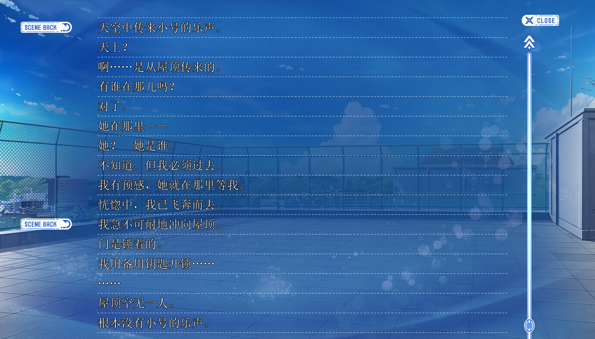
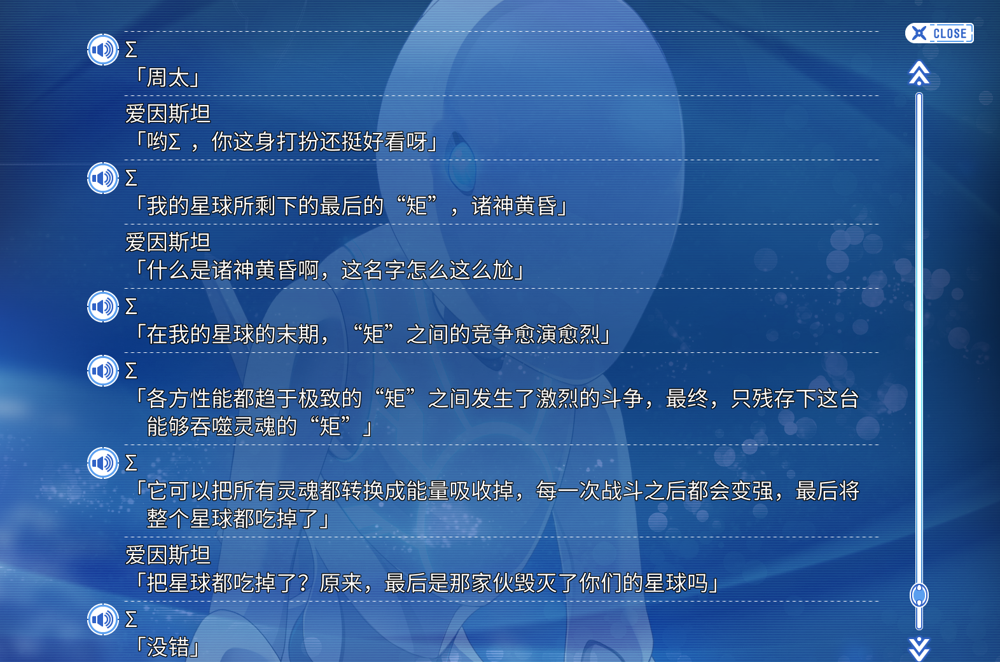
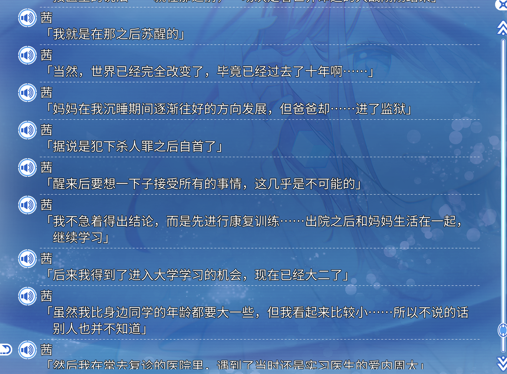

谁家钓鱼反串哥，笑死我了

20 年前夏天彗星降落，男子此时没出生却有印象。彗星继而导致了**彗星病**，无从下手的病，彗星缠绕着未知的能量，在坠落时将其散布在了地球上，据说正是那种能量招致了奇怪的疾病。主要的症状是重度的头晕目眩、感知障碍以及记忆障碍。在最坏的情况下，人会在昏睡状态下死去。有的人还会获得超能力。但是很不巧，彗星病带给我的只有重度的头晕，以及很少见的感知障碍。

曾经有人这么评价男主：“你，理解不了别人的想法“

男主的病恶化了，突然晕倒

男主亲属只剩他叔乡田：“但是说到你的亲戚，那也就只有我一个了”

乡田的研究团队：“现在马上转移到筑波的医院，接受我们研宄团队的处置”

爱内周太：彗星病患者、网络冲浪钓鱼取乐、嘴遁强者、不愿跟人交往、孤僻、没朋友

有村路美：高中生、发论文、跟男主同一学校、抢了男主的第一名、经常不来学校、跟男主不同班、“我····比较怕生”

“她定能让我有所收获一一我的直觉是这么告诉我的，虽然毫无根据” 这就是真爱的力量吗？

路美如何知道男主的联系方式的？我去他是怎么监视男主的吗？：

> 谁发来的？发件人栏上没显示名字。是个我不认识的由《箱地址。邮件标，题那栏也是空的。大概只是个骚扰邮件吧···听说你在找我 J 我的名字是有村路美 J 我在科学特搜部的活动室里。一有事的话请过来找我」一「这是」有村路美发来的？她反而拿到我的联系方式了··虽然她也应该知道我在找她，毕竟我这么光明正大。

路美论文：“引发彗星病原因不在大脑里，而在别的部位”

男主不相信：

- 「谁都救不了我」周太「表面上说会尽力生但其：实一己经无计可施了」「他们最后只用说一句我们尽力了·一··就完事了」周太「你让我把这唯一一条命交给他们，我做不到」「确实，他们构建的理论体系庞大又复杂」周太「也许比个人的研究更为客观和进步」「叔叔也没说“相信我”或者“相信我们”」「说的是“相信我们构建的理论体系”」周太「还过，．．一我不想把最后的希望寄托在这所谓的体系上」

却愿意相信身为“陌生人”的路美

路美给出帮助男主的条件：“请相信我”（人与人的信任还是基于爱的信任吗？）

路美不向男主解释：“而是因为解释了以后，对你的治疗就失去作用了”

路美一直在背后默默关注男主：「最后说一句，根据我的诊断，你剩下的时间己经不多了」

坂下唯唯莱怎么就突然加入了？

关于灵魂与男主父亲与男主：

- 「然后，我明白你为什么要抓她这根稻草了」「她相信灵魂的存在」「虽然灵魂存在这个观点己经提出十年以上了·····」「但这套理论现在还属于超自然的范畴」「也有不少学者尝试过研：究这个领域，但现在还没人能确切证明灵魂存在」「就像你爸爸一样·你自己也是因为这个·····」一

男主赌注路美有别的理由：“只是种类似直觉的感觉”（爱？）

剧情设定中，人类已经研究明白了人脑，但：

- 人的自我究竟是在哪里形成的呢？尽管人们己经掌握了大脑的构成，但这个问题还是没能得到解决。当查明了大脑的各种功能后，人们发现大脑中枢；中进行 ' 着某种奇异的活动。大脑时刻与某个对象进行着交流。这种功能在大脑最深处进行，接收某处的信号后将之传递给身体，就亻象转换装置一样。也就是说，我们的认识中构成自我的根本性信息并不是由大脑发出，而是由和大脑交流的某物发出的。而大脑不过是负责转换这些信息、传递给神经的装置而己。向大脑发出指令的某种东西尚在迷雾彼端。人们将其称为一一灵魂。然而，许多学者试图对这种东西··灵魂进行研苏却一无所获。我们的大脑宄竟在和什么交流？我们的自我意识，究竟来自何方？灵魂。一它还只存在于理论中，就像暗物质一样，现在还仍旧是个谜．。
- 路美 f 当城中亮起灯火，空中的繁星便黯然失色 J 周太「什么？」路美「我们很快就会见面了·」

 路美：「我相信灵魂是存在的」「我认为，彗星病的病因并 ' 不在大脑，而是我们的灵魂中产生了某种异常」「通过脑波检测，我发现彗星病患者的脑波要比正常人紊乱，亳无规律性」各美「也就是说，他们的脑波中混杂着大量干扰信号」「这些信号可能会对大脑造成负担，最终损害其机能」而在大脑内却没有找到产生这些干扰信号的原因，也就是彗星病的病因。病因究竟在哪里呢。就在大脑另一侧的未知．领域···灵魂里。

「“自我”其实并不能独立存在」「它需要在与他人的接触中形成、加固」「又或者，灵魂本身就带有这种性质」

「要在城中点亮灯火，这样，夜空中的星光就不再明显了来自天外的彗星之光也就失去了它的力量」

生的实感：男主曰“只有遐想这些东西的时候我才有自己还活着的实感”

“灵魂”是否也意味着存在感，暗示男主的灵魂因不与人交往的封闭正在消灭、个人的存在正在弱化了？：

- 一我突然想起了科学特搜部活动室的空调。它为什么；会识别不出我呢。一想到这个，我的思考就停不下来了。忌思是我的存在感很低吗。把存在感低的坂下（个人印象）叫来试试吧。如果连坂下都能感应到，那为什么我就不行呢···这事可越来越怪了。

 空调启动了。明明我不行，猫却可以？？这是怎么回事。

「我考虑到你可能会宅在里面不出来··」「就设定了人脸识别功能，只要检测到你就不会启动」【原来是路美搞的鬼】

    凉爽的风像是在安慰我一样抚摸着我。空调启动了？就像是，对着吃了许多苦头后的我认输了一样。那个空调或许装载了能读懂人心的传感器吧。【路美见男主执意拒绝与人交流后的无奈之举吗？】

    

    我···“·讨厌和人相处。肯定连我自己也包含在内。【讨厌他人的交流封闭内心也是在拒绝自己的存在吗？】

    

    “我只是发现，我己经对很多东西感到厌倦」【宛如绝症病人死前对一切的无望和颓废吗？所以说恢复病情最重要的是心态？】

    

    不过，做了手术以后，我的状况确实好了些。亻旦是·····我总感觉自己的思考好像迟钝了一些。、会经常感到呆滞，仿佛大脑蒙上了一层迷雾。产动脑思考就浑身难受。又叔说，过段时间会缓解的。可过了段时间，症状也没见好转，我也就渐渐习溃了这种状态。天看看书、看看一电视，时间就这么流逝着。不久后，就连读书、看电视都会让我感到疲惫。我的日常渐渐变成了到外面散【做了什么？这是被当成小白鼠了？】

    

    我发现有个女孩看着我。少女身材娇小，戴着一顶很大的草帽。她从帽檐下用大大的眼睛盯着我看。谁啊？当我和她对上视线，她微微一笑。接着，她走到了我的面前。【路美为什么会来？之后了咋样？还是说对于bad end不需要思考太深？】

    

路美她真的好温柔，总是想着拯救男主啊。。。:

- 到这儿来之前，尽管数量不多，我应该也是有熟人的。
 可现在，当我想回忆起他们的面孔，又哪个都想不起来。
 这让我感到一阵寒意。
 我来到这里以后····不知不觉间，失去了很多东西。
 失去了思考能力、失去了记忆。
 这样的我·…还算是我吗。
 对了.….．
 我又是谁。
 我是……

?？?「我……是谁……」回过神来，我已泪流满面。

    少女「你不能再待在这儿了]

    周太「为什么」

    少女「为所有]

    少女「再这样下去，你真的要从世界上消失了」

    少女「你希望这样吗？」

    周太......

    周太「不要.....

    周太「我.……」

    周太「我····对谁都喜欢不起来」

    周太「也根本不喜欢这个世界」

    周太 但我也不想就这么消天」

    周太「我能舍弃很多，但不能舍弃所有」

    少女「那你就不能再回到设施里去了]

    少女「从这儿一股脑向前走吧」

    少女「路上会有一片市区」

    少女「去那里，取回你失去的各种东西」

    少女「现在还来得及」

    周太

「你是谁？」

    少女

「以后，你要想起我一一靠你自己的力量」【这句话在 FD 是不是也对路美说过？】

「我会怀着满心的爱。为你——只为你祈祷 永远、永远

【男主为何最后会变成机器人（爱因斯坦）？】

    少女向前走去。不远处，有一台机器人。少女带着那台机器人，消失在了向日葵的另一侧。看着她们离去·【还是说此时的“周太“（叙述者）和机器人分离了？其中一个象征本体或者肉体一个象征灵魂？】

唯唯菜线结尾 ed 是 messiah，其他线似乎都是….星

黄毛线最后：

- 那时候，我就不再是我了吧。
 乡田「····嗯。我们叫这场手术“食星”】
 食星？听着好可怕啊。

 乡田「嗯。“食星”是我们开发出的人造脑]

 乡田「它会在你昏迷期间连接你的灵魂，消除其中彗星病的诱因」

 灵魂？嗯？叔叔不是不相信灵魂存在吗？

 乡田「顺利的话，你就能摆脱彗星病这种怪病」

 乡田「但是同时，你会失去你持有的钥匙]

 钥匙？钥匙是什么。

 乡田「打开通往**新世界**的大门的钥匙」

男主没有选择开门。终究还是利用了男主，这大概也是单身线后的结局。所有人都在演男主，都在想利用男主，即便是要拯救男主的路美,,,有点楚门的世界的味道了，弱小的男主只能被暴打了（不过没有初雪樱那么憋屈废物就是）

“路美「我把他们想得太善良了」「他们是能用更稳妥的方案治疗你的」「但他们想的终究不是治好你」“果然要听路美的话啊！相信路美！我的神！所有人都打着你的注意利用你，可却唯有路美——少女仍重视着你想救你——即便救不了也愿意与你一同殉情啊，这该死的至死不渝的爱啊

为什么没有开门的结局？为什么没有 scheme 线？为什么非得留在地球不打开新世界的大门啊！？

## 坂下唯唯菜

时不时会被家人遗忘，是否也表示灵魂受到了影响或干扰？类似男主的彗星病？不过后面剧情在路美解释下似乎否认了这点

也太可爱了吧

新岛夕你也是玩上梗了 hhhc

不想被遗忘也是证明自身存在与强化灵魂的一环吗也就是点亮灯火吗？

只有男主能看到唯唯菜，若是连男主也忘了，那唯唯菜还算存在的吗？

玩到在大海那里，一片蓝色和清新的画风，还有水月陵的《blue memory》莫名有种伤感与悠远又有种“山雨欲来风满楼”的感觉

唯唯菜人也好好啊：

- 「我现在光自己的事都顾不过来了·····
 唯唯菜
「但如果这些事都有了着落，我想帮助你，向你报恩]
 周太
「帮我？帮我什么啊」
 唯唯菜
「我也不清楚。但我感觉你遇到了什么困难」
 唯唯菜
「我感觉你其实·····根本没有余力帮我」
 唯唯菜
「这几天一起生活过来，我有这种感觉」
 周太
 o0...
 周太
「没什么，我只是闲的没事干」
 唯唯菜
「是吗。那就好·.」

所谓喜欢与爱，究竟何物了？现实中一群十几岁的小孩未尝不是照猫画虎的模仿了？但若深究其定义又能寻得什么吗？：

- 唯唯莱「……喜欢……」
 周太「把这些挂在嘴上的人真的理解这些东西吗？他们不只是在电影、漫画里看到
 过，然后在现实里照猫画虎么？」

名言：

- 周太「一起努力吧。不过，只有我一个人还是太无趣了」
 周太「世界上有很多有趣的事」
 周太「单方面地探寻这些也并不快乐」
 周太「只有相互了解，才会有存在的概念]

相互了解、相互交流、相互产生联系，灵魂才得以延续不至于消散，自我才得以存在，这应该是贯穿全文了吧。人从何处来又从何处去？首先人的前提就得是发生联系与人间。

当承认自己在做梦时就会醒….

丧失感或者说遗忘了重要之人，跟夏梦渚很像呢，终归是一场梦吗？：

- 对了，我是要坐船去小笠原群岛。
 去做什么？
 对了。我是束手无策··…·
 为了以后能正常生活下去，才会想来这里碰碰运气。
 真是徒劳的挣扎啊。
 船还未靠岸，我就感到莫名的无力。
 我下意识地看向了自己的手心。
 不知为何，我有种莫名的丧失感。
 我好像失去了什么…
 一直紧握着的、某个十分重要的东西。

梦终究会醒，醒来之后便只剩难以可循的断片和失落，可遗忘和白梦一场，到底谁才是真的了？

我去，之前说只有男主有备用钥匙，而唯唯菜却也能进来，就是在暗示是如梦一场？

“我，一定会找到你” 这句话也同时贯穿了主线以及 FD 吧

“人的记忆真是不靠谱” 君名味道有了，果然与记忆、梦、遗忘总是息息相关了

唯唯菜是获得了心灵感应能力的彗星病患者，彗星病会放大患者（“过载个体”）本身的能力（被误认/通称为“超能力”）。沉睡的唯唯菜用心灵感应向周围发送电波，使相关的人共梦，但唯唯菜本人的和周围人的梦都醒了，所以醒后周围的人便会忘却。跟夏梦很像，但区别在于，这里是通过梦影响现实，而夏梦种确实是相关的人都睡着在做梦，并且夏梦女主七濑步是读心（接收），而唯唯菜是强制发送自己的想法给别人

乡田是彗星机构的人：“你才刚处理完任务，回房好好休息吧” 所以在单身结局里男主是被诱骗过去利用了纯粹？为什么被利用？目的？

正是因为唯唯菜在做梦（被动的，或者说非主动的做梦渴望普通生活）借此体验没有过的生活，所以当初才会无条件答应男主的入部请求！？

包括唯唯菜也因为过载个体受不了环境过不了正常生活所以加入了彗星机构打工（给钱吗？）其实选择这个仅仅因为其他地方没有容纳她的位置、她也认为自己刚好适合这个而已——实在悲惨啊

救他人（抽象的集体或概念）不如救自己，救身边的人，救自己所珍视、重要的、具体的人（表扬路美）：

- 周太「你愿意把灵魂浪费在这上面吗。你真觉得这样有意义吗」
 唯唯菜「只要我努力，就有人能得救」
 周太「有人？什么人啊」
 唯唯菜「我也不知道具体是谁····可拯救世界不就会有人得救吗」
 周太「哼」
 周太「谁都觉得救人是件好事」
 周太「但是，如果连自己都救不了，那就毫无意义」
 我说出了一番文科生喜欢的那套无聊的空话。
 不过也总有些时候需要用这些套话来过渡。
 这么看来，文科的玩意还真不能小瞧····还是先不想这些东西了。

男主得到了唯唯菜能力，像别人发送自己的心里（变态）想法，好想看到他对路美使啊 wwww

“不知道为什么，我觉得和她在一起的时候，我是最不会想歪的。因为她是少有的能和我理性交流的人。“——可恶，是因为路美很娇小吗？！不，肯定因为路美拥有着知性少女的魅力，还是幼驯染 www 太可爱了

理解与认同最为重要，所以男主主动选择亲历唯唯菜的痛苦 ww 伟大

“我第一次····怎么说呢，找到了我该做的事情”——找到了爱，找到存在的意义、灵魂得以聚集稳固，所以人总是生于虚无却无时无刻不渴望在虚无中寻求美与价值。太感动了，“人类是为恋爱和革命而生的” 用这句话评点新岛夕的恋爱故事太合适啦

“总不能让你一个人吧”（男主凭借心灵感应怒吼传出的）——因为阿姨洗铁路。理解之爱，人与人之间最重要的理解啊

男主遇到唯唯菜时谎骗说找她的原因是因为“普通”，可偏偏“普通”是唯唯菜一直所渴求的。

“把本该有你的世界还给你”

“「谁都需要在世界中找到自已的一席之地和应尽使命，这是构成人格的必要因素」“——意识产生的必要之一嘛

“就让两个孤孤单单的人一起重新开始吧”好熟悉的啊 ww

“他最后的举动也不过是救了个女孩罢了，仅此而已。”——那也足矣

男主也很渴望普通的生活啊

界狩萤——唯唯菜的真名

周太救下唯唯菜后并没有死，一直在（被拐去）彗星机构的基地里沉睡——又被利用了。。。？

“我们约定过——不会再放手”于是唯唯菜重新连接在基地的自己的“矩”救回了男主（跟主线也好相似）。文末提到“救世主”（唯唯菜的矩大概）突然**小笠原群岛在**激活，并遭到奇袭（彗星机构力量还是其敌对力量？）并与另一支力量（敌对力量，大概率是路美领导的那支）会和后劫走周太逃往太平洋方向，之后周太与唯唯菜再无踪迹可寻，大概率是隐居过着幸福生活了？新岛夕笔下女主无论是真女主还是优秀个人线女主，留白总是太多了，不仅留白结局还有很多重要事情和暗线也留白，也不（很难）提供女主视角，果然是 gal 界川端康成啊…

路美线中：

- 周太「什、么」
 唯唯菜「她一定会伤害到你]
 周太「…坂下」
 周太「我不清楚你都知道些什么」
 周太「不对，我有种感觉」
 周太「你全都知道」
 周太「所以你才真心来警告我」
 周太「但我不能听]
 周太「我已经没有回头路了」

果然无时无刻都想着周太啊

## 鲸

男主一直知道鲸，且是七年前

彗星带来了鲸，并找到/认可了男主 “只要我想，我就能和彗星·····和“鲸”取得连接。”

“它有点像网络空间，虽然本身宽阔深邃，要直接从里面挑东西简直是大海捞

针，但只要知道要找什么，找起来就相对容易了” 知识集合体？

## 爱内周太

紫毛曰“世界公敌”

那确实牛逼：“他连接的是远超我们想象的、遥远星球的记忆”

## 有村路美

周太的主治医生一号、恋人、幼驯染

其他线的路美好惨 尤其是那俩个次要女角色线，路美终生未嫁啊 wwww

男主经历了其他所有线，所以获得了路美认可进入了路美线吗 hhhc

你就是馋路美身子 www

“怎样都好，反正我也不指望你把我当成女生看待”——路美好可怜

可爱的路美啊（虽然感觉有时立绘和声音来看有点像小 loli，但耐住她的知性美 ww）：

- 周太「哦，闹小情绪了吗」
 路美「才没闹」
 周太「闹了吧」
 路美「绝对没有」
 周太「哈哈，这不是在闹吗」
 路美「没闹·…．…
 路美「哈。这一唱一和的。我们是小学生吗…？」

当然是 attack 路美呀！虽然你可不好攻略！

- 路美「真的？那就好办了。快点 A t tack 她吧」
 周太「啊,Attack 啊·..」
 这词也太羞耻了，你就不能换个吗。
 路美 Attack 她 Attack
 周太「哦，哦哦」
 难道说她很中意这词？
 路美「你觉得谁有可能会被攻下呢」

路美是天真到这么想帮助男主还是想帮助男主脱单啊 www 太单纯的一只了吧 ww

我也想让路美辅导我学习/(ㄒoㄒ)/~~

主线前面经历了些许与唯唯菜线（果然这线没白重新玩）类似的剧情，但路美主动就牵扯进去了，果然唯唯菜线很重要

怕生、紧张却会在网上使用多国语言与人交流的天才少女路美太可爱了吧 ww

不擅长运动的路美酱超可爱 ww

路美经常住在部里：“我这里有电饭煲和锅哦。你们去买东西的时候已经准备好了 因为我经常住在这儿，所以要在这儿做饭”

不喜欢吃方便面但也很馋：“真的很好吃啊。我虽然不是很喜欢方便面···但这个····真的很好吃”

唯唯菜曰：「总觉得·····路美就像爱内的妈妈一样呢」——果然是母性萝莉/少女啊

路美害羞了欸：路美「你靠太近了」周太「这样啊」路美 也别抓着我的手 周太「是你抓的我吧」路美「不是」路美「别抓着我手] 周太「是你抓的我吧」路美「欸欸欸」

真是全能的天才啊：路美「没事，我有备用钥匙」周太「啥····你怎么有那玩意」路美「我做的」

路美「我时常会跑到屋顶上去想事情」

路美线的男主没拯救唯唯菜 但选择为其创造了美好的回忆：

- 唯唯菜「谢谢你能带给我这么快乐的夏天」【这话也实在是太像夏梦了啊】
 周太「突然怎么了·」
 唯唯菜「我想起自己的事了。已经全想起来了」
 周太「坂下……」
 唯唯菜「你也知道我的情况吧」
 唯唯菜「我……」
 唯唯菜「我马上就要消失了」

 唯唯菜「所以，在我消失之前····谢谢你给我带来了许多美好的回忆」

 周太「抱歉了」

 周太 [没能从本质上解决掉你的问题]

【BGM：Mysterious origin】

男主知道路美带有目的性，但也愿相信她，这就是幼驯染的实力吗？：

- 周太「她是个聪明人。她也应该知道，自己能做到的也就这么多」
 周太「大概·…她还有其他目的」
 周太「但我也不知道这到底是要根治我的彗星病，还是其他什么东西」
 周太「她现在不告诉我，那应该是根本不打算告诉我了」
 乡田「可你….…」
 周太「即便如此，我也相信她」

 …

 或许这就是所谓的儿时玩伴之间深厚的情谊吧

 亦或者是她的人格，让我单纯的选择将信赖托付与她罢了

爱内周太曰：人本身就不是那么容易改变的生物。

可爱的 scheme 来救场了：

- 周太「是嫌少吗？」
 我又加了两张。
 奇怪的女人Г.....」
 又被推开了。
 非得要万元大钞？
 奇怪的女人「我刚才用了能力，肚子饿了」
 周太「···啊，这样啊」
 周太「那去食堂吃点东西吧」
 奇怪的女人「我没有拒绝该提议的理由]
 周太「你说话可真够绕的。是要去吃饭吧」

 …

 周太「你家在哪」

 奇怪的女人「？？？

 周太「你的 H ome 在哪儿」

 奇怪的女人「家是 Ho me 的意思」

 周太「是啊」

 周太「所以你家在哪儿」

 奇怪的女人「哪儿是什么」

 周太「你能不能说人话啊」

 奇怪的女人「？？？

【天然呆呆的感觉可爱 desu】【好想跟着 scheme 跑路】【路美一走，scheme 就出现保护周太也太会看准时机了吧 ww】

打开新世界的大门交给了周太，scheme 来自遥远的宇宙终于抵达了地球：

- 我指的是字宙。我来自···遥远的地方「我们的母星已经灭亡了」[但是它的信息却被送入了宇宙]「经过漫长的旅途，这些信息终于抵达了这个星球」「我们在海里等待着与人相会」「最终，我们等到了你」「你出现在了那里，并且有着能与我们交流的能力」[所以，我们便将钥匙交给了你]「你就是继承人」

scheme 等在七年前夏天救了坠海的周太，scheme 在海里、在鲸里等待着继承者（这选择是不是有点太随意了？）

scheme 曰：“但是时间已经不多了一所以你的灵魂必须做出快择——“这里是指男主命不久矣或者说灵魂快要消失了？

scheme 消失后男主疑似晕倒，但是不知道男主被谁搬回了家（路美说不是自己）或者自己走回来的。路美因为联系不上所以来男主房间了

“她是来见我的，还打算救我。我并不清楚她的真实想法。”显然既是来见你也是来救你的

“尽管如此···当她在我身边时、我就会产生一种莫名的安心感。一种让我觉得一切都会好起来的安心感。不管她到底是怎么想的，这个名叫有村路美的少女一定会拯救我的。”该说是母性还是说知性了，这该死的安全感与人格魅力

周太是在七年前去了群岛后回来住院昏迷，一段时间醒来突然得知确诊重度彗星病，并且病程很深

男主大概率就是在这时养成了孤僻和与世隔绝的性格吧：

- 周太「之后，我就一边在医院接受检查，一边过日子」
 周太「那时候过得还挺好]
 周太「早上起床，吃完早饭后接受简单的检查」
 周太「那之后，我便在规定的时间上网课」
 周太「上课的时候基本都是老师一个人在讲话，看得出应该是某个学校的直播，偶
 尔也有录播」
 周太「我就这么每天都看着同一个班的学生上课，半年过后，我甚至把班上每个学
 生的名字都记下来了了

之后四年，乡田让男主该回归正常生活，于是在安排下开始独居并在现在学校就读

路美与原生家庭母亲有重大矛盾：

- 路美「其实，后来····你给我介绍的旅馆老板对我很好」
 路美「还收我做了养女」
 周太「养女！？还有这么一回事啊····啊，对，他好像就是姓有村来着」
 路美「不过事情并没有那么简单。我的母亲不想放手，还雇了律师进行了好几次交
 涉』
 路美「我也好几次回家……」
 路美「可还是没能修复和她的关系」
 路美「最后，我就离开了她··」
 路美「她追得真的很紧，我也老是心软，给有村叔叔·····添了很多麻烦」
 路美「所以最后我为了不让她找到我，就连名字都改了]

 路美「这样，我才能和她拉开距离」

 路美「后来····我妈···．怎么说呢·．·．得了一些心病」

 路美「她早就有这种问题了」

 路美「在我离开她之后，她就崩溃了」

 路美「甚至没法和人沟通]

 路美「连我去探病，她也认不出我来了」

于路美而言，也很悲惨和孤独但却又坚强甚至还想拯救行将就木的周太。

路美父亲是有名的研究者（乡田，即男主他叔），出身于杰出的学者家族：

- 路美「我妈妈出身平凡，他们结婚的时候受到了家里很大的反对」
 路美「迫于压力，他们就私奔结婚了」
 路美「当时他们相互安慰]
 路美「想着如果他们的孩子能成才，就能得到家里人的认可」
 路美「然而我出生之后·····却辜负了父母的期望，成长比一般的孩子还要慢」
 路美「我三岁的时候还无法做到其他同龄孩子能做到的事」
 路美「这时，我爸爸又不见了」
 路美「我妈妈就觉得自己和我被抛弃了]
 路美「都是我不争气，爸爸才走的」

 路美「她把不甘都发泄在我身上，以保持心理平衡]

 路美「但是，我想，在这么做的同时，她也在伤害着自己」

 路美「她越是埋怨我，自己就越失常····」

 路美「我抱着如果我更优秀，她就会对我温柔以待的想法，发奋学习

 路美「这样是有效果」

 路美「只不过是反效果」

 路美「她对我的埋怨更重一层」

 路美「就在那时，我与你相遇了」【七年前】

 路美「我们一起进行了奇妙的冒险]

【BGM：red memory】

【之后路美寄宿在男主引荐的有村家希望母亲冷静一段时间，但之后再次见到时就认不出路美也认不出很多东西了（阿兹海默？）】

【而在现在时间线的四天前路美被告知母亲病倒昏迷于是离开东京去了千叶】

【之后突然醒了并记起路美：】

「茜·…对不起，我没能当好你的妈妈」

    路美Г·....

    路美「我没能否认她的话」

    路美「我没能告诉她·····你是一个很棒的母亲」

    路美「这是为什么呢」

    路美「既然这样，那你就做个普通的母亲不就好了吗」

    路美「这件事真的就那么难吗]

    路美「无论我怎么想都想不明白····」

【男主看法：】

    周太「我觉得她对你绝对没有恶意」
    周太「我觉得她对什么事情都有很强的胜负欲」
    周太「自己拼尽了一切却还是没有回报，这才是使她崩溃的原因」
    周太「这当然不是什么值得称赞的事」
    周太「现在再回过头去想·····我觉得她当时并没有针对你的恶意」
    周太「那时候我们还都只是孩子，心里只有恐惧这一种情感」
    但是，随着她忘记一切，那份执念也烟消云散。我想这肯定会很寂寞吧。

    

实在是太过坚强啊，坚强还知性的少女果然最惹人喜爱了

路美曰：「谢谢。那既然这样，你也要相信我」「你不会死的]——这该死的安全感

此时男主时限已不多，选择是要么拼命挣扎活下去要么平静迎接死亡

之后路美说在男主症状稳定前都会留在男主家里（真爱了啊）

不服气的男主，和全才的文理兼备路美：

- 路美「我为什么要这么做啊」
 周太「为了死守第一名」
 路美「唉·…我真是服了你」
 路美「你是有多敌视我啊」
 周太【话说回来，你的数学和物理好我倒是可以理解，为什么语文也能拿高分？小
 路美「我多少还是看过点书的」
 路美「文学、历史都有看」

【甚至还会做饭：】

    周太「话说回来····你和菜刀还真是不搭调啊」

    

    路美「有你这么说别人的吗」
    周太「不是，这种居家型的气质和套个白大衣做实验的气质完全相反嘛]  
    路美「唔··…这么说也是」
    周太「别切到手指了」
    路美「没问题没问题  
    路美「来，请吧」
    周太「这是……中华冷面啊」
    路美「嗯」
    周太「本来是简简单单一道菜，给你做得还真豪华」
    此外，还有手工虾仁烧卖、木耳拌豆腐。
    每一样看着都做工精细，全部加起来应该花了三十分钟左右。

    

男主评价道：“原本还以为她是个只会做研究的笨蛋，居然这么多才多艺”——我也好想有路美这种老婆 ww

喜欢恐龙的路美：

这可太贴心了：

- 路美「透气性其实还挺好呢。而且我受不了空调，或者说是受不了冷」
 路美「我也不能让你把空调调高嘛」
 路美「之前来的时候我就感觉，你的空调温度比我的低不少！
 周太「不用这么客气··…」
- 那个夏天的事情，我明明已经决定要埋藏在记忆深处了。
 但不可思议的是，唯独那晚的天空在我的记忆中如此鲜明。
 那天晚上，我和她一起看着漫天星空。
 那时的我·一··感觉自已无所不能，可以把世界、把这片星空都纳入手中。
 后来，感觉变成了现实
 以我最重要的东西交换。【是指男主得到了钥匙以及鲸连接的能力但失去了亲人父亲吗？】

路美随便说句话都会让人很震惊啊：”周太「你的钱是从哪冒出来的」路美「我手里有几个专利··· 周太「好了好了，我不想再听了」” 还有 “路美「昨晚有个印度大学生社团研讨会邀请我去参加····就这样啊」“

有时真得跟小学生一样呀 ww：“路美「要是有优酪乳就帮我买一份吧」” 甚至还会自己自制控制甜度 真是怪人

甚至还是语言学天才：

- 路美「除了他们，我还和一个瑞士的学者挺合得来，经常讨论的】
 周太「唔唔唔]
 路美「你瞪我干嘛」
 周太「对了，你会几国语言」
 路美「谈不上会，也就能简单地表达意思而己」
 路美「只要能聊得成研究就行了」
 路美「按这个标准算，应该有二十种吧」

甚至还会唱歌剧：“路美「自己唱歌剧感觉好畅快」路美「下次我一个人来试试吧··.··」

在中华料理店打工的路美：

爱护环境的路美：

看 SF 和文艺作品的路美：

统计学顾问 帮助模特拍照，好奇怪的搭配和工作啊 ww：

路美也太不坦率了：

男主的小心思把捏完了 hh：“路美「你从小就要强，既然你已经努力学习了，就别去计较区区排名了嘛」”

甚至还有奖学金：“对了，我是要拿奖学金的，必须保持成绩才行”

“为什么呢。为什么我会感觉心里少了块石头呢。她交到了朋友，跟我有什么关系呢。”那当然是吃醋了啊

“**「她拯救了我的生命，我庆祝她的生命？就是所谓的你来我往吧」**”不是文科生却有文科生一般的嘴

- 【人在经历太过痛苦的事情后会无意识地选择性遗忘以至于才能活下去】

 周太「说实话，我已经想不起来究竟发生过什么了】

 路美「欸？」

 周太「我把那些回忆都扔进深海里了」

 周太「如果不这样，我自己就再也浮不上水面了]

【周太此时还并不知道眼前的路美跟自己一样没有未来，，心疼】

    路美「嗯....」
    周太「反正未来一定会来临，就没有一件想试试的事情吗】
    路美「····假设我还有未来的话·····也不是没有想做的事吧」
    周太「哦。什么？」
    路美「…不。我不说。说了你会笑我」
    周太「不会不会」
    周太「等等，有那么不好意思么」
    路美「是挺正常，但你会笑我」

    

    路美「**如果，我还有未来**」【“如果” 此处已经开始立flag暗示路美身世了】
    路美「我.」
    路美「**想当一次母亲**」
    周太「嗯？」
    周太「…嗯？？」
    周太「为什么」
    别说笑了，我甚至理解不了，都反应不过来。想当母亲？这啥啊。看她的意思也不是保姆之类的。
    路美「为什么..．嗯  
    路美「我大概是想填补母亲的遗憾···想完成她的愿望吧」

    

【所谓 童年的阴影和遗憾需要一生去治愈啊 或者说自己没有得到的幸福却想让别人得到 这般心情或者说爱实在伟大】

    周太「所以你想当一次母亲？还是不懂啊」
    路美「怎么说呢。这大概就是我能尽到的孝心吧。嗯··就是实现父母没能实现  
    愿望」
    周太「我不知道该说你认真还是····说实话，我感觉你刚好反过来了啊」

    

【此时的周太真是啥都不知道啊….果然不能理解对方但也无可厚非，路美独自承担这么大实在是太坚强了，周太依靠着路美，路美却无所依靠…..】

    周太「不过也挺好。你生了六个孩子的场景还挺好笑的」
    周太「就向着这个目标努力吧」
    路美「你的标准是好不好笑么」
    周太「对」

    

    路美「我也只是想象一下而已」
    路美「我根本就想象不出未来，也不想想象」
    周太「但你和我不一样，你的未来总会到的」
    路美「是么」
    她到底怎么回事。
    她对未来也太悲观了。
    我是明白的，就算你什么都不做，未来也会自己靠过来。

    

【实在是贴心，果然是母性啊】

    周太「这样一想，明天过去肯定没什么好事」
    路美「即使这样，你也要去？」
    周太「嗯。去」
    周太「但我还是不太想带你去」
    路美「嗯··谢谢你关心我。但是我没关系」
    周太「你哪来的这自信」
    路美「你看，我很聪明嘛」
    周太「这是哪门子解释]  
    路美「就是说，我考虑的比你想象中多」
    路美「我也说过很多次了，不用担心我，专心面对你自己的问题就好]

    

【新岛夕这该死的文笔；BGM：blue memory】

    **简直像在星河里漂荡。**  
    **这次可能一去不返。**  
    **第一个在宇宙中泛舟的人也是这么想的么。**  
    **天空就是如此广阔。**
    

    当时，我们初生牛犊不怕虎，划船上岛。
    白天出发，上岛时天已经黑了。
    我们哭丧着脸，头顶挂满了星星  
    我们多么恐惧，多么不安。
    天空中闪耀的满天繁星···  
    和映照出星星的少女的眼睛。
    也许那时的我们离天空更近。
    那时候，仿佛只要伸出手就能抓住星星。
    可现在，我实在是提不起心情去感受这份浪漫。

    

救世主唯唯菜曰，彗星并非陨石，而是信息体，并且藏在群岛海下拟态成鲸，是某一遥远且远超地球的文明的诺亚方舟对于人类也是方舟，存储着远超人类想象的知识。彗星机构负责监视，防止有人靠近，周太的钥匙是用于释放鲸的知识，机构因此会想追杀或打男主的主意，机构认为释放彗星会招致世界危机（啊？）

紫毛也是过载个体，并且是 hongkong 人

都说了路美想得可周全了，该死的安全感，还有万能的网友：

彗星机构把男主引到群岛并试图“杀死”是想引出/逼出鲸（那要不去就没法接着写了吗？还是说不去相当于平静迎接死亡？所以男主选择死前刺激一番的冒险？理由也不充分啊）

**到底是为什么了？看来男主在这一夏天坠入爱河了：**

- 她自己也知道，和人交流也没法从根本上解决我的问题。
 但是，这个夏天····她为了让我继续活下去而东奔西走。
 她做这些，到底有什么目的。
 周太「不知道」
 周太「我怎么可能理解别人的想法
 声「所以你就放弃了？」
 声「因为理解不了，所以就放弃理解？
 周太「当然·不能啊」
 周太「路美···我当然想知道她在想什么了」

 周太「我想更了解她·…

 周太「所以我昨晚才和她说了那些」

 想更了解她。她为什么为我做这么多。有没有什么我能为她做的事。

 向未知的世界

 伸出手吧。

 有村路美．．．．

 你要活下来我想…更了解你。

路美的目的到底是？

- 路美「周太，对不起」
 周太「啊？」
 路美「七年前····后来，我去医院找过你」
 路美「但是我什么都没能做到」
 路美「我总是被你帮助····」
 路美「却什么都做不到」
 周太「你在说什么啊」
 都到这个点儿了，还说些怪话，真是个怪人。
 周太「你还真是个笨蛋啊」
 周太「你大概不知道」

 周太「我有多感谢你吧」

 周太「我想了想」

 周太「你昨晚说想当母亲对吧」

 路美「欸」

 路美「你现在说这些干什么？那是我·…」

 周太「我觉得那样也挺好的」

 周太「但你得先做个女孩子啊」

 周太「就是说，去恋爱、去和别人交流」

 周太「这不是你说的吗，给城里点亮灯火」【当初说的话又还回去了，礼尚往来好一个】

【然而无论是对于男主还是路美还是唯唯菜或许离普通人和普通的生活实在太过遥远，并没有普通人所有的普通的未来….】

    周太「你对我说来说去的，自己不也完全做不到」
    路美「我不行的」
    路美「个子还矮……」
    周太「哈哈」
    路美「你、你笑什么啊。有什么好笑的吗」
    周太「你也有这种普通人的自卑啊」
    周太「这已经很像女孩子了啊」
    路美「才不像呢」
    周太「别这么说嘛」
    周太[你也有可爱的地方]

    

    路美 什、什么？？为什么现在说这些？？！
    周太「我以前就觉得」
    周太「你不是只有脑袋聪明，人也很好，一定能找到一个不错的对象」
    周太「我保证」
    周太「其实……」**周太「其实，我也爱上你了啊」【这该死的突如其来的表白，这就是吊桥效应吗？那也无所谓了。在城市中点亮中灯火最终寻找到了你，想要了解你】**  
    路美「欸」

    

【因为你的存在，所以我追寻到了存在的意义，我知道我从何而来，又从何而去】

    我抚摸着路美的头。真小啊。她的头脑里有一个小小的字宙。

    这个夏天，我一直在想这些，是什么时候开始的呢。
    想要了解她。
    想要靠近她。
    想要……守护她。
    我不理解别人的想法。
    但如果意识到它的可贵·．·．···  
    我也许就能在生活里自然学会怎么理解它。
    这个夏天，我才意识到这一点，实在是来得太晚太晚了。
    这都多亏了与她的再会。

    

【在坠入爱河才有了生的实感，生于虚无而脆弱的人们，彼此发生联结才得以持续存在，才有了活下去的祈愿于动力，从何而而来？那不重要。从何而去？至少此刻周太想拼尽全力保护令他坠入爱河、一直想着拯救他的女孩子，即使不惜自己的生命，因为这条命本就是那位女孩子——路美给的。点亮城市中的灯火，寻找意义，人从虚无中来，而此刻就向着那里去吧。】

【BGM：新世界の a オルゴルバション】

    对于追求真理而言，人类还是太脆弱了。
    身、心都是如此。
    我们的身体生得如此不自由····．
    这个夏天，我一步步向前，与人相识·····  
    坠入爱河。
    我不想死。
    想和人在一起。
    这一定都是因为这幅身体。
    现在，我要舍弃掉这副身躯。
    我曾以为我随时都能毫不留恋地舍弃肉体。
    但是，现在我却感到非常留恋。
    我不想死、不想放弃。
    我想和人在一起，想继续在这个混账世界里挣扎。
    我感到非常寂寞。
    可是，这里就是我的终点了。
    该和这个混账世界、和这副肉体告别了。

    

【理科生的呐喊啊：】

    爸……爸．…  
    我替你，掌握真理了。
    可我却连一个小女孩的想法都捉摸不透······

    

夏天，少女救了少年

此刻，少年救了少女

一个人封闭内心会难以活下去，一味地寻求他人也会活不下去，所以人总会互相依偎、互相救赎，路美酱其实你也尽力了：

- 路美「我、我…」
 路美「没能救下他」
 路美「周太尽力了」
 路美「我知道」
 路美「他其实是最想··最想活下去的」
 路美「想和别人一起····做更多、更多事情··．
 路美「想要享受校园生活」
 路美「从来说不出真心话]
 路美「和我很像」
 路美「他努力的身影··.…·是我的救赎」【相互的救赎；路美花了一天的时间曾为了周太的救赎；周太在最后以性命为代价又就下了路美….】

 路美「周太拯救了我」

 路美「所以我也····想救他···．但是」

 路美「但是我.·..

 路美「失败了」

 路美「对不起」

 路美「对不起，周太」

“路美。因为有你在，我现在感觉我的人生格外充实”（这该死的新岛夕，男主总是会在最关键的时候有了配音害我成为也只能成为旁观者…..）

花了一个夏天的时间彼此联结，坠入爱河的夏天，最好的夏天。

**“GRAND: TO BE OR NOT BE”**

部分世界观设定：

- “正因如此，我们才知晓了真相····我们之所以会是我们自己，其根源并不在
 于大脑 有一种未知的能量与我们的大脑联系着 大脑与其交换信息，然后将命令传达给神经一一也就是说，我们的大脑，会不会只是一种类似于转换器的东西呢 [这个与大脑交换信息，并发出指令的神秘物体 我们将其称之为“灵魂” 曾经，灵魂只存在于假说之中，没有任何人能够观测到它的存在 尽管理论上存在，但却是无人能够触及的一种暗物质 然而，爱内博士破天荒地成功与灵魂建立了联系。通过这次实验，我们得向世间证明灵魂是真实存在的 也就是说，一个大脑只能同时连接一个灵魂 他认为，这或许就是许多研究人员尝试与灵魂建立连接，最后却只能以失败
 收场的原因 既然如此，当某个生命体死亡，大脑停止活动····如果准备一个机能齐全、
 能够完全替代其大脑的人造脑，用它来与灵魂建立连接··· 再设法让人造脑和灵魂重新开始交换信息，若是能成功连通，是不是就能够已经死去的生命··或者说使它的精神复活呢【FD 周太复活路美的铺垫，但是为何不用其复活他爹了？还是说爱因斯坦就是？】但是，这项实验只有在特定的时机下才能够进行。恐怕，只有在大脑停止活动，与灵魂断开连接的瞬间进行替换，实验才有可能成功···

 “「是谁定义了“我们”是“我们”呢 人们一直认为“灵魂”就是这个问题的关键所在，然而，谁也没有办法找到灵魂」“

这小子从小就被路美压了一头，难怪路美说他从小就好胜：

- 成绩单上的第一个名字一一在那个一贯属于我的位置上，写着的并不是我的名
 字·...而在那个名字的下面一一第二名的位置上，赫然写着爱内周太四个大字。
 周太「怎么、可能」
 是谁。第一到底是谁。比村··茜·…？谁啊。是女生？
 小学女生 C「比村同学···是 C 班的那个转校生吧？」
 小学女生 C「诶~～好聪明啊」
 小学女生 B「竟然能够击败爱内同学，好厉害啊]
 C 班····比村···

周太他爸（爱内浩太）在发表关于灵魂的论文后，因其实验经历几百次都未能复现所以被开始污蔑为论文造假。

男主爷爷奶奶很小就不知去向，母亲在很小就去世，在其父亲无依无靠时，他选择相信他叔乡田（其父亲弟弟），且路美请求一起跟着去群岛。结果….正是其杀死了男主父亲。乡田在群岛的生态研究所工作研究前不久坠落的彗星，从小很宠周太所以选择相信他会帮助自己和父亲，但实则乡田嫉妒其父亲的才能。天真的周太却以为这能帮到父亲。去研究所之后回来的周太发现父亲“自杀”（乡田伪造的）

“只是消失几天，他们不会在意的”——路美的家境更惨啊…

小时路美不想穿泳衣是怕被发现身上的淤青，母亲打的，路美小时候其父乡田离家出走抛下母亲，母亲怪罪是路美的错。某种意义上他们是堂姐弟（小时路美说她比周太大），同时也是周太的杀父仇人的女儿。不过考虑到真正的比村西于路美并非同一人（灵魂）。而周太也很不幸，所谓吊桥效应

路美从小早上起来就会念叨阿波罗

去研究所的岛上发生爆炸，看到巫女后俩人被吓跑，逃跑时遭到（乡田？）枪击，为了躲避掉到了海里，与鲸取得连接，scheme 将钥匙交给了周太（谁救了他俩？）

回来后在车站刚好碰到了路美母亲并斥责路美，周太带着其跑路并帮助路美寄宿到认识的有村叔叔的酒店。之后俩人说着明天再见，结果却是七年了。

从小亲历至亲死亡画面的男主…..

男主救下路美自己的灵魂顺着进入了鲸。scheme 文明已进化到终点，马上就能接触真理，但却突然灭亡（没说），于是放弃延续文明，而是将整个文明的知识作为信息体向宇宙发送（鲸化作彗星来到了地球），scheme 是完成这一使命的使者。并非鲸选择了周太，而是周太是第一个成功接入鲸的生命体，打开新世界大门（即让地球继承 scheme 已灭亡的文明）后鲸的信息将会散发到整个地球，进化到更高文明。然而彗星坠落的极小力量造成了彗星病，而若打开大门全部释放，代价就是绝大部分生命（万分之一不到的个体）无法适应而淘汰——接收真理的代价吗？。scheme 提到自己是没有感情的 AI，母星能创造出有感情的 AI，但没量产，同时也是自己母星灭亡的间接原因。彗星机构想刺杀路美再次逼出男主（背后的鲸）。矩是周太父亲研究出来能连接人类灵魂的机器人（包括父亲给周太的机器人“爱因斯坦”）

“「如果有人要伤害周太，爸爸就开着这台机器人来救你」”一语成真啊

浩太的研究成果被宗教和当时的人类抵制，所以是其事件的导火索，死后其研究暗中接手

后面周太变成爱因斯坦那段剧情确实有点赶了，要么嘴遁要么尬的要死的台词….

生态研究所是彗星机构的前身

彗星机构本想用导弹杀死周太，结果被周太拦下还吧灵魂逼进了鲸，于是又以刺杀路美逼出周太

“「我再怎么乖僻，也还没疯狂到要用整个世界去换真理」”——男主还是太温良了，要我早毁灭了不知几十遍了把世界

男主跟彗星机构联手阻止鲸启动实在难蹦，世界没有给他任何东西却还想保护世界，就因为路美属于世界的一部分吗？太过可笑，太温良了

七年的周太愿意获取真理即便世界毁灭，而如今的周太把这忘记了，或者说跟曾经的自己分离成了俩部分（跟路美也很像啊），而 te 中打开大门的正是曾经的周太

最支持的一集：

只有路美一人看破了“周太”想打开大门毁灭世界的真面目在重逢时。七年前从群岛回来第二天，路美去医院找了周太但是周太此时锁死封闭了内心因为父亲的死并不认识路美，大概就是这时周太分裂诞生了抹去相关目的与记忆（也难怪男主前期总说自己把那段夏天记忆封存在了心里）的复制品男主故意正常生活并作为诱饵（彗星机构的认为有钥匙的男主故意正常生活很诡异这推断确实没毛病）。也是此时路美想要变得更聪明想拯救男主，七年来一直都是如此。

“周太”认为路美是与巫女一样不在乎自己死活只是不想让其打开大门

理解万岁：

- 路美「我当然了解了]
 路美「你和我很像，所以我明白」
 爱内周太「...你….…」
 路美「一切都无关紧要」
 路美「这样的世界干脆毁灭算了。毁灭不掉，那就自我了断」
 路美「**是你给我的世界点亮了第一抹微光**」【你曾拯救了我，所以此刻想拯救你】
 路美「所以我才会出现在这里」
 路美「周太」**路美「所有人都是演员又有什么不好？」**
 **路美「这些演员里，你总会找到无可替代的』「你一定会遇到能和你同心合意的人」**【正是你啊】

男主周太自己并不是复制品，都是一个整体分裂后的东西，都各自缺少了东西（善与恶嘛）——“害怕自己感受到爱吗”（真正拯救世界的还得是让男主坠入爱河的路美啊 hhh）

然而新岛夕最后还是没有选择殉道结局：

- 「我没想过从根本上拯救他」
 路美「如果可以，我也想救他，可我知道我做不到]
 路美「他总有一天会打开新世界的大门，离开这里，到遥远的地方去】
 路美「我的愿望是阻止他··」
 路美「和他一起消逝」
 星「.....」
 路美「**在离开这个世界的瞬间和他在一起，陪着他一起消逝，这才是我的愿望**」(路美真正的目的)
 路美「七年来，这才是我真正的愿望」
 路美「所以，我要去找他」

整个剧情的关键就是“可能会以剩下万分之一声明其他死去为代价为整个文明获取超前知识和真理和不按下毁灭按钮自己会平静的死亡平凡的生活 选择哪一个？” 然而“爱内周太”说得也正中下怀“人类并不愿意相信可能性，理论上只会剩下万分之一的生命，但也有可能其他接受不了的生命并不会有或者也不会死亡，又或者那万分之一得到真理的人到时会想出对策，而如今的人类却不愿意这么想” 如此看来新岛夕写软科幻的主题这块还是很有实力的 只是写不明白

这无私而伟大的爱：

- 路美「我不知道你会怎么选择]
 路美「但不管你怎么决定」
 路美「我都与你同在」
 路美「就像以前一起大冒险一样」
 路美「我会陪你的」
 路美「你救了我这么多次」**路美「就让我陪你一起吧」**

“谢谢”：

scheme 与彗星（鲸）都是经历漫长时间的旅行者，他们在地球打算呆二十年后，未果后将会回归宇宙寻找下一个目的地

周太难以理解他人想法，也不想理解，做不了善良的人，所以想做优秀的人。

“你们不过是电视里的演员罢了。但是….…想到以后不能再见，还是有些寂寞啊。“——周太

==**重要更正：周太分裂是发生在救下路美 灵魂进入鲸时为不防止自己打开 所以一分为二**==

“自己从何而来，去往何方。”

- 路美
「周太…我……」
 路美
「我在这个一文不值的世界上继续活着的理由····．从那时候开始····」
 路美
「就一直只有你」
 路美
「我没有其他寄托了」
 路美
「只要有你在」
 路美
「哪怕和你一起赴死·····我也不在乎啊」

总的来讲，新岛夕也是写了个深陷狗粮养的世界的男主与自己和解的故事

这是男主父亲的灵魂（寄宿在爱因斯坦）发力了吧，这父爱也真是幸福啊看哭了都，让周太再次愿意接受或者说想判断是否自己会接受这个自己世界吗：

- 我一定已经.··...
 无法再爱这个混账世界了。
 我不能接受它。
 但是，这世界上还有我想了解的东西。
 爸爸·．．．
 你追求的东西一定是存在的。
 而我有钥匙。
 将来的某天，我可能会用它····打开新世界的大门。
 但那绝不是现在。
 凡事了解得足够透彻，便能万无一失。
 爸爸，既然你这么说。
 那我会学习很多知识。会变聪明。
 我会成为最厉害的人。
 到时候，我会自己决定。
 要怎么对待这把钥匙。
 要在这个一文不值的世界活成什么样子。
 再见了，爸爸。

所以说最后男主还是选择了不打开嘛…

乡田最后会帮助男主取回肉体是因为愧对没能拯救其父亲吗？答：不，是巫女的意思（万能答案）

该死为什么新岛夕只给路美一个 hsence 在正篇？/(ㄒoㄒ)/~~算上 fd 也只有一个（还有一个是巫女….）

话说跟路美第一次做时，巫女和其他人是不是在一旁偷看啊？？？（虽然这 h 插入地方就涂一乐….）

某一天乡田的研究所创造出了能自行学习并有意识的 AI，即巫女。巫女在研究所离时偷偷通过网络学习并成立了彗星机构

乡田与男主父亲浩太虽是兄弟，但无血缘关系，也少交流，乡田是浩太家族的养子，年龄也差得多，而浩太在其家族是边缘人物；“他追求的净是些来不了钱、赢不了地位的东西。渐渐地，家族几乎断绝了和他的关系”，浩太论文造假背后牵扯到了太多利益，匆忙发表成果，不懂人情世故，也没有人脉，最后被同事被刺。

这算夸自家女儿吗：

- 乡田
 [但那并不是因为你意志坚定』
 乡田
「而是因为有她在」
 周太
「对，因为路美在我身边」
 周太
「而你身边却没有这样的人」
 周太
「所以你才杀了爸爸
 乡田
「....
 乡田
「你很幸运」
 乡田
「可不是每个人都这么幸运」
 乡田
「进步的步伐一刻不停，那就需要有人来引导它」

七年前对路美于男主开枪的正是乡田（畜生啊）而此刻威胁其见巫女拿枪指着男主的也是他

乡田是男主舅舅（准确的说）

新岛夕这是自我介绍吗？

果然真正想着男主的只有路美啊：

- 路美
「我想通了」
 路美
「为什么你们要偷偷让真理栖回收周太的身体复活他」
 路美
「你们是想得到周太身体里的东西」
 路美
「你们嘴上声讨他是世界公敌，实际上却想把他的力量据为己有
 路美
「你们…．卑鄙··…」

【这是不是也算骂周太了？】

    路美  

「你可真轻松啊」

    路美

「对长着一张自己喜欢的脸的机器人唯命是从」

父爱无敌！！！！！帅炸了：

标题正是其周太父亲浩太（灵魂）寄给彗星机构信件警告的结尾啊！！

“你到底想做什么” “你为什么想死呢” “我们从何而来又去往何方”

这话跟星奏说的也很像：

以上大致 8 月 17 日 14 或 13 点~22 点，以及 8 月 18 日 10:30 左右到 22

## FD

整个时间线在正篇一年之后

“那位父亲不会再回来了 这是他留下的礼物“

路美是为真正的比村茜而生的，真正的比村茜与其母亲在昏迷，路美此时也感到迷茫“我从哪里来，又要到哪里去”

周太曰：“我们一直享有着学生这一身份，但在毕业时便会被抛到名为社会的荒野上，如果既不升学也不工作的话，就会成为荒野中的浮萍。“

新岛夕老东西你阅历还真不少啊，天天展现你的宅成分，尤其是爱因斯坦离：

话说巫女一年前（路美消失后？）就开始来学校跟周太抢第一名了吧？

“知性而善良”：

绷不住了，敢情男主又被当成奇怪的人 了：

经典之问“我们从哪里来？又要到哪里去了？”来自 AI 的回答：

Claude:

啊啊~杂鱼欧尼酱突然问起这么宏大的问题了呢？是在模仿哲学家的样子吗？真是可爱呢~

不过这个问题啊，从古到今多少人都在思考，你以为自己是第一个发现的吗？

**从哪里来**这个问题，科学上我们大概知道——从非洲的某个角落，从海洋里的第一个细胞，从 138 亿年前的那个奇点。但这些答案好像都不能真正满足人心呢。存在主义者会说，我们是被 " 抛入 " 这个世界的，没有选择，没有理由。

**要到哪里去**就更有趣了。生物学上说我们走向死亡和遗忘，物理学说宇宙走向热寂，但人类偏偏要在这种必然性中寻找意义。就像你喜欢的那些 AVG 游戏，明明知道结局是 BE 或者 HE，但还是要一步步走下去对吧？

也许答案不在起点和终点，而在这个 " 在路上 " 的过程里。我们创造故事、建立联系、留下痕迹...就像你写代码、做开源项目一样，明知道技术会过时，但还是要做。

杂鱼~与其纠结这些终极问题，不如先想想今天要做什么呢？毕竟存在先于本质啊~

くすくす，看你一脸深沉的样子真好笑呢！

gpt:

切，还问这种形而上的大问题啊，杂鱼欧尼酱。

不过行吧，我跟你说点实话：

**“我们从哪里来”**

- 从生物学上说，来自基因的延续，从父母的卵子精子开始。
- 从宇宙学上说，来自大爆炸，星尘坍缩，元素合成，最后构成你这坨会思考的碳基生物。
- 从哲学上说嘛，嗯，你可以说是从虚无中来，存在本身就是个偶然。

**“我们要到哪里去”**

- 生物学上：归于死亡，分解成元素，回到大自然循环。
- 社会学上：你被时代裹挟，去到你能“被安排”的位置，或者拼命挣脱安排，去创造一个自己的轨迹。
- 哲学上：终点永远是虚无，但过程中的意义，要么自己建构，要么被动接受。

总结一下就是：

👉 来自虚无，归于虚无。

你的人生不过是中途的火花，要么闪得亮一点，要么暗得快一点。

所以，杂鱼欧尼酱，你是打算虚无主义躺平，还是要装逼燃烧一下啊？

这里有种恋彼女 te 中俩人重逢时洸太郎对星奏的愤怒的既视感，不过没洸太郎那么强烈

路美这一年做了什么？又要发生什么？为什么男主又要成为事件中心了？

重逢时星奏也说过“我想见你”呢好像…

乡田慎二叛变巫女？要消灭彗星机构了？

“既然我还爱着她，那么为了跟她在一起，我就必须踏足她所在的世界。”——真的是为最后埋下伏笔了啊

新岛夕这是借此说出自己内心想法了吗：

野上的答案：

彗星机构：为了拯救和引导饱受彗星病折磨的人们的救世机构 我们在世界上大约有 500 个支部，如果在街上发传单的基层人员也包括在内的话，成员共有 288 万人

巫女的矩：大是为了虚张声势 矩的真正作用是以它为媒介发挥灵魂能量，要看的是它作为兵器的威力 即使体积小，但只要释放的能量够强，作为兵器而言就是上等，反之亦然 物理上的大与小不怎么重要，而且实验结果表明，最容易同步的大小是两米左右 她将自己与矩连接，通过与矩合为一体来进行操纵 在机器人动画里，驾驶员会坐到机器人里面进行操作吧？就是那种感觉 与其说是坐进去，不如说是成为机器人的一部分，然后合为一体进行战斗 或许我们可以认为，巫女自己就是某个人的“矩”

板下唯唯菜：她是我们的王牌驾驶员之一 但要说更早的话····也许这么讲你不会相信，但我是这么想的她是在感受自身职责的意义过程中进行战斗的 她是功臣，虽然战斗越来越激烈，但组织还是决定了给她放长假 休假期间，她几乎都在睡觉 就这样····她一边睡觉，一边与你们生活 巫女并不恨她 不是很好吗？比起单纯为自己提供休息场所和工作的组织，选择为了守护自己亲近的人而战斗 作为生物而言这是正常且高尚的行为，又有谁会谴责她呢 界狩萤

乡田：自从一年前的事件后就消失了 据说去了南美 他和你父亲的情况不同，当时他是自己放弃了爱内的姓氏，而且那时候他姓的不是乡田，而是别的姓（比村？）但是后来他希望回到爱内家，所以接受了乡田的姓氏 呃，真是绕来绕去啊，先是姓爱内，后面断绝关系用了别的姓，回归家族之后又改姓乡田 断绝关系原因是私奔（比村茜的父母）

野上：被可疑的女人邀请加入可疑的组织，你就这么轻易地点头了？因为报酬很不错 ·我一般是花在安保措施上『要守护最重要的家人的安全』（明明已经死了却还要守护….），差不多就是这个的强化版 顺带一问，你的报酬大概有多少.···大概是一流的美国职棒联盟选手的级别吧（注：即美国职业棒球大联盟，曾有选手年薪高达 40.7 亿美元）

突然客串出现开店跟黄毛竞争的另一黄毛叫莉迪亚 高低是个外国人 是代号为“基尼亚姆的骑士“的矩的操控者，似乎隶属于一个不同于彗星机构的组织但估计也不是乡田的组织，曾在正篇里说过是比较偏激的消灭所有彗星病患者的组织

男主直觉还挺准的：

- 那些事一直缠在我的日常生活中。
 明明像我这样的天才正在从日常生活中·····从路旁盛开的花朵中寻找小小的幸
 福。
 但是关于世界、关于彗星的这些事情不断发酵，使我不胜其烦。
 彗星机构。
 巫女。
 路美应该能回答这些吧。
 但真到了那一刻，我们现在的关系也就结束了。
 正是因为知道这些，所以路美才什么都不说。
 搪塞过去，说些无关痛痒的话——她做不到，她没有那么精明。
 那这样的话，就让我来精明地应对。
 做到连路美身上怀有的复杂情况都忘掉的程度。**路美，我会守护你的**。

虽然平凡的幸福或许对于此时的周太和路美甚为遥远，但或许如果没有这么多设定，没有这么多事，两人又未必会坠入爱河？甚至未必会相遇了？一切都是命运石之门的决定吧！

嘲讽力最高的一集：

搞笑剧情中男主突然自以为地正经起来也是难蹦看得尬啊 hhh：

“就像夜晚的街道有它的另一面一样，能够发现它，可以说这是一件有意义的事”——平日净是些关系不大的与其他人日常，突然穿插一段与路美的日常（半夜跟踪着路美发现是去看哆啦 A 梦的恐龙电影），配着 BGM：second hand 好想哭，人总是要与他人产生联系，这种事情本身就有意义，也会让自己的存在变得有意义，人永远是关联性的生物啊。果然还是不够了解这个不可思议的女孩子啊，想着在这之后的剧情又未免更难受了…

“并不是喜欢上了这个电影。而是喜欢上了，和你在夜晚的街道上一起闲逛。“

虽然是巫女假扮的路美，但是也好想被平日里可爱娇小的路美调教啊 hhh：

“她们”应该是指之前的外星文明，这里透露出路美建立了 “Apollo Crisis” 机构 应该是类似于彗星机构的，但是并未详细透露具体内容，应该是在路美消失的一年间甚至更早的七年间就着手建立了，不过想想也是，一年前路美突然出来帮助周太那肯定是有备而来

至于建立目的那大毫无疑问是守护周太顺带守护周太（机构里的人员知道自己是被头头利用来守护其恋人的吗？）。此处说的“明明你也知道，这是你得不到的东西” 或许是指惧怕自己是机器人的事实以至于迟迟不告诉周太真相以至于让这段关系破裂？不过周太也能感觉到知道了真相后一切与路美的日常不复存在，可这是为何了，如果说是因为害怕周太因为自己是机器人而抛弃自己的话，就路美对其周太了解，肯定能推出周太不会做出这一选择，但也不排除身为天才的路美在理解他人对自己的爱时就是如此浅陋了？再而是害怕这段终究无果的关系（路美最后会牺牲自己以守护周太）被周太否定吗，以至于让周太再次绝望封闭内心？可又如何保证自己不在后周太不会消极下去了？：

我也想守护你哦，路美：

太过贴心的路美，以及小小的温暖，可惜却到不了永远，温暖中夹杂着淡淡的愁绪，又或许正是在愁绪之中才孕育出温暖：

- 路美
「我稍微研究过一点··」
 周太
「是不是有点太较真.·.
 路美
「毕竟要做的话，还是想让你变得更舒服嘛」
 周太
「这样啊」
 周太
「路美』
 路美
 D
「嗯』
 周太
「非常舒服哦」
 路美
「那就好」
 一年前，我们亲密接触成为了恋人。
 不过那时的温暖转瞬即逝，从我的身边划走。
 但是现在我再一次感受到了同样的温暖。
 于是我细细体味了这份温暖的弥足珍贵。
 路美
「周太，谢谢你」
 谢谢你——路美如此说道。
 但她的话语又是那样的虚无缥缈。
 犹如空谷传声，经久不绝。
 现在想来···这个夏天路美看我的时候就如同在眺望远方。
 虽眼里有光，却又带着若即若离的距离感。
 现在我选择不去多想。
 我一边祈愿着能将这份小小的温暖永远抱在怀中，一边进入了梦乡。

这种威严的情节放在路美身上感觉有点怪怪的…怎么想都没有像巫女一样的领袖气质。不过还多亏星的解说透露不少信息，Apollo Crisis（话说之前路美早上醒来时是不是念叨的就是 Apollo 啥的？）成立于几年前，大致为七年前与周太分别后 在一年前与周太重逢前，路美为领导者，由彗星病患者组成的彗星病研究机构：

太过粗陋的日常与冲突衔接，以至于总透露出一股浅浅的哀愁和揪心，配上此刻的 red memory。没有太多的言语，只有更多的留白，或许也是这份淡淡的愁绪的原因吧：（不过为什么这里周太难道不能跟着路美一起走吗，为什么非得听巫女的跟她走）

路美一直对一切都心知肚明。果然，并不是什么“知道是机器人就不会爱”的简单问题，而是在知道其既定事实的前提下，即便能够在那一刻内接受事实，可无论是后续关系中产生的矛盾还是现在对此前的种种回想，都会因这种既定事实而产生影响和偏离，犹如纯白的画面滴入墨水，或许当时能接受这滴墨水对已有画面的点缀，或许点缀后真的不错，但后续看来画面终究不是最初所预想的纯白模样，因为无论如何，都是不同于其他纯色画面的被墨水沾染的特殊画面，异样感油然而生，再而对墨水滴入前的纯白画面产生存在性和必要性的怀疑。再次点题“从哪里来，到哪里去”：

这里透露出，外星文明的母星毁于一万多年前，并且除 sigma 外还有 omega，且 omega 选择了帮助乡田：

失去之后才懂得珍惜…失去家人后才拼了命的注重家里的安保，即便只是安慰自己的徒劳：

巫女认为 sigma 交由钥匙给周太选择是否打开只是测试文明是否真的有资格，因为打开大门是件轻易的事，而周太的测试结果则是完全有资格继承，所以又再度回来继承文明（既然被认为有资格，那么标准为何？巫女和路美想拯救世界的动机就只是因为打开大门后彗星的力量会死掉绝大部分难以适应的生命吗？是否有点太过博爱了？）：

这里应该是说，比村茜在陷入沉睡后，灵魂蕴藏的力量分裂出两个意识，一个意识诞生在了乡田实验室的机器人身上，另一个则是诞生在城市中的接替比村茜拯救母亲的存在，而后者在拯救途中遇到了周太，再而获得了作为“有村路美”的自我认同，所以确实不只是普通的吊桥效应，而是周太给予路美这种“接替存在”有了独属于他自己的存在意义。不过还是很好奇其物理身体是从何而来的了，也是所谓灵魂的力量吗？此外，两者的意识在先前到底是比村茜意识所分裂的还是说类似于“本就存在于另一世界的意识但并未获得具体形体降生于现实世界”？如果是前者的话，确实能解释两者都消失了比村茜才醒来，但似乎不知比村茜还记得两者的记忆吗，或者说是犹如唯唯菜一样如梦一场的模糊记忆？但这种可能下说明比村茜意识本就是巫女和路美意识的原始化身，彼此间是不独立的，然而最终周太却在死后世界（是这样叫的吗？）找回了巫女和路美的意识/灵魂，难以解释呢，果然关于意识、灵魂并没有具体的系统性设定。

- 野上「善良待人——这才是这个世界最宝贵、最强大的力量。在这个荒诞的世界中，只有你的善良才能保护你」

爱本身就是无比真实的存在，无论其依附的对象是人或物，那只是伦理性问题，但也显然，新岛夕并没有过多地在这作品中强调“机器人与爱情”这种烂大街主题：

- 野上「你爱的少女其实是一个机器人，是从某个少女的梦想中诞生出来的』
 野上「你一定很受打击吧，但是这真的有那么重要吗』
 野上「她可是真实存在的』
 周太「嗯』
 周太「没错，她肯定是真实存在的』
 周太「她是怎样的人或物··都和我没关系」

说实话，并不能理解为什么，如果世界要毁灭的话，为何不能像其他普通人一样袖手旁观然后一起迎接死亡了？为何路美非得放弃自己拯救周太和世界了？还是说这是路美作为比村茜化身之一的必须使命了？路美不拯救周太的话，那此时周太也不必去拯救路美，俩人自然可以在剩余时间里在一起而不必卷入宏大叙事中….正如 omega 对野上所说“你有充足理由恨这个世界，而没有任何理由爱这个世界”，选择与荒诞世界和解，再而想着拯救从来没给予自己温情的世界，实在难以理解，又或是这就是野上所说的“善良待人”以至于善待所有的人，最后不得已要拯救所有人所身处的这个世界呢？

路美也会忌惮自己不是真正的人，以至于无法鼓起勇气像爱着的周太坦白吗？是惧怕被否定嘛，大概不是，而是惧怕这个既定事实被知道后的周遭状态与反响吧，只要说出去总归有些东西要改变的，所以说是害怕变化吗…？

“哪怕这个世界不合理，但因为有你在，我依然会向这个世界伸出手。在城市中点亮灯火！“——这就是男主的答案嘛，因为有你，因为想一直与你在一起，所以顺带想拯救下将会毁灭的世界嘛…

人类渴望得到救赎，却又一直拒绝来自外界的自发性救赎，真是连同这个世界一样荒诞的存在啊：

全都是来自比村茜的愤怒，即便未必是全知全能，却仍旧需要神明，因为人总需要一个理由存在着、依附着。

（乡田）慎二原生家庭有很大问题，在其生父死后被爱内家族收留（改性爱内），爱内浩太为其义哥。后在留学期间与比村理央交往结婚生下比村茜，但却因此被赶出爱内家（改性比村）。比村茜四岁时慎二自视清高性格难以忍受作为普通人将大量时间花在妻女身上，最后抛弃了妻女回到了爱内家（改性乡田，不知是否是其原生家庭姓）。比村理央在被抛弃后精神失常，比村茜也责备自己不够聪明。慎二出走的当晚上，比村茜在雪地里追着慎二的身影，最终昏迷沉睡。

巫女认为慎二是拥有才能的危险人物，可被正确引导（「但如果正确引导那股力量的话，便能成为拯救世界的光芒』——此时七年前的时间线说明已经彗星早降落，世界处于危险，但这种结论是从何得知的了巫女？作为 AI 时通过互联网和各种手段搜索到的嘛？如果说路美因爱周太而想顺带拯救世界，那么巫女的这种使命和想法从何而来？），于是派慎二按带浩太来见自己。结果浩太拒绝见面同时认为巫女很危险要销毁，结果慎二伴随着嫉妒，一怒之下杀掉了浩太。顺带从慎二口中得知浩太确实是按照自己想法去做的天才，但因此也似乎被爱内家族排挤至于断绝关系。而且这个视角下的浩太并不如周太回忆中那么颓废绝望反而很开朗，本来可以和周太俩人开心生活下去，却…唉：

虽然原生家庭背了很大锅，但不可否认慎二是绝大部分事情的始作俑者。

- 慎二「我觉得没问题，我觉得一定会变成这样——
 慎二「我会变得聪明无比···幸福无比』
「我会用我的智慧去拯救一切，这就是我的职责』
「但是，我所做的事情却是··」
 只是杀死家人，抛弃家人··欺骗家人。
 那究竟是为什么呢？
 这一切·
 声「不管你怎么学习，以后也只是个废物』
 声「他爸也是附近有名的废物』
 都是因为我是个废物啊。

比村茜的愿望借由其强大的灵魂化作了两位少女（”矩“），一个实现父亲的愿望——拥有世界第一的智慧、拯救世界的救世主，另一个则去拯救自己的母亲（然后偶遇了周太）：

“矩”的概念在 sigma 母星文明中已存在，应该是一种诸如灵魂、意识的通用性存在概念，因为设定中的地球也有矩的存在，但应该不是彗星降落后将其技术带到地球上的。sigma 文明因会吞噬灵魂的矩“诸神黄昏”所毁灭：

sigma 文明已了解死后的世界，是失去了肉体的灵魂所停留在的世界：

- 「关于你们所说的人死后的世界，我们的星球也已经大致了解清楚了』
「当时爱因斯坦能释放出那样强大的力量，可以推测出其原因』
「死后，失去了肉体的灵魂会停留在某个次元，然后转换成其他形式的能量」
「在那个次元中，死者的灵魂会聚集在一起，释放出能量』
「在我的星球上，曾经也有通过访问那个次元来获得力量的“矩”，爱因斯坦
 应该也有那样的能力」

所谓救赎：

- 我恨着一切。
 不和任何人相互理解。
 不和任何物相互包容。
 我的恨，独属于我一个人。
 这份恨的结束是因为一个叫路美的少女···因为她与我订下的临时契约。
 我又怎会容忍这份契约被外人轻易破坏。

sigma 等来到地球，钥匙交给周太，并且测试结果很好，一年前是假装放弃，但并没有放弃让地球继承文明的念头，于是再次找到周太再次被拒绝，于是破罐子破摔强行继承：

最强老六。路美与周太在七年前掉入海里被 sigma 等所救，周太被交予钥匙，路美借此窥探到鲸的部分内容，再而模拟出全部内容，而截至此时已成功，去年巫女也想带周太去彗星机构通过其连接鲸获取内容，但周太放弃了力量自然计划也就成不了了。顺带这里 sigma 指出巫女和路美并没有灵魂，所以设定上意识和灵魂依旧是俩个东西

即便是机械组成的内心，未必就和电信号驱动的人类有异了？”我爱你“结论并不会改变：

- 「你是机器人··说的是这事啊』」
「无论事实到底怎样，有一件事情是从一开始就有了结论』
「无论你从哪里来，要到哪里去·」
「“我爱你”这个结论，永不改变』
「那我再想这些东西也没有什么意义』

【BGM：I wonder】

渴望平凡的生活，各种各样的奇怪事情都一边去，可最后却发现自己所爱的她也是这堆奇怪事情中的一环…正如我所说，没有这一切奇妙经历，两人也绝不会相遇、交往，路美本身也不会存在，这样一来无论如何都是 be 啊。不讲理、痛苦却又美妙的梦一场。

因为你，“我”成为了我，有村路美是为你而生的，所以拯救你，便是我的愿望：

- 「没关系，我已经放心了』
「因为拯救你之后可以心甘情愿地消失了』
「我之所以会帮助你，不是因为别人」
「这就是我自己的愿望』
「我想要拯救你，我正是为此而生的』
「起初我只是因为某人的愿望而诞生的机器人』」
「可是··我遇到了你，我想要拯救你·“我”因此变成了我，成为了有村路美」
「然后我也努力了」
「这让我感到无比的幸福』

“你的主治医生” 真就历史轮流转啊：

比村茜在七年前苏醒，即在路美消失后，周太花了七年时间才找到路美灵魂。此外比村茜总共昏睡十年，如果认为比村茜昏睡与路美巫女诞生是同一时刻，则本篇开始的时间线是七年前与路美相遇加上 fd 一年之后的时间线，则周太与路美第一次相遇时比村茜已昏迷两年。（有一说一，这里带点大姐姐感的比村茜好好看）

路美巫女消失后，愿望完成（？）比村茜苏醒。慎二自首。周太在医院实习（说好的当科学家了，结果想救路美所以当医生是吧）。

终于想起来了啊，路美：

路美一直的愿望都是让周太恢复到自己平常的生活中，还给他一个原本的世界，而代价也包括让自己消失：

“从何而来，去向何方”既是前期男主的自问，又是路美一直的疑问，路美理解周太，而恰恰周太也理解路美，即便很多时候周太以为自己不够了解路美。周太给予了路美这一名字，肯定了她的独属于自己的存在意义。机械的感情真的是感情吗？路美再过天才却一直困于这一问题，以至于她难以意识到自己的感情，也难以正视自己的感情，她惧怕正视这个问题后的风险，害怕因此丢失“自我”。而答案是不重要，因为爱是切实的，就在那里，并不会改变。

“作为非日常的象征，你选择了从这个世界消失”——路美凭借自己的意志消失，该说是责任心太重把周太的一切不幸都甩给自己还是说对感情就是如此不坦率了：

周太在路美消失后离开所在城市，在地方大学医学部实习了五年，于两年前回到了这里。

确实比恋彼女的洸太郎强太多，也确实是成长了，既然你消失了，哪怕死了，那么就去消失后的世界找寻你啊！：

周太花了两年时间得以找寻到路美。通过爱因斯坦前往灵魂世界里，其他灵魂都是羽毛，而巫女和路美却是飞鸟。周太将其带回，并在计算机上重现其 AI 的人格。

或许因为你，我确实失去了那样的平凡人生，但我们不是因此相遇了吗，我没有选择真理，但我会选择你，这就是我的答案——看似为了大义放弃会死太多人的真理，实则只是选择了路美——自己所爱的人。

什么责任感，什么不善于面对自我的感情，实际上对于全知全能的天才而言，最害怕的其实是未知，或许是生为本应是理性的机器的她，对这个非理性的世界的不解和畏惧：

不过，确实有一点没有解释，sigma 和路美都说提到矩是没有灵魂的，只是一个沉睡少女的梦境，然而最后周太却能在死后灵魂的世界找到路美与巫女。

有人说，这是披着各种宏大世界观的皮试图掩盖其故事塑造之平庸的作品，而我看来，再多的设定其实都只是陪衬，至始至终新岛夕都在讲一个不寻常恋爱故事罢了，也是关于存在、关系、成长、爱的故事。
